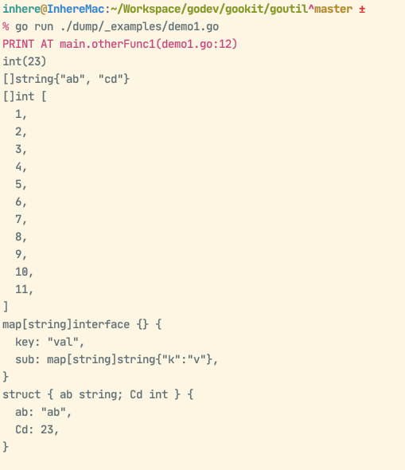
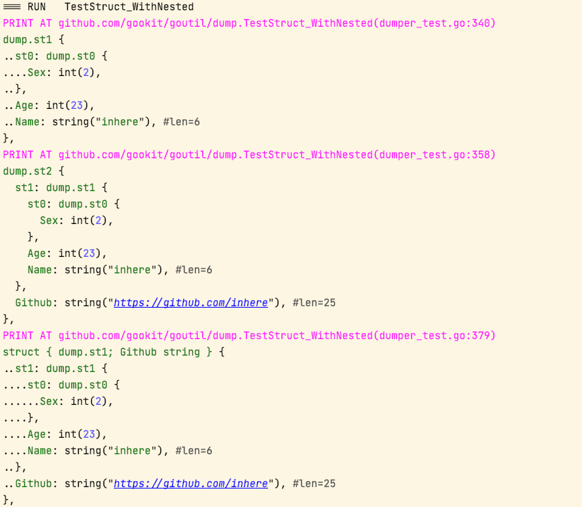

# Go Util


[](https://github.com/gookit/goutil)
[](https://goreportcard.com/report/github.com/gookit/goutil)
[](https://github.com/gookit/goutil/actions)
[](https://coveralls.io/github/gookit/goutil?branch=master)
[](https://pkg.go.dev/github.com/gookit/goutil)

💪 Useful utils(**600+**) package for the Go: int, string, array/slice, map, error, time, format, CLI, ENV, filesystem, system, testing and more.

> **[中文说明](README.zh-CN.md)**

**Basic packages:**

- [`arrutil`](./arrutil): Array/Slice util functions. eg: check, convert, formatting, enum, collections
- [`cliutil`](./cliutil) Command-line util functions. eg: colored print, read input, exec command
- [`envutil`](./envutil) ENV util for current runtime env information. eg: get one, get info, parse var
- [`fmtutil`](./fmtutil) Format data util functions. eg: data, size, time
- [`fsutil`](./fsutil) Filesystem util functions, quick create, read and write file. eg: file and dir check, operate
- [`jsonutil`](./jsonutil) Provide some util functions for quick read, write, encode, decode JSON data.
- [`maputil`](./maputil) Map data util functions. eg: convert, sub-value get, simple merge
- [`mathutil`](./mathutil) Math(int, number) util functions. eg: convert, math calc, random
- `netutil` Network util functions
- [`reflects`](./reflects) Provide extends reflect util functions.
- [`stdutil`](./stdutil) Provide some commonly std util functions.
- [`structs`](./structs) Provide some extends util functions for struct. eg: tag parse, struct data init
- [`strutil`](./strutil) String util functions. eg: bytes, check, convert, encode, format and more
- [`sysutil`](./sysutil) System util functions. eg: sysenv, exec, user, process

**Advance packages:**

- [`cflag`](./cflag):  Wraps and extends go `flag.FlagSet` to build simple command line applications
- cli util:
  - [cmdline](./cliutil/cmdline) Provide cmdline parse, args build to cmdline
- [`dump`](./dump): GO value printing tool. print slice, map will auto wrap each element and display the call location
- [`errorx`](./errorx) Provide an enhanced error implements for go, allow with stacktrace and wrap another error.
- [`finder`](./fsutil/finder) Provides a simple and convenient filedir lookup function, supports filtering, excluding, matching, ignoring, etc.
- net util:
  - [httpreq](netutil/httpreq) An easier-to-use HTTP client that wraps http.Client
- string util:
  - [textscan](strutil/textscan) Implemented a parser that quickly scans and analyzes text content. It can be used to parse INI, Properties and other formats
  - [textutil](strutil/textutil) Provide some extensions text handle util functions. eg: text replace, etc.
- system util:
  - [clipboard](./sysutil/clipboard) Provide a simple clipboard read and write operations.
  - [cmdr](./sysutil/cmdr) Provide for quick build and run a cmd, batch run multi cmd tasks
  - [process](./sysutil/process) Provide some process handle util functions.
- [`testutil`](testutil) Test help util functions. eg: http test, mock ENV value
  - [assert](testutil/assert) Provides commonly asserts functions for help testing
  - [fakeobj](testutil/fakeobj) provides a fake object for testing. such as fake fs.File, fs.FileInfo, fs.DirEntry etc.
- [`timex`](./timex) Provides an enhanced time.Time implementation. Add more commonly used functional methods
  - such as: DayStart(), DayAfter(), DayAgo(), DateFormat() and more.

## Go Doc

Please see [Go doc](https://pkg.go.dev/github.com/gookit/goutil)

## Install

```shell
go get github.com/gookit/goutil
```

## Usage

```go
// github.com/gookit/goutil
is.True(goutil.IsEmpty(nil))
is.False(goutil.IsEmpty("abc"))

is.True(goutil.IsEqual("a", "a"))
is.True(goutil.IsEqual([]string{"a"}, []string{"a"}))
is.True(goutil.IsEqual(23, 23))

is.True(goutil.Contains("abc", "a"))
is.True(goutil.Contains([]string{"abc", "def"}, "abc"))
is.True(goutil.Contains(map[int]string{2: "abc", 4: "def"}, 4))

// convert type
str = goutil.String(23) // "23"
iVal = goutil.Int("-2") // 2
i64Val = goutil.Int64("-2") // -2
u64Val = goutil.Uint("2") // 2
```

## Packages

### Array and Slice

> Package `github.com/gookit/goutil/arrutil`

```go
// source at arrutil/arrutil.go
func Reverse(ss []string) 
func StringsRemove(ss []string, s string) []string 
func StringsFilter(ss []string, filter ...func(s string) bool) []string 
func StringsMap(ss []string, mapFn func(s string) string) []string 
func TrimStrings(ss []string, cutSet ...string) []string 
func GetRandomOne[T any](arr []T) T 
func RandomOne[T any](arr []T) T 
func Unique[T ~string | comdef.XintOrFloat](list []T) []T 
func IndexOf[T ~string | comdef.XintOrFloat](val T, list []T) int 
// source at arrutil/check.go
func IntsHas(ints []int, val int) bool 
func Int64sHas(ints []int64, val int64) bool 
func InStrings(elem string, ss []string) bool 
func StringsHas(ss []string, val string) bool 
func NotIn[T comdef.ScalarType](value T, list []T) bool 
func In[T comdef.ScalarType](value T, list []T) bool 
func ContainsAll[T comdef.ScalarType](list, values []T) bool 
func IsSubList[T comdef.ScalarType](values, list []T) bool 
func IsParent[T comdef.ScalarType](values, list []T) bool 
func HasValue(arr, val any) bool 
func Contains(arr, val any) bool 
func NotContains(arr, val any) bool 
// source at arrutil/collection.go
func TwowaySearch(data any, item any, fn Comparer) (int, error) 
func MakeEmptySlice(itemType reflect.Type) any 
func CloneSlice(data any) any 
func Differences[T any](first, second []T, fn Comparer) []T 
func Excepts(first, second any, fn Comparer) any 
func Intersects(first any, second any, fn Comparer) any 
func Union(first, second any, fn Comparer) any 
func Find(source any, fn Predicate) (any, error) 
func FindOrDefault(source any, fn Predicate, defaultValue any) any 
func TakeWhile(data any, fn Predicate) any 
func ExceptWhile(data any, fn Predicate) any 
// source at arrutil/collection_gte118.go
func Map[T any, V any](list []T, mapFn func(obj T) (val V, find bool)) []V 
func Column[T any, V any](list []T, mapFn func(obj T) (val V, find bool)) []V 
// source at arrutil/convert.go
func JoinStrings(sep string, ss ...string) string 
func StringsJoin(sep string, ss ...string) string 
func JoinSlice(sep string, arr ...any) string 
func ToInt64s(arr any) (ret []int64, err error) 
func MustToInt64s(arr any) []int64 
func SliceToInt64s(arr []any) []int64 
func StringsAsInts(ss []string) []int 
func StringsToInts(ss []string) (ints []int, err error) 
func StringsTryInts(ss []string) (ints []int, err error) 
func AnyToSlice(sl any) (ls []any, err error) 
func AnyToStrings(arr any) []string 
func MustToStrings(arr any) []string 
func StringsToSlice(ss []string) []any 
func ToStrings(arr any) (ret []string, err error) 
func SliceToStrings(arr []any) []string 
func QuietStrings(arr []any) []string 
func ConvType[T any, R any](arr []T, newElemTyp R) ([]R, error) 
func AnyToString(arr any) string 
func SliceToString(arr ...any) string 
func ToString(arr []any) string 
func CombineToMap[K comdef.SortedType, V any](keys []K, values []V) map[K]V 
func CombineToSMap(keys, values []string) map[string]string 
// source at arrutil/format.go
func NewFormatter(arr any) *ArrFormatter 
func FormatIndent(arr any, indent string) string 
```
#### ArrUtil Usage

**check value**:

```go
arrutil.IntsHas([]int{2, 4, 5}, 2) // True
arrutil.Int64sHas([]int64{2, 4, 5}, 2) // True
arrutil.StringsHas([]string{"a", "b"}, "a") // True

// list and val interface{}
arrutil.Contains(list, val)
arrutil.Contains([]uint32{9, 2, 3}, 9) // True
```

**convert**:

```go
ints, err := arrutil.ToInt64s([]string{"1", "2"}) // ints: []int64{1, 2} 
ss, err := arrutil.ToStrings([]int{1, 2}) // ss: []string{"1", "2"}
```


### Bytes Utils

> Package `github.com/gookit/goutil/byteutil`

```go
// source at byteutil/buffer.go
func NewBuffer() *Buffer 
// source at byteutil/byteutil.go
func Random(length int) ([]byte, error) 
func FirstLine(bs []byte) []byte 
func StrOrErr(bs []byte, err error) (string, error) 
func SafeString(bs []byte, err error) string 
func String(b []byte) string 
func ToString(b []byte) string 
func AppendAny(dst []byte, v any) []byte 
func Cut(bs []byte, sep byte) (before, after []byte, found bool) 
// source at byteutil/bytex.go
func Md5(src any) []byte 
// source at byteutil/check.go
func IsNumChar(c byte) bool 
// source at byteutil/encoder.go
func NewStdEncoder(encFn func(src []byte) []byte, decFn func(src []byte) ([]byte, error)) *StdEncoder 
// source at byteutil/pool.go
func NewChanPool(maxSize int, width int, capWidth int) *ChanPool 
```

### Cflag

> Package `github.com/gookit/goutil/cflag`

```go
// source at cflag/app.go
func NewApp(fns ...func(app *App)) *App 
func NewCmd(name, desc string) *Cmd 
// source at cflag/cflag.go
func SetDebug(open bool) 
func New(fns ...func(c *CFlags)) *CFlags 
func NewEmpty(fns ...func(c *CFlags)) *CFlags 
func WithDesc(desc string) func(c *CFlags) 
func WithVersion(version string) func(c *CFlags) 
// source at cflag/ext.go
func NewEnumString(enum ...string) EnumString 
func NewKVString() KVString 
// source at cflag/optarg.go
func NewArg(name, desc string, required bool) *FlagArg 
// source at cflag/util.go
func IsGoodName(name string) bool 
func IsZeroValue(opt *flag.Flag, value string) (bool, bool) 
func AddPrefix(name string) string 
func AddPrefixes(name string, shorts []string) string 
func AddPrefixes2(name string, shorts []string, nameAtEnd bool) string 
func SplitShortcut(shortcut string) []string 
func FilterNames(names []string) []string 
func IsFlagHelpErr(err error) bool 
func WrapColorForCode(s string) string 
func ReplaceShorts(args []string, shortsMap map[string]string) []string 
```
#### `cflag` Usage

`cflag` usage please see [cflag/README.md](cflag/README.md)


### CLI/Console

> Package `github.com/gookit/goutil/cliutil`

```go
// source at cliutil/cliutil.go
func LineBuild(binFile string, args []string) string 
func BuildLine(binFile string, args []string) string 
func String2OSArgs(line string) []string 
func StringToOSArgs(line string) []string 
func ParseLine(line string) []string 
func QuickExec(cmdLine string, workDir ...string) (string, error) 
func ExecLine(cmdLine string, workDir ...string) (string, error) 
func ExecCmd(binName string, args []string, workDir ...string) (string, error) 
func ExecCommand(binName string, args []string, workDir ...string) (string, error) 
func ShellExec(cmdLine string, shells ...string) (string, error) 
func CurrentShell(onlyName bool) (path string) 
func HasShellEnv(shell string) bool 
func BuildOptionHelpName(names []string) string 
func ShellQuote(s string) string 
func OutputLines(output string) []string 
// source at cliutil/color_print.go
func Redp(a ...any) 
func Redf(format string, a ...any) 
func Redln(a ...any) 
func Bluep(a ...any) 
func Bluef(format string, a ...any) 
func Blueln(a ...any) 
func Cyanp(a ...any) 
func Cyanf(format string, a ...any) 
func Cyanln(a ...any) 
func Grayp(a ...any) 
func Grayf(format string, a ...any) 
func Grayln(a ...any) 
func Greenp(a ...any) 
func Greenf(format string, a ...any) 
func Greenln(a ...any) 
func Yellowp(a ...any) 
func Yellowf(format string, a ...any) 
func Yellowln(a ...any) 
func Magentap(a ...any) 
func Magentaf(format string, a ...any) 
func Magentaln(a ...any) 
func Infop(a ...any) 
func Infof(format string, a ...any) 
func Infoln(a ...any) 
func Successp(a ...any) 
func Successf(format string, a ...any) 
func Successln(a ...any) 
func Errorp(a ...any) 
func Errorf(format string, a ...any) 
func Errorln(a ...any) 
func Warnp(a ...any) 
func Warnf(format string, a ...any) 
func Warnln(a ...any) 
// source at cliutil/info.go
func Workdir() string 
func BinDir() string 
func BinFile() string 
func BinName() string 
func GetTermSize(refresh ...bool) (w int, h int) 
// source at cliutil/read.go
func ReadInput(question string) (string, error) 
func ReadLine(question string) (string, error) 
func ReadFirst(question string) (string, error) 
func ReadFirstByte(question string) (byte, error) 
func ReadFirstRune(question string) (rune, error) 
func ReadAsBool(tip string, defVal bool) bool 
func ReadPassword(question ...string) string 
func Confirm(tip string, defVal ...bool) bool 
func InputIsYes(ans string) bool 
func ByteIsYes(ans byte) bool 
```

#### CLI Util Usage

**helper functions:**

```go
cliutil.Workdir() // current workdir
cliutil.BinDir() // the program exe file dir

cliutil.ReadInput("Your name?")
cliutil.ReadPassword("Input password:")
ans, _ := cliutil.ReadFirstByte("continue?[y/n] ")
```

**cmdline parse:**

```go
package main

import (
	"fmt"

	"github.com/gookit/goutil/cliutil"
	"github.com/gookit/goutil/dump"
)

func main() {
	args := cliutil.ParseLine(`./app top sub --msg "has multi words"`)
	dump.P(args)

	s := cliutil.BuildLine("./myapp", []string{
		"-a", "val0",
		"-m", "this is message",
		"arg0",
	})
	fmt.Println("Build line:", s)
}
```

**output**:

```shell
PRINT AT github.com/gookit/goutil/cliutil_test.TestParseLine(line_parser_test.go:30)
[]string [ #len=5
  string("./app"), #len=5
  string("top"), #len=3
  string("sub"), #len=3
  string("--msg"), #len=5
  string("has multi words"), #len=15
]

Build line: ./myapp -a val0 -m "this is message" arg0
```

> More, please see [./cliutil/README](cliutil/README.md)

### Dumper

> Package `github.com/gookit/goutil/dump`

```go
// source at dump/dump.go
func Std() *Dumper 
func Reset() 
func Config(fns ...OptionFunc) 
func Print(vs ...any) 
func Println(vs ...any) 
func Fprint(w io.Writer, vs ...any) 
func Std2() *Dumper 
func Reset2() 
func Format(vs ...any) string 
func NoLoc(vs ...any) 
func Clear(vs ...any) 
// source at dump/dumper.go
func NewDumper(out io.Writer, skip int) *Dumper 
func NewWithOptions(fns ...OptionFunc) *Dumper 
// source at dump/options.go
func NewDefaultOptions(out io.Writer, skip int) *Options 
func SkipNilField() OptionFunc 
func SkipPrivate() OptionFunc 
func BytesAsString() OptionFunc 
func WithCallerSkip(skip int) OptionFunc 
func WithoutPosition() OptionFunc 
func WithoutOutput(out io.Writer) OptionFunc 
func WithoutColor() OptionFunc 
func WithoutType() OptionFunc 
```
#### Examples

example code:

```go
package main

import "github.com/gookit/goutil/dump"

// rum demo:
// 	go run ./dump/_examples/demo1.go
func main() {
	otherFunc1()
}

func otherFunc1() {
	dump.P(
		23,
		[]string{"ab", "cd"},
		[]int{1, 2, 3, 4, 5, 6, 7, 8, 9, 10, 11}, // len > 10
		map[string]interface{}{
			"key": "val", "sub": map[string]string{"k": "v"},
		},
		struct {
			ab string
			Cd int
		}{
			"ab", 23,
		},
	)
}
```

Preview:



**nested struct**

> source code at `dump/dumper_test.TestStruct_WithNested`




### ENV/Environment

> Package `github.com/gookit/goutil/envutil`

```go
// source at envutil/envutil.go
func VarReplace(s string) string 
func VarParse(val string) string 
func ParseEnvValue(val string) string 
func ParseValue(val string) (newVal string) 
func SetEnvMap(mp map[string]string) 
func SetEnvs(kvPairs ...string) 
func UnsetEnvs(keys ...string) 
// source at envutil/get.go
func Getenv(name string, def ...string) string 
func GetInt(name string, def ...int) int 
func GetBool(name string, def ...bool) bool 
func GetMulti(names ...string) map[string]string 
func EnvPaths() []string 
func EnvMap() map[string]string 
func Environ() map[string]string 
func SearchEnvKeys(keywords string) map[string]string 
func SearchEnv(keywords string, matchValue bool) map[string]string 
// source at envutil/info.go
func IsWin() bool 
func IsWindows() bool 
func IsMac() bool 
func IsLinux() bool 
func IsMSys() bool 
func IsWSL() bool 
func IsTerminal(fd uintptr) bool 
func StdIsTerminal() bool 
func IsConsole(out io.Writer) bool 
func HasShellEnv(shell string) bool 
func IsSupportColor() bool 
func IsSupport256Color() bool 
func IsSupportTrueColor() bool 
func IsGithubActions() bool 
```
#### ENV Util Usage

**helper functions:**

```go
envutil.IsWin()
envutil.IsMac()
envutil.IsLinux()

// get ENV value by key, can with default value
envutil.Getenv("APP_ENV", "dev")
envutil.GetInt("LOG_LEVEL", 1)
envutil.GetBool("APP_DEBUG", true)

// parse ENV var value from input string, support default value.
envutil.ParseValue("${ENV_NAME | defValue}")
```


### Errorx

> Package `github.com/gookit/goutil/errorx`

Package errorx provide a enhanced error implements, allow with call stack and wrap another error.


```go
// source at errorx/assert.go
func IsTrue(result bool, fmtAndArgs ...any) error 
func IsFalse(result bool, fmtAndArgs ...any) error 
func IsIn[T comdef.ScalarType](value T, list []T, fmtAndArgs ...any) error 
func NotIn[T comdef.ScalarType](value T, list []T, fmtAndArgs ...any) error 
// source at errorx/errors.go
func NewR(code int, msg string) ErrorR 
func Fail(code int, msg string) ErrorR 
func Failf(code int, tpl string, v ...any) ErrorR 
func Suc(msg string) ErrorR 
// source at errorx/errorx.go
func New(msg string) error 
func Newf(tpl string, vars ...any) error 
func Errorf(tpl string, vars ...any) error 
func With(err error, msg string) error 
func Withf(err error, tpl string, vars ...any) error 
func WithPrev(err error, msg string) error 
func WithPrevf(err error, tpl string, vars ...any) error 
func WithStack(err error) error 
func Traced(err error) error 
func Stacked(err error) error 
func WithOptions(msg string, fns ...func(opt *ErrStackOpt)) error 
func Wrap(err error, msg string) error 
func Wrapf(err error, tpl string, vars ...any) error 
// source at errorx/stack.go
func FuncForPC(pc uintptr) *Func 
func ResetStdOpt() 
func Config(fns ...func(opt *ErrStackOpt)) 
func SkipDepth(skipDepth int) func(opt *ErrStackOpt) 
func TraceDepth(traceDepth int) func(opt *ErrStackOpt) 
// source at errorx/util.go
func Err(msg string) error 
func Raw(msg string) error 
func Ef(tpl string, vars ...any) error 
func Errf(tpl string, vars ...any) error 
func Rawf(tpl string, vars ...any) error 
func Cause(err error) error 
func Unwrap(err error) error 
func Previous(err error) error 
func ToErrorX(err error) (ex *ErrorX, ok bool) 
func Has(err, target error) bool 
func Is(err, target error) bool 
func To(err error, target any) bool 
func As(err error, target any) bool 
```

#### Errorx Usage

**Create error with call stack info**

- use the `errorx.New` instead `errors.New`

```go
func doSomething() error {
    if false {
	    // return errors.New("a error happen")
	    return errorx.New("a error happen")
	}
}
```

- use the `errorx.Newf` or `errorx.Errorf` instead `fmt.Errorf`

```go
func doSomething() error {
    if false {
	    // return fmt.Errorf("a error %s", "happen")
	    return errorx.Newf("a error %s", "happen")
	}
}
```

**Wrap the previous error**

used like this before:

```go
    if err := SomeFunc(); err != nil {
	    return err
	}
```

can be replaced with:

```go
    if err := SomeFunc(); err != nil {
	    return errors.Stacked(err)
	}
```

**Print the errorx.New() error**

Examples for use `errorx` package, more please see [./errorx/README](errorx/README.md)

```go
    err := errorx.New("the error message")

    fmt.Println(err)
    // fmt.Printf("%v\n", err)
    // fmt.Printf("%#v\n", err)
```

> from the test: `errorx/errorx_test.TestNew()`

**Output**:

```text
the error message
STACK:
github.com/gookit/goutil/errorx_test.returnXErr()
  /Users/inhere/Workspace/godev/gookit/goutil/errorx/errorx_test.go:21
github.com/gookit/goutil/errorx_test.returnXErrL2()
  /Users/inhere/Workspace/godev/gookit/goutil/errorx/errorx_test.go:25
github.com/gookit/goutil/errorx_test.TestNew()
  /Users/inhere/Workspace/godev/gookit/goutil/errorx/errorx_test.go:29
testing.tRunner()
  /usr/local/Cellar/go/1.18/libexec/src/testing/testing.go:1439
runtime.goexit()
  /usr/local/Cellar/go/1.18/libexec/src/runtime/asm_amd64.s:1571
```


### Format Utils

> Package `github.com/gookit/goutil/fmtutil`

```go
// source at fmtutil/fmtutil.go
func StringOrJSON(v any) ([]byte, error) 
// source at fmtutil/format.go
func DataSize(size uint64) string 
func SizeToString(size uint64) string 
func StringToByte(sizeStr string) uint64 
func ParseByte(sizeStr string) uint64 
func PrettyJSON(v any) (string, error) 
func StringsToInts(ss []string) (ints []int, err error) 
func ArgsWithSpaces(vs []any) (message string) 
// source at fmtutil/time.go
func HowLongAgo(sec int64) string 
```

### File System

> Package `github.com/gookit/goutil/fsutil`

```go
// source at fsutil/check.go
func PathExists(path string) bool 
func IsDir(path string) bool 
func FileExists(path string) bool 
func IsFile(path string) bool 
func IsAbsPath(aPath string) bool 
func IsImageFile(path string) bool 
func IsZipFile(filepath string) bool 
func PathMatch(pattern, s string) bool 
// source at fsutil/find.go
func SearchNameUp(dirPath, name string) string 
func SearchNameUpx(dirPath, name string) (string, bool) 
func WalkDir(dir string, fn fs.WalkDirFunc) error 
func Glob(pattern string, fls ...comdef.StringMatchFunc) []string 
func GlobWithFunc(pattern string, fn func(filePath string) error) (err error) 
func OnlyFindDir(_ string, ent fs.DirEntry) bool 
func OnlyFindFile(_ string, ent fs.DirEntry) bool 
func ExcludeNames(names ...string) FilterFunc 
func IncludeSuffix(ss ...string) FilterFunc 
func ExcludeDotFile(_ string, ent fs.DirEntry) bool 
func ExcludeSuffix(ss ...string) FilterFunc 
func ApplyFilters(fPath string, ent fs.DirEntry, filters []FilterFunc) bool 
func FindInDir(dir string, handleFn HandleFunc, filters ...FilterFunc) (e error) 
// source at fsutil/fsutil.go
func OSTempFile(pattern string) (*os.File, error) 
func TempFile(dir, pattern string) (*os.File, error) 
func OSTempDir(pattern string) (string, error) 
func TempDir(dir, pattern string) (string, error) 
func MimeType(path string) (mime string) 
func ReaderMimeType(r io.Reader) (mime string) 
func JoinPaths(elem ...string) string 
func JoinSubPaths(basePath string, elem ...string) string 
func SlashPath(path string) string 
func UnixPath(path string) string 
func ToAbsPath(p string) string 
// source at fsutil/info.go
func Dir(fpath string) string 
func PathName(fpath string) string 
func Name(fpath string) string 
func FileExt(fpath string) string 
func Extname(fpath string) string 
func Suffix(fpath string) string 
func Expand(pathStr string) string 
func ExpandPath(pathStr string) string 
func ResolvePath(pathStr string) string 
func SplitPath(pathStr string) (dir, name string) 
// source at fsutil/info_nonwin.go
func Realpath(pathStr string) string 
// source at fsutil/operate.go
func Mkdir(dirPath string, perm os.FileMode) error 
func MkDirs(perm os.FileMode, dirPaths ...string) error 
func MkSubDirs(perm os.FileMode, parentDir string, subDirs ...string) error 
func MkParentDir(fpath string) error 
func OpenFile(filepath string, flag int, perm os.FileMode) (*os.File, error) 
func MustOpenFile(filepath string, flag int, perm os.FileMode) *os.File 
func QuickOpenFile(filepath string, fileFlag ...int) (*os.File, error) 
func OpenAppendFile(filepath string, filePerm ...os.FileMode) (*os.File, error) 
func OpenTruncFile(filepath string, filePerm ...os.FileMode) (*os.File, error) 
func OpenReadFile(filepath string) (*os.File, error) 
func CreateFile(fpath string, filePerm, dirPerm os.FileMode, fileFlag ...int) (*os.File, error) 
func MustCreateFile(filePath string, filePerm, dirPerm os.FileMode) *os.File 
func Remove(fPath string) error 
func MustRemove(fPath string) 
func QuietRemove(fPath string) 
func RmIfExist(fPath string) error 
func DeleteIfExist(fPath string) error 
func RmFileIfExist(fPath string) error 
func DeleteIfFileExist(fPath string) error 
func RemoveSub(dirPath string, fns ...FilterFunc) error 
func Unzip(archive, targetDir string) (err error) 
// source at fsutil/opread.go
func NewIOReader(in any) (r io.Reader, err error) 
func DiscardReader(src io.Reader) 
func ReadFile(filePath string) []byte 
func MustReadFile(filePath string) []byte 
func ReadReader(r io.Reader) []byte 
func MustReadReader(r io.Reader) []byte 
func ReadString(in any) string 
func ReadStringOrErr(in any) (string, error) 
func ReadAll(in any) []byte 
func GetContents(in any) []byte 
func ReadOrErr(in any) ([]byte, error) 
func ReadExistFile(filePath string) []byte 
func TextScanner(in any) *scanner.Scanner 
func LineScanner(in any) *bufio.Scanner 
// source at fsutil/opwrite.go
func PutContents(filePath string, data any, fileFlag ...int) (int, error) 
func WriteFile(filePath string, data any, perm os.FileMode, fileFlag ...int) error 
func WriteOSFile(f *os.File, data any) (n int, err error) 
func CopyFile(srcPath, dstPath string) error 
func MustCopyFile(srcPath, dstPath string) 
```

#### FsUtil Usage

**files finder:**

```go
package main

import (
	"fmt"
	"io/fs"

	"github.com/gookit/goutil/fsutil"
)

func main() {
	// find all files in dir
	fsutil.FindInDir("./", func(filePath string, de fs.DirEntry) error {
		fmt.Println(filePath)
		return nil
	})

	// find files with filters
	fsutil.FindInDir("./", func(filePath string, de fs.DirEntry) error {
		fmt.Println(filePath)
		return nil
	}, fsutil.ExcludeDotFile)
}
```


### JSON Utils

> Package `github.com/gookit/goutil/jsonutil`

```go
// source at jsonutil/jsonutil.go
func WriteFile(filePath string, data any) error 
func WritePretty(filePath string, data any) error 
func ReadFile(filePath string, v any) error 
func Pretty(v any) (string, error) 
func Encode(v any) ([]byte, error) 
func EncodePretty(v any) ([]byte, error) 
func EncodeToWriter(v any, w io.Writer) error 
func EncodeUnescapeHTML(v any) ([]byte, error) 
func Decode(bts []byte, ptr any) error 
func DecodeString(str string, ptr any) error 
func DecodeReader(r io.Reader, ptr any) error 
func Mapping(src, dst any) error 
func IsJSON(s string) bool 
func IsJSONFast(s string) bool 
func StripComments(src string) string 
```

### Map

> Package `github.com/gookit/goutil/maputil`

```go
// source at maputil/check.go
func HasKey(mp, key any) (ok bool) 
func HasOneKey(mp any, keys ...any) (ok bool, key any) 
func HasAllKeys(mp any, keys ...any) (ok bool, noKey any) 
// source at maputil/convert.go
func KeyToLower(src map[string]string) map[string]string 
func ToStringMap(src map[string]any) map[string]string 
func CombineToSMap(keys, values []string) SMap 
func CombineToMap[K comdef.SortedType, V any](keys []K, values []V) map[K]V 
func ToAnyMap(mp any) map[string]any 
func TryAnyMap(mp any) (map[string]any, error) 
func HTTPQueryString(data map[string]any) string 
func StringsMapToAnyMap(ssMp map[string][]string) map[string]any 
func ToString(mp map[string]any) string 
func ToString2(mp any) string 
func FormatIndent(mp any, indent string) string 
func Flatten(mp map[string]any) map[string]any 
func FlatWithFunc(mp map[string]any, fn reflects.FlatFunc) 
// source at maputil/format.go
func NewFormatter(mp any) *MapFormatter 
// source at maputil/get.go
func DeepGet(mp map[string]any, path string) (val any) 
func QuietGet(mp map[string]any, path string) (val any) 
func GetByPath(path string, mp map[string]any) (val any, ok bool) 
func GetByPathKeys(mp map[string]any, keys []string) (val any, ok bool) 
func Keys(mp any) (keys []string) 
func Values(mp any) (values []any) 
func EachAnyMap(mp any, fn func(key string, val any)) 
// source at maputil/maputil.go
func SimpleMerge(src, dst map[string]any) map[string]any 
func DeepMerge(src, dst map[string]any, deep int) map[string]any 
func MergeSMap(src, dst map[string]string, ignoreCase bool) map[string]string 
func MergeStringMap(src, dst map[string]string, ignoreCase bool) map[string]string 
func MakeByPath(path string, val any) (mp map[string]any) 
func MakeByKeys(keys []string, val any) (mp map[string]any) 
// source at maputil/setval.go
func SetByPath(mp *map[string]any, path string, val any) error 
func SetByKeys(mp *map[string]any, keys []string, val any) (err error) 
```

### Math/Number

> Package `github.com/gookit/goutil/mathutil`

```go
// source at mathutil/check.go
func Compare(srcVal, dstVal any, op string) (ok bool) 
func CompInt[T comdef.Xint](srcVal, dstVal T, op string) (ok bool) 
func CompInt64(srcVal, dstVal int64, op string) bool 
func CompFloat[T comdef.Float](srcVal, dstVal T, op string) (ok bool) 
func CompValue[T comdef.XintOrFloat](srcVal, dstVal T, op string) (ok bool) 
func InRange[T comdef.IntOrFloat](val, min, max T) bool 
func OutRange[T comdef.IntOrFloat](val, min, max T) bool 
func InUintRange[T comdef.Uint](val, min, max T) bool 
// source at mathutil/convert.go
func Int(in any) (int, error) 
func QuietInt(in any) int 
func MustInt(in any) int 
func IntOrPanic(in any) int 
func IntOrErr(in any) (iVal int, err error) 
func ToInt(in any) (iVal int, err error) 
func StrInt(s string) int 
func Uint(in any) (uint64, error) 
func QuietUint(in any) uint64 
func MustUint(in any) uint64 
func UintOrErr(in any) (uint64, error) 
func ToUint(in any) (u64 uint64, err error) 
func Int64(in any) (int64, error) 
func SafeInt64(in any) int64 
func QuietInt64(in any) int64 
func MustInt64(in any) int64 
func Int64OrErr(in any) (int64, error) 
func ToInt64(in any) (i64 int64, err error) 
func QuietFloat(in any) float64 
func FloatOrPanic(in any) float64 
func MustFloat(in any) float64 
func Float(in any) (float64, error) 
func FloatOrErr(in any) (float64, error) 
func ToFloat(in any) (f64 float64, err error) 
func StringOrPanic(val any) string 
func MustString(val any) string 
func ToString(val any) (string, error) 
func StringOrErr(val any) (string, error) 
func QuietString(val any) string 
func String(val any) string 
func TryToString(val any, defaultAsErr bool) (str string, err error) 
// source at mathutil/mathutil.go
func Min[T comdef.XintOrFloat](x, y T) T 
func Max[T comdef.XintOrFloat](x, y T) T 
func SwapMin[T comdef.XintOrFloat](x, y T) (T, T) 
func SwapMax[T comdef.XintOrFloat](x, y T) (T, T) 
func MaxInt(x, y int) int 
func SwapMaxInt(x, y int) (int, int) 
func MaxI64(x, y int64) int64 
func SwapMaxI64(x, y int64) (int64, int64) 
func MaxFloat(x, y float64) float64 
func OrElse[T comdef.XintOrFloat](in, nv T) T 
// source at mathutil/number.go
func IsNumeric(c byte) bool 
func Percent(val, total int) float64 
func ElapsedTime(startTime time.Time) string 
func DataSize(size uint64) string 
func HowLongAgo(sec int64) string 
// source at mathutil/random.go
func RandomInt(min, max int) int 
func RandInt(min, max int) int 
func RandIntWithSeed(min, max int, seed int64) int 
func RandomIntWithSeed(min, max int, seed int64) int 
```

### Reflects

> Package `github.com/gookit/goutil/reflects`

```go
// source at reflects/check.go
func HasChild(v reflect.Value) bool 
func IsArrayOrSlice(k reflect.Kind) bool 
func IsSimpleKind(k reflect.Kind) bool 
func IsAnyInt(k reflect.Kind) bool 
func IsIntx(k reflect.Kind) bool 
func IsUintX(k reflect.Kind) bool 
func IsNil(v reflect.Value) bool 
func IsFunc(val any) bool 
func IsEqual(src, dst any) bool 
func IsEmpty(v reflect.Value) bool 
func IsEmptyValue(v reflect.Value) bool 
// source at reflects/conv.go
func BaseTypeVal(v reflect.Value) (value any, err error) 
func ValueByType(val any, typ reflect.Type) (rv reflect.Value, err error) 
func ValueByKind(val any, kind reflect.Kind) (rv reflect.Value, err error) 
func ConvSlice(oldSlRv reflect.Value, newElemTyp reflect.Type) (rv reflect.Value, err error) 
func String(rv reflect.Value) string 
func ToString(rv reflect.Value) (str string, err error) 
func ValToString(rv reflect.Value, defaultAsErr bool) (str string, err error) 
// source at reflects/type.go
func ToBaseKind(kind reflect.Kind) BKind 
func ToBKind(kind reflect.Kind) BKind 
func TypeOf(v any) Type 
// source at reflects/util.go
func Elem(v reflect.Value) reflect.Value 
func Indirect(v reflect.Value) reflect.Value 
func Len(v reflect.Value) int 
func SliceSubKind(typ reflect.Type) reflect.Kind 
func SliceElemKind(typ reflect.Type) reflect.Kind 
func UnexportedValue(rv reflect.Value) any 
func SetUnexportedValue(rv reflect.Value, value any) 
func SetValue(rv reflect.Value, val any) error 
func SetRValue(rv, val reflect.Value) 
func EachMap(mp reflect.Value, fn func(key, val reflect.Value)) 
func EachStrAnyMap(mp reflect.Value, fn func(key string, val any)) 
func FlatMap(rv reflect.Value, fn FlatFunc) 
// source at reflects/value.go
func Wrap(rv reflect.Value) Value 
func ValueOf(v any) Value 
```

### Stdio

> Package `github.com/gookit/goutil/stdio`

```go
// source at stdio/ioutil.go
func QuietFprint(w io.Writer, a ...any) 
func QuietFprintf(w io.Writer, tpl string, vs ...any) 
func QuietFprintln(w io.Writer, a ...any) 
func QuietWriteString(w io.Writer, ss ...string) 
// source at stdio/stdio.go
func DiscardReader(src io.Reader) 
func ReadString(r io.Reader) string 
func MustReadReader(r io.Reader) []byte 
func NewIOReader(in any) io.Reader 
func NewScanner(in any) *bufio.Scanner 
func WriteByte(b byte) 
func WriteBytes(bs []byte) 
func WritelnBytes(bs []byte) 
func WriteString(s string) 
func Writeln(s string) 
// source at stdio/writer.go
func NewWriteWrapper(w io.Writer) *WriteWrapper 
```

### Standard

> Package `github.com/gookit/goutil/stdutil`

```go
// source at stdutil/chan.go
func WaitCloseSignals(closer io.Closer) error 
func Go(f func() error) error 
func SignalHandler(ctx context.Context, signals ...os.Signal) (execute func() error, interrupt func(error)) 
// source at stdutil/check.go
func IsNil(v any) bool 
func IsEmpty(v any) bool 
func IsFunc(val any) bool 
func IsEqual(src, dst any) bool 
func Contains(data, elem any) bool 
func IsContains(data, elem any) bool 
func CheckContains(data, elem any) (valid, found bool) 
func ValueIsEmpty(v reflect.Value) bool 
func ValueLen(v reflect.Value) int 
// source at stdutil/conv.go
func ToString(v any) string 
func MustString(v any) string 
func TryString(v any) (string, error) 
func BaseTypeVal(val any) (value any, err error) 
func BaseTypeVal2(v reflect.Value) (value any, err error) 
// source at stdutil/gofunc.go
func FuncName(fn any) string 
func CutFuncName(fullFcName string) (pkgPath, shortFnName string) 
func PkgName(fullFcName string) string 
// source at stdutil/stack.go
func GetCallStacks(all bool) []byte 
func GetCallerInfo(skip int) string 
func SimpleCallersInfo(skip, num int) []string 
func GetCallersInfo(skip, max int) []string 
// source at stdutil/stdutil.go
func DiscardE(_ error) 
func PanicIfErr(err error) 
func PanicIf(err error) 
func Panicf(format string, v ...any) 
func GoVersion() string 
```

### Structs

> Package `github.com/gookit/goutil/structs`

```go
// source at structs/alias.go
func NewAliases(checker func(alias string)) *Aliases 
// source at structs/convert.go
func ToMap(st any, optFns ...MapOptFunc) map[string]any 
func MustToMap(st any, optFns ...MapOptFunc) map[string]any 
func TryToMap(st any, optFns ...MapOptFunc) (map[string]any, error) 
func ToSMap(st any, optFns ...MapOptFunc) map[string]string 
func TryToSMap(st any, optFns ...MapOptFunc) (map[string]string, error) 
func MustToSMap(st any, optFns ...MapOptFunc) map[string]string 
func ToString(st any, optFns ...MapOptFunc) string 
func WithMapTagName(tagName string) MapOptFunc 
func MergeAnonymous(opt *MapOptions) 
func ExportPrivate(opt *MapOptions) 
func StructToMap(st any, optFns ...MapOptFunc) (map[string]any, error) 
// source at structs/copy.go
func MapStruct(srcSt, dstSt any) 
// source at structs/data.go
func NewLiteData(data map[string]any) *Data 
func NewData() *Data 
func NewOrderedMap(len int) *OrderedMap 
// source at structs/init.go
func Init(ptr any, optFns ...InitOptFunc) error 
func InitDefaults(ptr any, optFns ...InitOptFunc) error 
// source at structs/structs.go
func IsExported(name string) bool 
func IsUnexported(name string) bool 
// source at structs/tags.go
func ParseTags(st any, tagNames []string) (map[string]maputil.SMap, error) 
func ParseReflectTags(rt reflect.Type, tagNames []string) (map[string]maputil.SMap, error) 
func NewTagParser(tagNames ...string) *TagParser 
func ParseTagValueDefault(field, tagVal string) (mp maputil.SMap, err error) 
func ParseTagValueQuick(tagVal string, defines []string) maputil.SMap 
func ParseTagValueDefine(sep string, defines []string) TagValFunc 
func ParseTagValueNamed(field, tagVal string, keys ...string) (mp maputil.SMap, err error) 
// source at structs/value.go
func NewValue(val any) *Value 
// source at structs/wrapper.go
func Wrap(src any) *Wrapper 
func NewWrapper(src any) *Wrapper 
func WrapValue(rv reflect.Value) *Wrapper 
// source at structs/writer.go
func NewWriter(ptr any) *Wrapper 
func WithParseDefault(opt *SetOptions) 
func SetValues(ptr any, data map[string]any, optFns ...SetOptFunc) error 
```

### Strings

> Package `github.com/gookit/goutil/strutil`

```go
// source at strutil/bytes.go
func NewBuffer() *Buffer 
func NewByteChanPool(maxSize, width, capWidth int) *ByteChanPool 
// source at strutil/check.go
func IsNumChar(c byte) bool 
func IsNumeric(s string) bool 
func IsAlphabet(char uint8) bool 
func IsAlphaNum(c uint8) bool 
func StrPos(s, sub string) int 
func BytePos(s string, bt byte) int 
func IEqual(s1, s2 string) bool 
func NoCaseEq(s, t string) bool 
func IContains(s, sub string) bool 
func ContainsByte(s string, c byte) bool 
func ContainsOne(s string, subs []string) bool 
func HasOneSub(s string, subs []string) bool 
func ContainsAll(s string, subs []string) bool 
func HasAllSubs(s string, subs []string) bool 
func IsStartsOf(s string, prefixes []string) bool 
func HasOnePrefix(s string, prefixes []string) bool 
func HasPrefix(s string, prefix string) bool 
func IsStartOf(s, prefix string) bool 
func HasSuffix(s string, suffix string) bool 
func IsEndOf(s, suffix string) bool 
func HasOneSuffix(s string, suffixes []string) bool 
func IsValidUtf8(s string) bool 
func IsSpace(c byte) bool 
func IsEmpty(s string) bool 
func IsBlank(s string) bool 
func IsNotBlank(s string) bool 
func IsBlankBytes(bs []byte) bool 
func IsSymbol(r rune) bool 
func HasEmpty(ss ...string) bool 
func IsAllEmpty(ss ...string) bool 
func IsVersion(s string) bool 
func Compare(s1, s2, op string) bool 
func VersionCompare(v1, v2, op string) bool 
func SimpleMatch(s string, keywords []string) bool 
func QuickMatch(pattern, s string) bool 
func PathMatch(pattern, s string) bool 
func GlobMatch(pattern, s string) bool 
func LikeMatch(pattern, s string) bool 
func MatchNodePath(pattern, s string, sep string) bool 
// source at strutil/convert.go
func Quote(s string) string 
func Unquote(s string) string 
func Join(sep string, ss ...string) string 
func JoinList(sep string, ss []string) string 
func JoinAny(sep string, parts ...any) string 
func Implode(sep string, ss ...string) string 
func String(val any) (string, error) 
func ToString(val any) (string, error) 
func QuietString(in any) string 
func SafeString(in any) string 
func MustString(in any) string 
func StringOrErr(val any) (string, error) 
func AnyToString(val any, defaultAsErr bool) (str string, err error) 
func Byte2str(b []byte) string 
func Byte2string(b []byte) string 
func ToBytes(s string) (b []byte) 
func ToBool(s string) (bool, error) 
func QuietBool(s string) bool 
func MustBool(s string) bool 
func Bool(s string) (bool, error) 
func Int(s string) (int, error) 
func ToInt(s string) (int, error) 
func Int2(s string) int 
func QuietInt(s string) int 
func MustInt(s string) int 
func IntOrPanic(s string) int 
func Int64(s string) int64 
func QuietInt64(s string) int64 
func ToInt64(s string) (int64, error) 
func Int64OrErr(s string) (int64, error) 
func MustInt64(s string) int64 
func Int64OrPanic(s string) int64 
func Ints(s string, sep ...string) []int 
func ToInts(s string, sep ...string) ([]int, error) 
func ToIntSlice(s string, sep ...string) (ints []int, err error) 
func ToArray(s string, sep ...string) []string 
func Strings(s string, sep ...string) []string 
func ToStrings(s string, sep ...string) []string 
func ToSlice(s string, sep ...string) []string 
func ToOSArgs(s string) []string 
func ToDuration(s string) (time.Duration, error) 
// source at strutil/crypto.go
func Md5(src any) string 
func MD5(src any) string 
func GenMd5(src any) string 
func Md5Bytes(src any) []byte 
func HashPasswd(pwd, key string) string 
func VerifyPasswd(pwdMAC, pwd, key string) bool 
// source at strutil/encode.go
func EscapeJS(s string) string 
func EscapeHTML(s string) string 
func AddSlashes(s string) string 
func StripSlashes(s string) string 
func URLEncode(s string) string 
func URLDecode(s string) string 
func B32Encode(str string) string 
func B32Decode(str string) string 
func B64Encode(str string) string 
func B64EncodeBytes(src []byte) []byte 
func B64Decode(str string) string 
func B64DecodeBytes(str string) []byte 
func Encoding(base int, typ BaseType) BaseEncoder 
// source at strutil/ext.go
func NewComparator(src, dst string) *SimilarComparator 
func Similarity(s, t string, rate float32) (float32, bool) 
// source at strutil/filter.go
func Trim(s string, cutSet ...string) string 
func Ltrim(s string, cutSet ...string) string 
func LTrim(s string, cutSet ...string) string 
func TrimLeft(s string, cutSet ...string) string 
func Rtrim(s string, cutSet ...string) string 
func RTrim(s string, cutSet ...string) string 
func TrimRight(s string, cutSet ...string) string 
func FilterEmail(s string) string 
func Filter(ss []string, fls ...comdef.StringMatchFunc) []string  
// source at strutil/format.go
func Title(s string) string 
func Lower(s string) string 
func Lowercase(s string) string 
func Upper(s string) string 
func Uppercase(s string) string 
func UpperWord(s string) string 
func LowerFirst(s string) string 
func UpperFirst(s string) string 
func SnakeCase(s string, sep ...string) string 
func Camel(s string, sep ...string) string 
func CamelCase(s string, sep ...string) string 
func Indent(s, prefix string) string 
func IndentBytes(b, prefix []byte) []byte 
// source at strutil/id.go
func MicroTimeID() string 
func MicroTimeHexID() string 
func DatetimeNo(prefix string) string 
// source at strutil/padding.go
func Padding(s, pad string, length int, pos PosFlag) string 
func PadLeft(s, pad string, length int) string 
func PadRight(s, pad string, length int) string 
func Resize(s string, length int, align PosFlag) string 
func PadChars[T byte | rune](cs []T, pad T, length int, pos PosFlag) []T 
func PadBytes(bs []byte, pad byte, length int, pos PosFlag) []byte 
func PadBytesLeft(bs []byte, pad byte, length int) []byte 
func PadBytesRight(bs []byte, pad byte, length int) []byte 
func PadRunes(rs []rune, pad rune, length int, pos PosFlag) []rune 
func PadRunesLeft(rs []rune, pad rune, length int) []rune 
func PadRunesRight(rs []rune, pad rune, length int) []rune 
func Repeat(s string, times int) string 
func RepeatRune(char rune, times int) []rune 
func RepeatBytes(char byte, times int) []byte 
func RepeatChars[T byte | rune](char T, times int) []T 
// source at strutil/parse.go
func MustToTime(s string, layouts ...string) time.Time 
func ToTime(s string, layouts ...string) (t time.Time, err error) 
func ParseSizeRange(expr string, opt *ParseSizeOpt) (min, max uint64, err error) 
func SafeByteSize(sizeStr string) uint64 
func ToByteSize(sizeStr string) (uint64, error) 
// source at strutil/random.go
func RandomChars(ln int) string 
func RandomCharsV2(ln int) string 
func RandomCharsV3(ln int) string 
func RandomBytes(length int) ([]byte, error) 
func RandomString(length int) (string, error) 
func RandWithTpl(n int, letters string) string 
// source at strutil/runes.go
func RuneIsWord(c rune) bool 
func RuneIsLower(c rune) bool 
func RuneIsUpper(c rune) bool 
func RunePos(s string, ru rune) int 
func IsSpaceRune(r rune) bool 
func Utf8Len(s string) int 
func Utf8len(s string) int 
func RuneCount(s string) int 
func RuneWidth(r rune) int 
func TextWidth(s string) int 
func Utf8Width(s string) int 
func RunesWidth(rs []rune) (w int) 
func Truncate(s string, w int, tail string) string 
func TextTruncate(s string, w int, tail string) string 
func Utf8Truncate(s string, w int, tail string) string 
func TextSplit(s string, w int) []string 
func Utf8Split(s string, w int) []string 
func TextWrap(s string, w int) string 
func WidthWrap(s string, w int) string 
func WordWrap(s string, w int) string 
// source at strutil/split.go
func Cut(s, sep string) (before string, after string, found bool) 
func QuietCut(s, sep string) (before string, after string) 
func MustCut(s, sep string) (before string, after string) 
func TrimCut(s, sep string) (string, string) 
func SplitKV(s, sep string) (string, string) 
func SplitValid(s, sep string) (ss []string) 
func Split(s, sep string) (ss []string) 
func SplitNValid(s, sep string, n int) (ss []string) 
func SplitN(s, sep string, n int) (ss []string) 
func SplitTrimmed(s, sep string) (ss []string) 
func SplitNTrimmed(s, sep string, n int) (ss []string) 
func Substr(s string, pos, length int) string 
func SplitInlineComment(val string, strict ...bool) (string, string) 
func FirstLine(output string) string 
// source at strutil/strutil.go
func OrCond(cond bool, s1, s2 string) string 
func OrElse(s, orVal string) string 
func OrHandle(s string, fn func(s string) string) string 
func Valid(ss ...string) string 
func Replaces(str string, pairs map[string]string) string 
func NewReplacer(pairs map[string]string) *strings.Replacer 
func PrettyJSON(v any) (string, error) 
func RenderTemplate(input string, data any, fns template.FuncMap, isFile ...bool) string 
func RenderText(input string, data any, fns template.FuncMap, isFile ...bool) string 
func WrapTag(s, tag string) string 
func SubstrCount(s string, substr string, params ...uint64) (int, error) 
```

### System Utils

> Package `github.com/gookit/goutil/sysutil`

```go
// source at sysutil/exec.go
func NewCmd(bin string, args ...string) *cmdr.Cmd 
func FlushExec(bin string, args ...string) error 
func QuickExec(cmdLine string, workDir ...string) (string, error) 
func ExecLine(cmdLine string, workDir ...string) (string, error) 
func ExecCmd(binName string, args []string, workDir ...string) (string, error) 
func ShellExec(cmdLine string, shells ...string) (string, error) 
// source at sysutil/stack.go
func CallersInfos(skip, num int, filters ...func(file string, fc *runtime.Func) bool) []*CallerInfo 
// source at sysutil/sysenv.go
func IsMSys() bool 
func IsConsole(out io.Writer) bool 
func IsTerminal(fd uintptr) bool 
func StdIsTerminal() bool 
func Hostname() string 
func CurrentShell(onlyName bool) (path string) 
func HasShellEnv(shell string) bool 
func IsShellSpecialVar(c uint8) bool 
func FindExecutable(binName string) (string, error) 
func Executable(binName string) (string, error) 
func HasExecutable(binName string) bool 
func Getenv(name string, def ...string) string 
func Environ() map[string]string 
func EnvMapWith(newEnv map[string]string) map[string]string 
func EnvPaths() []string 
func SearchPath(keywords string, limit int) []string 
// source at sysutil/sysgo.go
func GoVersion() string 
func ParseGoVersion(line string) (*GoInfo, error) 
func OsGoInfo() (*GoInfo, error) 
// source at sysutil/sysutil.go
func Workdir() string 
func BinDir() string 
func BinName() string 
func BinFile() string 
func Open(fileOrURL string) error 
func OpenBrowser(fileOrURL string) error 
func OpenFile(path string) error 
// source at sysutil/sysutil_nonwin.go
func Kill(pid int, signal syscall.Signal) error 
func ProcessExists(pid int) bool 
// source at sysutil/sysutil_unix.go
func IsWin() bool 
func IsWindows() bool 
func IsMac() bool 
func IsDarwin() bool 
func IsLinux() bool 
func OpenURL(URL string) error 
// source at sysutil/user.go
func MustFindUser(uname string) *user.User 
func LoginUser() *user.User 
func CurrentUser() *user.User 
func UHomeDir() string 
func UserHomeDir() string 
func HomeDir() string 
func UserDir(subPath string) string 
func UserCacheDir(subPath string) string 
func UserConfigDir(subPath string) string 
func ExpandPath(path string) string 
func ExpandHome(path string) string 
// source at sysutil/user_nonwin.go
func ChangeUserByName(newUname string) (err error) 
func ChangeUserUidGid(newUID int, newGid int) (err error) 
```

### Testing Utils

> Package `github.com/gookit/goutil/testutil`

```go
// source at testutil/buffer.go
func NewBuffer() *byteutil.Buffer 
// source at testutil/envmock.go
func MockEnvValue(key, val string, fn func(nv string)) 
func MockEnvValues(kvMap map[string]string, fn func()) 
func MockOsEnvByText(envText string, fn func()) 
func MockOsEnv(mp map[string]string, fn func()) 
func ClearOSEnv() 
func RevertOSEnv() 
func MockCleanOsEnv(mp map[string]string, fn func()) 
// source at testutil/fsmock.go
func NewDirEnt(fpath string, isDir ...bool) *fakeobj.DirEntry 
// source at testutil/httpmock.go
func NewHttpRequest(method, path string, data *MD) *http.Request 
func MockRequest(h http.Handler, method, path string, data *MD) *httptest.ResponseRecorder 
func TestMain(m *testing.M) 
func NewEchoServer() *httptest.Server 
func BuildEchoReply(r *http.Request) *EchoReply 
func ParseRespToReply(w *http.Response) *EchoReply 
func ParseBodyToReply(bd io.ReadCloser) *EchoReply 
// source at testutil/testutil.go
func DiscardStdout() error 
func ReadOutput() (s string) 
func RewriteStdout() 
func RestoreStdout(printData ...bool) (s string) 
func RewriteStderr() 
func RestoreStderr(printData ...bool) (s string) 
// source at testutil/writer.go
func NewTestWriter() *TestWriter 
```

### Timex

> Package `github.com/gookit/goutil/timex`

Provides an enhanced time.Time implementation, and add more commonly used functional methods.
```go
// source at timex/gotime.go
func SetLocalByName(tzName string) error 
func NowAddDay(day int) time.Time 
func NowAddHour(hour int) time.Time 
func NowAddMinutes(minutes int) time.Time 
func NowAddSec(seconds int) time.Time 
func NowAddSeconds(seconds int) time.Time 
func NowHourStart() time.Time 
func NowHourEnd() time.Time 
func AddDay(t time.Time, day int) time.Time 
func AddHour(t time.Time, hour int) time.Time 
func AddMinutes(t time.Time, minutes int) time.Time 
func AddSeconds(t time.Time, seconds int) time.Time 
func AddSec(t time.Time, seconds int) time.Time 
func HourStart(t time.Time) time.Time 
func HourEnd(t time.Time) time.Time 
func DayStart(t time.Time) time.Time 
func DayEnd(t time.Time) time.Time 
func TodayStart() time.Time 
func TodayEnd() time.Time 
// source at timex/template.go
func ToLayout(template string) string 
// source at timex/timex.go
func Now() *Time 
func New(t time.Time) *Time 
func Wrap(t time.Time) *Time 
func FromTime(t time.Time) *Time 
func Local() *Time 
func FromUnix(sec int64) *Time 
func FromDate(s string, template ...string) (*Time, error) 
func FromString(s string, layouts ...string) (*Time, error) 
func LocalByName(tzName string) *Time 
// source at timex/util.go
func NowUnix() int64 
func Format(t time.Time) string 
func FormatBy(t time.Time, layout string) string 
func Date(t time.Time, template ...string) string 
func Datetime(t time.Time, template ...string) string 
func DateFormat(t time.Time, template string) string 
func FormatByTpl(t time.Time, template string) string 
func FormatUnix(sec int64, layout ...string) string 
func FormatUnixBy(sec int64, layout string) string 
func FormatUnixByTpl(sec int64, template ...string) string 
func HowLongAgo(sec int64) string 
func ToTime(s string, layouts ...string) (time.Time, error) 
func ToDur(s string) (time.Duration, error) 
func ToDuration(s string) (time.Duration, error) 
func IsDuration(s string) bool 
func TryToTime(s string, bt time.Time) (time.Time, error) 
func InRange(dst, start, end time.Time) bool 
func ParseRange(expr string, opt *ParseRangeOpt) (start, end time.Time, err error) 
```
#### Timex Usage

**Create timex instance**

```go
now := timex.Now()

// from time.Time
tx := timex.New(time.Now())
tx := timex.FromTime(time.Now())

// from time unix
tx := timex.FromUnix(1647411580)
```

Create from datetime string:

```go
// auto match layout by datetime
tx, err  := timex.FromString("2022-04-20 19:40:34")
// custom set the datetime layout
tx, err  := timex.FromString("2022-04-20 19:40:34", "2006-01-02 15:04:05")
// use date template as layout
tx, err  := timex.FromDate("2022-04-20 19:40:34", "Y-m-d H:I:S")
```

**Use timex instance**

```go
tx := timex.Now()
```

change time:

```go
tx.Yesterday()
tx.Tomorrow()

tx.DayStart() // get time at Y-m-d 00:00:00
tx.DayEnd() // get time at Y-m-d 23:59:59
tx.HourStart() // get time at Y-m-d H:00:00
tx.HourEnd() // get time at Y-m-d H:59:59

tx.AddDay(2)
tx.AddHour(1)
tx.AddMinutes(15)
tx.AddSeconds(120)
```

compare time:

```go
// before compare
tx.IsBefore(u time.Time)
tx.IsBeforeUnix(1647411580)
// after compare
tx.IsAfter(u time.Time)
tx.IsAfterUnix(1647411580)
```

**Helper functions**

```go
ts := timex.NowUnix() // current unix timestamp

t := NowAddDay(1) // from now add 1 day
t := NowAddHour(1) // from now add 1 hour
t := NowAddMinutes(3) // from now add 3 minutes
t := NowAddSeconds(180) // from now add 180 seconds
```

**Convert time to date by template**

Template Chars:

```text
 Y,y - year
  Y - year 2006
  y - year 06
 m - month 01-12
 d - day 01-31
 H,h - hour
  H - hour 00-23
  h - hour 01-12
 I,i - minute
  I - minute 00-59
  i - minute 0-59
 S,s - second
  S - second 00-59
  s - second 0-59
```

> More, please see [char map](./timex/template.go)

Examples, use timex:

```go
tx := timex.Now()
date := tx.DateFormat("Y-m-d H:I:S") // Output: 2022-04-20 19:09:03
date = tx.DateFormat("y-m-d h:i:s") // Output: 22-04-20 07:9:3
```

Format time.Time:

```go
tx := time.Now()
date := timex.DateFormat(tx, "Y-m-d H:I:S") // Output: 2022-04-20 19:40:34
```

More usage:

```go
ts := timex.NowUnix() // current unix timestamp

date := FormatUnix(ts, "2006-01-02 15:04:05") // Get: 2022-04-20 19:40:34
date := FormatUnixByTpl(ts, "Y-m-d H:I:S") // Get: 2022-04-20 19:40:34
```


## Code Check & Testing

```bash
gofmt -w -l ./
golint ./...

# testing
go test -v ./...
go test -v -run ^TestErr$
go test -v -run ^TestErr$ ./testutil/assert/...
```

Testing in docker:

```shell
cd goutil
docker run -ti -v $(pwd):/go/work golang:1.18
root@xx:/go/work# go test ./...
```

## Related

- https://github.com/duke-git/lancet
- https://github.com/samber/lo
- https://github.com/zyedidia/generic
- https://github.com/thoas/go-funk

## Gookit packages

- [gookit/ini](https://github.com/gookit/ini) Go config management, use INI files
- [gookit/rux](https://github.com/gookit/rux) Simple and fast request router for golang HTTP
- [gookit/gcli](https://github.com/gookit/gcli) Build CLI application, tool library, running CLI commands
- [gookit/slog](https://github.com/gookit/slog) Lightweight, easy to extend, configurable logging library written in Go
- [gookit/color](https://github.com/gookit/color) A command-line color library with true color support, universal API methods and Windows support
- [gookit/event](https://github.com/gookit/event) Lightweight event manager and dispatcher implements by Go
- [gookit/cache](https://github.com/gookit/cache) Generic cache use and cache manager for golang. support File, Memory, Redis, Memcached.
- [gookit/config](https://github.com/gookit/config) Go config management. support JSON, YAML, TOML, INI, HCL, ENV and Flags
- [gookit/filter](https://github.com/gookit/filter) Provide filtering, sanitizing, and conversion of golang data
- [gookit/validate](https://github.com/gookit/validate) Use for data validation and filtering. support Map, Struct, Form data
- [gookit/goutil](https://github.com/gookit/goutil) Some utils for the Go: string, array/slice, map, format, cli, env, filesystem, test and more
- More, please see https://github.com/gookit

## License

[MIT](LICENSE)
