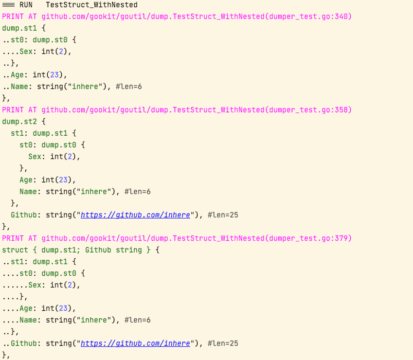
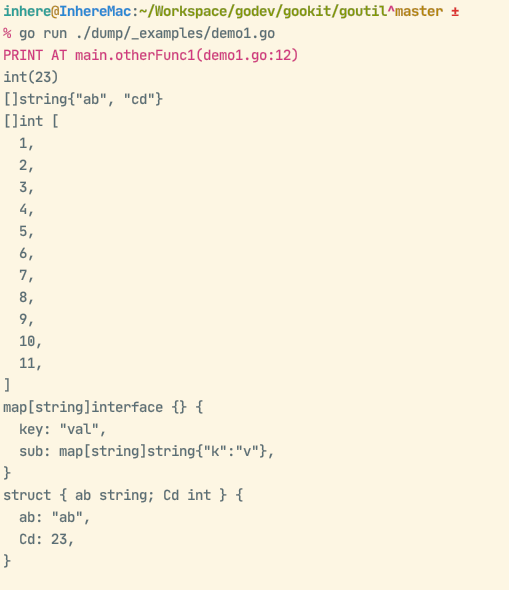

<!--@nrg.languages=en,zh-CN-->
<!--@nrg.defaultLanguage=en-->
# GoUtil<!--en-->
<!--en-->
<!--en-->
[](https://github.com/gookit/goutil)<!--en-->
[](https://goreportcard.com/report/github.com/gookit/goutil)<!--en-->
[](https://github.com/gookit/goutil/actions)<!--en-->
[](https://coveralls.io/github/gookit/goutil?branch=master)<!--en-->
[](https://pkg.go.dev/github.com/gookit/goutil)<!--en-->
<!--en-->
💪 Useful utils(**900+**) package for the Go: int, string, array/slice, map, struct, reflect, error, time, format, CLI, ENV, filesystem, system, testing and more.<!--en-->
<!--en-->
> **[中文说明](README.zh-CN.md)**<!--en-->
<!--en-->
## Packages<!--en-->
<!--en-->
### Basic packages<!--en-->
<!--en-->
- [`arrutil`](arrutil): Array/Slice util functions. eg: check, convert, formatting, enum, collections<!--en-->
- [`byteutil`](byteutil): Provide some common bytes util functions. eg: convert, check and more<!--en-->
- [`maputil`](maputil) Map data util functions. eg: convert, sub-value get, simple merge<!--en-->
- [`mathutil`](mathutil) Math(int, number) util functions. eg: convert, math calc, random<!--en-->
- [`reflects`](reflects) Provide extends reflect util functions.<!--en-->
- [`structs`](structs) Provide some extends util functions for struct. eg: tag parse, struct data init<!--en-->
- [`strutil`](strutil) String util functions. eg: bytes, check, convert, encode, format and more<!--en-->
- [`sysutil`](sysutil) System util functions. eg: sysenv, exec, user, process<!--en-->
- [`cliutil`](cliutil) Command-line util functions. eg: colored print, read input, exec command<!--en-->
- [`envutil`](envutil) ENV util for current runtime env information. eg: get one, get info, parse var<!--en-->
- [`fsutil`](fsutil) Filesystem util functions, quick create, read and write file. eg: file and dir check, operate<!--en-->
- [`jsonutil`](jsonutil) Provide some util functions for quick read, write, encode, decode JSON data.<!--en-->
<!--en-->
### Debug & Test & Errors<!--en-->
<!--en-->
- [`dump`](dump): GO value printing tool. print slice, map will auto wrap each element and display the call location<!--en-->
- [`errorx`](errorx) Provide an enhanced error implements for go, allow with stacktrace and wrap another error.<!--en-->
- [`assert`](testutil/assert) Provides commonly asserts functions for help testing<!--en-->
- [`testutil`](testutil) Test help util functions. eg: http test, mock ENV value<!--en-->
- [`fakeobj`](x/fakeobj) provides a fake object for testing. such as fake fs.File, fs.FileInfo, fs.DirEntry etc.<!--en-->
<!--en-->
### Extra Tools packages<!--en-->
<!--en-->
- [`cflag`](cflag):  Wraps and extends go `flag.FlagSet` to build simple command line applications<!--en-->
- [`ccolor`](x/ccolor): Simple command-line color output library that uses ANSI color codes to output text with colors.<!--en-->
- [`timex`](timex) Provides an enhanced time.Time implementation. Add more commonly used functional methods<!--en-->
  - Provides datetime format parsing like `Y-m-d H:i:s`<!--en-->
  - such as: DayStart(), DayAfter(), DayAgo(), DateFormat() and more.<!--en-->
- [httpreq](netutil/httpreq) An easier-to-use HTTP client that wraps http.Client, and with some http utils.<!--en-->
- [syncs](syncs) Provides synchronization primitives util functions.<!--en-->
<!--en-->
**More ...**<!--en-->
<!--en-->
- [`cmdline`](cliutil/cmdline) Provide cmdline parse, args build to cmdline<!--en-->
- [`encodes`](encodes): Provide some encoding/decoding, hash, crypto util functions. eg: base64, hex, etc.<!--en-->
- [`finder`](x/finder) Provides a simple and convenient file/dir lookup function, supports filtering, excluding, matching, ignoring, etc.<!--en-->
- [`netutil`](netutil) Network util functions. eg: Ip, IpV4, IpV6, Mac, Port, Hostname, etc.<!--en-->
- [`textutil`](strutil/textutil) Provide some extensions text handle util functions. eg: text replace, etc.<!--en-->
- [`textscan`](strutil/textscan) Implemented a parser that quickly scans and analyzes text content. It can be used to parse INI, Properties and other formats<!--en-->
- [`cmdr`](sysutil/cmdr) Provide for quick build and run a cmd, batch run multi cmd tasks<!--en-->
- [`clipboard`](x/clipboard) Provide a simple clipboard read and write operations.<!--en-->
- [`process`](sysutil/process) Provide some process handle util functions.<!--en-->
- [`fmtutil`](x/fmtutil) Format data util functions. eg: data, size, time<!--en-->
- [`goinfo`](x/goinfo) provide some standard util functions for go.<!--en-->
<!--en-->
## Go Doc<!--en-->
<!--en-->
Please see [Go doc](https://pkg.go.dev/github.com/gookit/goutil).<!--en-->
Wiki docs on [ZRead.ai - gookit/goutil](https://zread.ai/gookit/goutil)<!--en-->
<!--en-->
## Install<!--en-->
<!--en-->
```shell<!--en-->
go get github.com/gookit/goutil<!--en-->
```<!--en-->
<!--en-->
## Usage<!--en-->
<!--en-->
```go<!--en-->
// github.com/gookit/goutil<!--en-->
is.True(goutil.IsEmpty(nil))<!--en-->
is.False(goutil.IsEmpty("abc"))<!--en-->
<!--en-->
is.True(goutil.IsEqual("a", "a"))<!--en-->
is.True(goutil.IsEqual([]string{"a"}, []string{"a"}))<!--en-->
is.True(goutil.IsEqual(23, 23))<!--en-->
<!--en-->
is.True(goutil.Contains("abc", "a"))<!--en-->
is.True(goutil.Contains([]string{"abc", "def"}, "abc"))<!--en-->
is.True(goutil.Contains(map[int]string{2: "abc", 4: "def"}, 4))<!--en-->
<!--en-->
// convert type<!--en-->
str = goutil.String(23) // "23"<!--en-->
iVal = goutil.Int("-2") // 2<!--en-->
i64Val = goutil.Int64("-2") // -2<!--en-->
u64Val = goutil.Uint("2") // 2<!--en-->
```<!--en-->
<!--en-->
### Dump go variable<!--en-->
<!--en-->
```go<!--en-->
dump.Print(somevar, somevar2, ...)<!--en-->
```<!--en-->
<!--en-->
**dump nested struct**<!--en-->
<!--en-->
<!--en-->
<!--en-->
## Packages<!--en-->
<!--en-->
### Array and Slice<!--en-->
<!--en-->
> Package `github.com/gookit/goutil/arrutil`<!--en-->
<!--en-->
<details><summary>Click to see functions 👈</summary><!--en-->
<!--en-->
```go<!--en-->
// source at arrutil/arrutil.go<!--en-->
func GetRandomOne[T any](arr []T) T<!--en-->
func RandomOne[T any](arr []T) T<!--en-->
// source at arrutil/check.go<!--en-->
func SliceHas[T comdef.ScalarType](slice []T, val T) bool<!--en-->
func IntsHas[T comdef.Integer](ints []T, val T) bool<!--en-->
func Int64sHas(ints []int64, val int64) bool<!--en-->
func StringsHas[T ~string](ss []T, val T) bool<!--en-->
func InStrings[T ~string](elem T, ss []T) bool<!--en-->
func NotIn[T comdef.ScalarType](value T, list []T) bool<!--en-->
func In[T comdef.ScalarType](value T, list []T) bool<!--en-->
func ContainsAll[T comdef.ScalarType](list, values []T) bool<!--en-->
func IsSubList[T comdef.ScalarType](values, list []T) bool<!--en-->
func IsParent[T comdef.ScalarType](values, list []T) bool<!--en-->
func HasValue(arr, val any) bool<!--en-->
func Contains(arr, val any) bool<!--en-->
func NotContains(arr, val any) bool<!--en-->
// source at arrutil/collection.go<!--en-->
func StringEqualsComparer(a, b string) int<!--en-->
func ValueEqualsComparer[T comdef.Compared](a, b T) int<!--en-->
func ReflectEqualsComparer[T any](a, b T) int<!--en-->
func ElemTypeEqualsComparer[T any](a, b T) int<!--en-->
func TwowaySearch[T any](data []T, item T, fn Comparer[T]) (int, error)<!--en-->
func CloneSlice[T any](data []T) []T<!--en-->
func Diff[T any](first, second []T, fn Comparer[T]) []T<!--en-->
func Differences[T any](first, second []T, fn Comparer[T]) []T<!--en-->
func Excepts[T any](first, second []T, fn Comparer[T]) []T<!--en-->
func Intersects[T any](first, second []T, fn Comparer[T]) []T<!--en-->
func Union[T any](first, second []T, fn Comparer[T]) []T<!--en-->
func Find[T any](source []T, fn Predicate[T]) (v T, err error)<!--en-->
func FindOrDefault[T any](source []T, fn Predicate[T], defaultValue T) T<!--en-->
func TakeWhile[T any](data []T, fn Predicate[T]) []T<!--en-->
func ExceptWhile[T any](data []T, fn Predicate[T]) []T<!--en-->
// source at arrutil/convert.go<!--en-->
func JoinStrings(sep string, ss ...string) string<!--en-->
func StringsJoin(sep string, ss ...string) string<!--en-->
func JoinTyped[T any](sep string, arr ...T) string<!--en-->
func JoinSlice(sep string, arr ...any) string<!--en-->
func IntsToString[T comdef.Integer](ints []T) string<!--en-->
func ToInt64s(arr any) (ret []int64, err error)<!--en-->
func MustToInt64s(arr any) []int64<!--en-->
func SliceToInt64s(arr []any) []int64<!--en-->
func ToMap[T any, K comdef.ScalarType, V any](list []T, mapFn func(T) (K, V)) map[K]V<!--en-->
func AnyToSlice(sl any) (ls []any, err error)<!--en-->
func AnyToStrings(arr any) []string<!--en-->
func MustToStrings(arr any) []string<!--en-->
func ToStrings(arr any) (ret []string, err error)<!--en-->
func SliceToStrings(arr []any) []string<!--en-->
func QuietStrings(arr []any) []string<!--en-->
func ConvType[T any, R any](arr []T, newElemTyp R) ([]R, error)<!--en-->
func AnyToString(arr any) string<!--en-->
func SliceToString(arr ...any) string<!--en-->
func ToString[T any](arr []T) string<!--en-->
func CombineToMap[K comdef.SortedType, V any](keys []K, values []V) map[K]V<!--en-->
func CombineToSMap(keys, values []string) map[string]string<!--en-->
// source at arrutil/format.go<!--en-->
func NewFormatter(arr any) *ArrFormatter<!--en-->
func FormatIndent(arr any, indent string) string<!--en-->
// source at arrutil/process.go<!--en-->
func Reverse[T any](ls []T)<!--en-->
func Remove[T comdef.Compared](ls []T, val T) []T<!--en-->
func Filter[T any](ls []T, filter ...comdef.MatchFunc[T]) []T<!--en-->
func Map[T, V any](list []T, mapFn MapFn[T, V]) []V<!--en-->
func Map1[T, R any](list []T, fn func(t T) R) []R<!--en-->
func Column[T any, V any](list []T, mapFn func(obj T) (val V, find bool)) []V<!--en-->
func Unique[T comdef.NumberOrString](list []T) []T<!--en-->
func IndexOf[T comdef.NumberOrString](val T, list []T) int<!--en-->
func FirstOr[T any](list []T, defVal ...T) T<!--en-->
// source at arrutil/strings.go<!--en-->
func StringsToAnys(ss []string) []any<!--en-->
func StringsToSlice(ss []string) []any<!--en-->
func StringsAsInts(ss []string) []int<!--en-->
func StringsToInts(ss []string) (ints []int, err error)<!--en-->
func StringsTryInts(ss []string) (ints []int, err error)<!--en-->
func StringsUnique(ss []string) []string<!--en-->
func StringsContains(ss []string, s string) bool<!--en-->
func StringsRemove(ss []string, s string) []string<!--en-->
func StringsFilter(ss []string, filter ...comdef.StringMatchFunc) []string<!--en-->
func StringsMap(ss []string, mapFn func(s string) string) []string<!--en-->
func TrimStrings(ss []string, cutSet ...string) []string<!--en-->
```<!--en-->
</details><!--en-->
<!--en-->
#### ArrUtil Usage<!--en-->
<!--en-->
**check value**:<!--en-->
<!--en-->
```go<!--en-->
arrutil.IntsHas([]int{2, 4, 5}, 2) // True<!--en-->
arrutil.Int64sHas([]int64{2, 4, 5}, 2) // True<!--en-->
arrutil.StringsHas([]string{"a", "b"}, "a") // True<!--en-->
<!--en-->
// list and val interface{}<!--en-->
arrutil.Contains(list, val)<!--en-->
arrutil.Contains([]uint32{9, 2, 3}, 9) // True<!--en-->
```<!--en-->
<!--en-->
**convert**:<!--en-->
<!--en-->
```go<!--en-->
ints, err := arrutil.ToInt64s([]string{"1", "2"}) // ints: []int64{1, 2} <!--en-->
ss, err := arrutil.ToStrings([]int{1, 2}) // ss: []string{"1", "2"}<!--en-->
```<!--en-->
<!--en-->
<!--en-->
<!--en-->
### Bytes Utils<!--en-->
<!--en-->
> Package `github.com/gookit/goutil/byteutil`<!--en-->
<!--en-->
<details><summary>Click to see functions 👈</summary><!--en-->
<!--en-->
```go<!--en-->
// source at byteutil/buffer.go<!--en-->
func NewBuffer() *Buffer<!--en-->
// source at byteutil/byteutil.go<!--en-->
func Md5(src any) []byte<!--en-->
func Md5Sum(src any) []byte<!--en-->
func ShortMd5(src any) []byte<!--en-->
func Random(length int) ([]byte, error)<!--en-->
func FirstLine(bs []byte) []byte<!--en-->
func AppendAny(dst []byte, v any) []byte<!--en-->
func Cut(bs []byte, sep byte) (before, after []byte, found bool)<!--en-->
func SafeCut(bs []byte, sep byte) (before, after []byte)<!--en-->
func SafeCuts(bs []byte, sep []byte) (before, after []byte)<!--en-->
// source at byteutil/check.go<!--en-->
func IsNumChar(c byte) bool<!--en-->
func IsAlphaChar(c byte) bool<!--en-->
// source at byteutil/conv.go<!--en-->
func StrOrErr(bs []byte, err error) (string, error)<!--en-->
func SafeString(bs []byte, err error) string<!--en-->
func String(b []byte) string<!--en-->
func ToString(b []byte) string<!--en-->
func ToBytes(v any) ([]byte, error)<!--en-->
func SafeBytes(v any) []byte<!--en-->
func ToBytesWithFunc(v any, usrFn ToBytesFunc) ([]byte, error)<!--en-->
// source at byteutil/encoder.go<!--en-->
func NewStdEncoder(encFn BytesEncodeFunc, decFn BytesDecodeFunc) *StdEncoder<!--en-->
// source at byteutil/pool.go<!--en-->
func NewChanPool(chSize int, width int, capWidth int) *ChanPool<!--en-->
```<!--en-->
</details><!--en-->
<!--en-->
<!--en-->
### Cflag<!--en-->
<!--en-->
> Package `github.com/gookit/goutil/cflag`<!--en-->
<!--en-->
`cflag` - Wraps and extends go `flag.FlagSet` to build simple command line applications<!--en-->
<!--en-->
<!--en-->
<details><summary>Click to see functions 👈</summary><!--en-->
<!--en-->
```go<!--en-->
// source at cflag/cflag.go<!--en-->
func New(fns ...func(c *CFlags)) *CFlags<!--en-->
func NewWith(name, version, desc string, fns ...func(c *CFlags)) *CFlags<!--en-->
func NewEmpty(fns ...func(c *CFlags)) *CFlags<!--en-->
func WithDesc(desc string) func(c *CFlags)<!--en-->
func WithVersion(version string) func(c *CFlags)<!--en-->
// source at cflag/ext.go<!--en-->
func LimitInt(min, max int) comdef.IntCheckFunc<!--en-->
func NewIntVar(checkFn comdef.IntCheckFunc) IntVar<!--en-->
func NewStrVar(checkFn comdef.StrCheckFunc) StrVar<!--en-->
func NewEnumString(enum ...string) EnumString<!--en-->
func NewKVString() KVString<!--en-->
func Value<!--en-->
// source at cflag/optarg.go<!--en-->
func NewArg(name, desc string, required bool) *FlagArg<!--en-->
// source at cflag/util.go<!--en-->
func SetDebug(open bool)<!--en-->
func DebugMsg(format string, args ...any)<!--en-->
func IsGoodName(name string) bool<!--en-->
func IsZeroValue(opt *flag.Flag, value string) (bool, bool)<!--en-->
func AddPrefix(name string) string<!--en-->
func AddPrefixes(name string, shorts []string) string<!--en-->
func AddPrefixes2(name string, shorts []string, nameAtEnd bool) string<!--en-->
func SplitShortcut(shortcut string) []string<!--en-->
func FilterNames(names []string) []string<!--en-->
func IsFlagHelpErr(err error) bool<!--en-->
func WrapColorForCode(s string) string<!--en-->
func ReplaceShorts(args []string, shortsMap map[string]string) []string<!--en-->
```<!--en-->
</details><!--en-->
<!--en-->
#### `cflag` Usage<!--en-->
<!--en-->
`cflag` usage please see [cflag/README.md](cflag/README.md)<!--en-->
<!--en-->
<!--en-->
<!--en-->
### CLI Utils<!--en-->
<!--en-->
> Package `github.com/gookit/goutil/cliutil`<!--en-->
<!--en-->
<details><summary>Click to see functions 👈</summary><!--en-->
<!--en-->
```go<!--en-->
// source at cliutil/cliutil.go<!--en-->
func SplitMulti(ss []string, sep string) []string<!--en-->
func LineBuild(binFile string, args []string) string<!--en-->
func BuildLine(binFile string, args []string) string<!--en-->
func String2OSArgs(line string) []string<!--en-->
func StringToOSArgs(line string) []string<!--en-->
func ParseLine(line string) []string<!--en-->
func QuickExec(cmdLine string, workDir ...string) (string, error)<!--en-->
func ExecLine(cmdLine string, workDir ...string) (string, error)<!--en-->
func ExecCmd(binName string, args []string, workDir ...string) (string, error)<!--en-->
func ExecCommand(binName string, args []string, workDir ...string) (string, error)<!--en-->
func ShellExec(cmdLine string, shells ...string) (string, error)<!--en-->
func CurrentShell(onlyName bool) (path string)<!--en-->
func HasShellEnv(shell string) bool<!--en-->
func BuildOptionHelpName(names []string) string<!--en-->
func ShellQuote(s string) string<!--en-->
func OutputLines(output string) []string<!--en-->
// source at cliutil/info.go<!--en-->
func Workdir() string<!--en-->
func BinDir() string<!--en-->
func BinFile() string<!--en-->
func BinName() string<!--en-->
func GetTermSize(refresh ...bool) (w int, h int)<!--en-->
// source at cliutil/read.go<!--en-->
func ReadInput(question string) (string, error)<!--en-->
func ReadLine(question string) (string, error)<!--en-->
func ReadFirst(question string) (string, error)<!--en-->
func ReadFirstByte(question string) (byte, error)<!--en-->
func ReadFirstRune(question string) (rune, error)<!--en-->
func ReadAsBool(tip string, defVal bool) bool<!--en-->
func Confirm(tip string, defVal ...bool) bool<!--en-->
func InputIsYes(ans string) bool<!--en-->
func ByteIsYes(ans byte) bool<!--en-->
func ReadPassword(question ...string) string<!--en-->
```<!--en-->
</details><!--en-->
<!--en-->
<!--en-->
#### CLI Util Usage<!--en-->
<!--en-->
**helper functions:**<!--en-->
<!--en-->
```go<!--en-->
cliutil.Workdir() // current workdir<!--en-->
cliutil.BinDir() // the program exe file dir<!--en-->
<!--en-->
cliutil.ReadInput("Your name?")<!--en-->
cliutil.ReadPassword("Input password:")<!--en-->
ans, _ := cliutil.ReadFirstByte("continue?[y/n] ")<!--en-->
```<!--en-->
<!--en-->
**cmdline parse:**<!--en-->
<!--en-->
```go<!--en-->
package main<!--en-->
<!--en-->
import (<!--en-->
	"fmt"<!--en-->
<!--en-->
	"github.com/gookit/goutil/cliutil"<!--en-->
	"github.com/gookit/goutil/dump"<!--en-->
)<!--en-->
<!--en-->
func main() {<!--en-->
	args := cliutil.ParseLine(`./app top sub --msg "has multi words"`)<!--en-->
	dump.P(args)<!--en-->
<!--en-->
	s := cliutil.BuildLine("./myapp", []string{<!--en-->
		"-a", "val0",<!--en-->
		"-m", "this is message",<!--en-->
		"arg0",<!--en-->
	})<!--en-->
	fmt.Println("Build line:", s)<!--en-->
}<!--en-->
```<!--en-->
<!--en-->
**output**:<!--en-->
<!--en-->
```shell<!--en-->
PRINT AT github.com/gookit/goutil/cliutil_test.TestParseLine(line_parser_test.go:30)<!--en-->
[]string [ #len=5<!--en-->
  string("./app"), #len=5<!--en-->
  string("top"), #len=3<!--en-->
  string("sub"), #len=3<!--en-->
  string("--msg"), #len=5<!--en-->
  string("has multi words"), #len=15<!--en-->
]<!--en-->
<!--en-->
Build line: ./myapp -a val0 -m "this is message" arg0<!--en-->
```<!--en-->
<!--en-->
> More, please see [./cliutil/README](cliutil/README.md)<!--en-->
<!--en-->
<!--en-->
### Var Dumper<!--en-->
<!--en-->
> Package `github.com/gookit/goutil/dump`<!--en-->
<!--en-->
<details><summary>Click to see functions 👈</summary><!--en-->
<!--en-->
```go<!--en-->
// source at dump/dump.go<!--en-->
func Std() *Dumper<!--en-->
func Reset()<!--en-->
func Config(fns ...OptionFunc)<!--en-->
func Print(vs ...any)<!--en-->
func Println(vs ...any)<!--en-->
func Fprint(w io.Writer, vs ...any)<!--en-->
func Std2() *Dumper<!--en-->
func Reset2()<!--en-->
func Format(vs ...any) string<!--en-->
func NoLoc(vs ...any)<!--en-->
func Clear(vs ...any)<!--en-->
// source at dump/dumper.go<!--en-->
func NewDumper(out io.Writer, skip int) *Dumper<!--en-->
func NewWithOptions(fns ...OptionFunc) *Dumper<!--en-->
// source at dump/options.go<!--en-->
func NewDefaultOptions(out io.Writer, skip int) *Options<!--en-->
func SkipNilField() OptionFunc<!--en-->
func SkipPrivate() OptionFunc<!--en-->
func BytesAsString() OptionFunc<!--en-->
func WithCallerSkip(skip int) OptionFunc<!--en-->
func WithoutPosition() OptionFunc<!--en-->
func WithoutOutput(out io.Writer) OptionFunc<!--en-->
func WithoutColor() OptionFunc<!--en-->
func WithoutType() OptionFunc<!--en-->
func WithoutLen() OptionFunc<!--en-->
```<!--en-->
</details><!--en-->
<!--en-->
#### Examples<!--en-->
<!--en-->
example code:<!--en-->
<!--en-->
```go<!--en-->
package main<!--en-->
<!--en-->
import "github.com/gookit/goutil/dump"<!--en-->
<!--en-->
// rum demo:<!--en-->
// 	go run ./dump/_examples/demo1.go<!--en-->
func main() {<!--en-->
	otherFunc1()<!--en-->
}<!--en-->
<!--en-->
func otherFunc1() {<!--en-->
	dump.P(<!--en-->
		23,<!--en-->
		[]string{"ab", "cd"},<!--en-->
		[]int{1, 2, 3, 4, 5, 6, 7, 8, 9, 10, 11}, // len > 10<!--en-->
		map[string]interface{}{<!--en-->
			"key": "val", "sub": map[string]string{"k": "v"},<!--en-->
		},<!--en-->
		struct {<!--en-->
			ab string<!--en-->
			Cd int<!--en-->
		}{<!--en-->
			"ab", 23,<!--en-->
		},<!--en-->
	)<!--en-->
}<!--en-->
```<!--en-->
<!--en-->
Preview:<!--en-->
<!--en-->
<!--en-->
<!--en-->
**nested struct**<!--en-->
<!--en-->
> source code at `dump/dumper_test.TestStruct_WithNested`<!--en-->
<!--en-->
<!--en-->
<!--en-->
<!--en-->
<!--en-->
### ENV/Environment<!--en-->
<!--en-->
> Package `github.com/gookit/goutil/envutil`<!--en-->
<!--en-->
<details><summary>Click to see functions 👈</summary><!--en-->
<!--en-->
```go<!--en-->
// source at envutil/envutil.go<!--en-->
func VarReplace(s string) string<!--en-->
func ParseOrErr(val string) (string, error)<!--en-->
func ParseValue(val string) string<!--en-->
func VarParse(val string) string<!--en-->
func ParseEnvValue(val string) string<!--en-->
func SplitText2map(text string) map[string]string<!--en-->
func SplitLineToKv(line string) (string, string)<!--en-->
// source at envutil/get.go<!--en-->
func Getenv(name string, def ...string) string<!--en-->
func MustGet(name string) string<!--en-->
func GetInt(name string, def ...int) int<!--en-->
func GetBool(name string, def ...bool) bool<!--en-->
func GetOne(names []string, defVal ...string) string<!--en-->
func GetMulti(names ...string) map[string]string<!--en-->
func OnExist(name string, fn func(val string)) bool<!--en-->
func EnvPaths() []string<!--en-->
func EnvMap() map[string]string<!--en-->
func Environ() map[string]string<!--en-->
func SearchEnvKeys(keywords string) map[string]string<!--en-->
func SearchEnv(keywords string, matchValue bool) map[string]string<!--en-->
// source at envutil/info.go<!--en-->
func IsWin() bool<!--en-->
func IsWindows() bool<!--en-->
func IsMac() bool<!--en-->
func IsLinux() bool<!--en-->
func IsMSys() bool<!--en-->
func IsTerminal(fd uintptr) bool<!--en-->
func StdIsTerminal() bool<!--en-->
func IsConsole(out io.Writer) bool<!--en-->
func HasShellEnv(shell string) bool<!--en-->
func IsSupportColor() bool<!--en-->
func IsSupport256Color() bool<!--en-->
func IsSupportTrueColor() bool<!--en-->
func IsGithubActions() bool<!--en-->
// source at envutil/set.go<!--en-->
func SetEnvMap(mp map[string]string)<!--en-->
func SetEnvs(kvPairs ...string)<!--en-->
func UnsetEnvs(keys ...string)<!--en-->
func LoadText(text string)<!--en-->
func LoadString(line string) bool<!--en-->
```<!--en-->
</details><!--en-->
<!--en-->
#### ENV Util Usage<!--en-->
<!--en-->
**helper functions:**<!--en-->
<!--en-->
```go<!--en-->
envutil.IsWin()<!--en-->
envutil.IsMac()<!--en-->
envutil.IsLinux()<!--en-->
<!--en-->
// get ENV value by key, can with default value<!--en-->
envutil.Getenv("APP_ENV", "dev")<!--en-->
envutil.GetInt("LOG_LEVEL", 1)<!--en-->
envutil.GetBool("APP_DEBUG", true)<!--en-->
<!--en-->
// parse ENV var value from input string, support default value.<!--en-->
envutil.ParseValue("${ENV_NAME | defValue}")<!--en-->
```<!--en-->
<!--en-->
<!--en-->
<!--en-->
### Errorx<!--en-->
<!--en-->
> Package `github.com/gookit/goutil/errorx`<!--en-->
<!--en-->
`errorx` provides an enhanced error reporting implementation that contains call stack information and can wrap the previous level of error.<!--en-->
<!--en-->
> Additional call stack information is included when printing errors, making it easy to log and find problems.<!--en-->
<!--en-->
<!--en-->
<details><summary>Click to see functions 👈</summary><!--en-->
<!--en-->
```go<!--en-->
// source at errorx/assert.go<!--en-->
func IsTrue(result bool, fmtAndArgs ...any) error<!--en-->
func IsFalse(result bool, fmtAndArgs ...any) error<!--en-->
func IsIn[T comdef.ScalarType](value T, list []T, fmtAndArgs ...any) error<!--en-->
func NotIn[T comdef.ScalarType](value T, list []T, fmtAndArgs ...any) error<!--en-->
// source at errorx/errors.go<!--en-->
func NewR(code int, msg string) ErrorR<!--en-->
func Fail(code int, msg string) ErrorR<!--en-->
func Failf(code int, tpl string, v ...any) ErrorR<!--en-->
func Suc(msg string) ErrorR<!--en-->
// source at errorx/errorx.go<!--en-->
func New(msg string) error<!--en-->
func Newf(tpl string, vars ...any) error<!--en-->
func Errorf(tpl string, vars ...any) error<!--en-->
func With(err error, msg string) error<!--en-->
func Withf(err error, tpl string, vars ...any) error<!--en-->
func WithPrev(err error, msg string) error<!--en-->
func WithPrevf(err error, tpl string, vars ...any) error<!--en-->
func WithStack(err error) error<!--en-->
func Traced(err error) error<!--en-->
func Stacked(err error) error<!--en-->
func WithOptions(msg string, fns ...func(opt *ErrStackOpt)) error<!--en-->
func Wrap(err error, msg string) error<!--en-->
func Wrapf(err error, tpl string, vars ...any) error<!--en-->
// source at errorx/stack.go<!--en-->
func FuncForPC(pc uintptr) *Func<!--en-->
func ResetStdOpt()<!--en-->
func Config(fns ...func(opt *ErrStackOpt))<!--en-->
func SkipDepth(skipDepth int) func(opt *ErrStackOpt)<!--en-->
func TraceDepth(traceDepth int) func(opt *ErrStackOpt)<!--en-->
// source at errorx/util.go<!--en-->
func Err(msg string) error<!--en-->
func Raw(msg string) error<!--en-->
func Ef(tpl string, vars ...any) error<!--en-->
func Errf(tpl string, vars ...any) error<!--en-->
func Rf(tpl string, vs ...any) error<!--en-->
func Rawf(tpl string, vs ...any) error<!--en-->
func Cause(err error) error<!--en-->
func Unwrap(err error) error<!--en-->
func Previous(err error) error<!--en-->
func IsErrorX(err error) (ok bool)<!--en-->
func ToErrorX(err error) (ex *ErrorX, ok bool)<!--en-->
func MustEX(err error) *ErrorX<!--en-->
func Has(err, target error) bool<!--en-->
func Is(err, target error) bool<!--en-->
func To(err error, target any) bool<!--en-->
func As(err error, target any) bool<!--en-->
```<!--en-->
</details><!--en-->
<!--en-->
<!--en-->
#### Errorx Usage<!--en-->
<!--en-->
**Create error with call stack info**<!--en-->
<!--en-->
- use the `errorx.New` instead `errors.New`<!--en-->
<!--en-->
```go<!--en-->
func doSomething() error {<!--en-->
    if false {<!--en-->
	    // return errors.New("a error happen")<!--en-->
	    return errorx.New("a error happen")<!--en-->
	}<!--en-->
}<!--en-->
```<!--en-->
<!--en-->
- use the `errorx.Newf` or `errorx.Errorf` instead `fmt.Errorf`<!--en-->
<!--en-->
```go<!--en-->
func doSomething() error {<!--en-->
    if false {<!--en-->
	    // return fmt.Errorf("a error %s", "happen")<!--en-->
	    return errorx.Newf("a error %s", "happen")<!--en-->
	}<!--en-->
}<!--en-->
```<!--en-->
<!--en-->
**Wrap the previous error**<!--en-->
<!--en-->
used like this before:<!--en-->
<!--en-->
```go<!--en-->
    if err := SomeFunc(); err != nil {<!--en-->
	    return err<!--en-->
	}<!--en-->
```<!--en-->
<!--en-->
can be replaced with:<!--en-->
<!--en-->
```go<!--en-->
    if err := SomeFunc(); err != nil {<!--en-->
	    return errors.Stacked(err)<!--en-->
	}<!--en-->
```<!--en-->
<!--en-->
**Print the errorx.New() error**<!--en-->
<!--en-->
Examples for use `errorx` package, more please see [./errorx/README](errorx/README.md)<!--en-->
<!--en-->
```go<!--en-->
    err := errorx.New("the error message")<!--en-->
<!--en-->
    fmt.Println(err)<!--en-->
    // fmt.Printf("%v\n", err)<!--en-->
    // fmt.Printf("%#v\n", err)<!--en-->
```<!--en-->
<!--en-->
> from the test: `errorx/errorx_test.TestNew()`<!--en-->
<!--en-->
**Output**:<!--en-->
<!--en-->
```text<!--en-->
the error message<!--en-->
STACK:<!--en-->
github.com/gookit/goutil/errorx_test.returnXErr()<!--en-->
  /Users/inhere/Workspace/godev/gookit/goutil/errorx/errorx_test.go:21<!--en-->
github.com/gookit/goutil/errorx_test.returnXErrL2()<!--en-->
  /Users/inhere/Workspace/godev/gookit/goutil/errorx/errorx_test.go:25<!--en-->
github.com/gookit/goutil/errorx_test.TestNew()<!--en-->
  /Users/inhere/Workspace/godev/gookit/goutil/errorx/errorx_test.go:29<!--en-->
testing.tRunner()<!--en-->
  /usr/local/Cellar/go/1.18/libexec/src/testing/testing.go:1439<!--en-->
runtime.goexit()<!--en-->
  /usr/local/Cellar/go/1.18/libexec/src/runtime/asm_amd64.s:1571<!--en-->
```<!--en-->
<!--en-->
<!--en-->
<!--en-->
### File System<!--en-->
<!--en-->
> Package `github.com/gookit/goutil/fsutil`<!--en-->
<!--en-->
Package `fsutil` Filesystem util functions: quick check, create, read and write file. eg: file and dir check, operate<!--en-->
<!--en-->
<!--en-->
<details><summary>Click to see functions 👈</summary><!--en-->
<!--en-->
```go<!--en-->
// source at fsutil/check.go<!--en-->
func PathExists(path string) bool<!--en-->
func IsDir(path string) bool<!--en-->
func FileExists(path string) bool<!--en-->
func IsFile(path string) bool<!--en-->
func IsSymlink(path string) bool<!--en-->
func IsAbsPath(aPath string) bool<!--en-->
func IsEmptyDir(dirPath string) bool<!--en-->
func IsImageFile(path string) bool<!--en-->
func IsZipFile(filepath string) bool<!--en-->
func PathMatch(pattern, s string) bool<!--en-->
// source at fsutil/define.go<!--en-->
func NewEntry(fPath string, ent fs.DirEntry) Entry<!--en-->
func NewFileInfo(fPath string, info fs.FileInfo) FileInfo<!--en-->
// source at fsutil/find.go<!--en-->
func FilePathInDirs(fPath string, dirs ...string) string<!--en-->
func FirstExists(paths ...string) string<!--en-->
func FirstExistsDir(paths ...string) string<!--en-->
func FirstExistsFile(paths ...string) string<!--en-->
func MatchPaths(paths []string, matcher PathMatchFunc) []string<!--en-->
func MatchFirst(paths []string, matcher PathMatchFunc, defaultPath string) string<!--en-->
func FindAllInParentDirs(dirPath, name string, optFns ...FindParentOptFn) []string<!--en-->
func FindOneInParentDirs(dirPath, name string, optFns ...FindParentOptFn) string<!--en-->
func FindNameInParentDirs(dirPath, name string, collectFn func(fullPath string), optFns ...FindParentOptFn)<!--en-->
func FindInParentDirs(dirPath string, matchFunc func(dir string) bool, maxLevel int)<!--en-->
func SearchNameUp(dirPath, name string) string<!--en-->
func SearchNameUpx(dirPath, name string) (string, bool)<!--en-->
func WalkDir(dir string, fn fs.WalkDirFunc) error<!--en-->
func Glob(pattern string, fls ...NameMatchFunc) []string<!--en-->
func GlobWithFunc(pattern string, fn func(filePath string) error) (err error)<!--en-->
func OnlyFindDir(_ string, ent fs.DirEntry) bool<!--en-->
func OnlyFindFile(_ string, ent fs.DirEntry) bool<!--en-->
func ExcludeNames(names ...string) FilterFunc<!--en-->
func IncludeSuffix(ss ...string) FilterFunc<!--en-->
func ExcludeDotFile(_ string, ent fs.DirEntry) bool<!--en-->
func ExcludeSuffix(ss ...string) FilterFunc<!--en-->
func ApplyFilters(fPath string, ent fs.DirEntry, filters []FilterFunc) bool<!--en-->
func FindInDir(dir string, handleFn HandleFunc, filters ...FilterFunc) (e error)<!--en-->
func FileInDirs(paths []string, names ...string) string<!--en-->
// source at fsutil/fsutil.go<!--en-->
func JoinPaths(elem ...string) string<!--en-->
func JoinPaths3(basePath, secPath string, elems ...string) string<!--en-->
func JoinSubPaths(basePath string, elems ...string) string<!--en-->
func SlashPath(path string) string<!--en-->
func UnixPath(path string) string<!--en-->
func ToAbsPath(p string) string<!--en-->
func Must2(_ any, err error)<!--en-->
// source at fsutil/info.go<!--en-->
func DirPath(fPath string) string<!--en-->
func Dir(fPath string) string<!--en-->
func PathName(fPath string) string<!--en-->
func PathNoExt(fPath string) string<!--en-->
func Name(fPath string) string<!--en-->
func NameNoExt(fPath string) string<!--en-->
func FileExt(fPath string) string<!--en-->
func Extname(fPath string) string<!--en-->
func Suffix(fPath string) string<!--en-->
func Expand(pathStr string) string<!--en-->
func ExpandHome(pathStr string) string<!--en-->
func ExpandPath(pathStr string) string<!--en-->
func ResolvePath(pathStr string) string<!--en-->
func SplitPath(pathStr string) (dir, name string)<!--en-->
func UserHomeDir() string<!--en-->
func HomeDir() string<!--en-->
// source at fsutil/info_nonwin.go<!--en-->
func Realpath(pathStr string) string<!--en-->
// source at fsutil/mime.go<!--en-->
func DetectMime(path string) string<!--en-->
func MimeType(path string) (mime string)<!--en-->
func ReaderMimeType(r io.Reader) (mime string)<!--en-->
// source at fsutil/operate.go<!--en-->
func Mkdir(dirPath string, perm fs.FileMode) error<!--en-->
func MkdirQuick(dirPath string) error<!--en-->
func EnsureDir(path string) error<!--en-->
func MkDirs(perm fs.FileMode, dirPaths ...string) error<!--en-->
func MkSubDirs(perm fs.FileMode, parentDir string, subDirs ...string) error<!--en-->
func MkParentDir(fpath string) error<!--en-->
func NewOpenOption(optFns ...OpenOptionFunc) *OpenOption<!--en-->
func OpenOptOrNew(opt *OpenOption) *OpenOption<!--en-->
func WithFlag(flag int) OpenOptionFunc<!--en-->
func WithPerm(perm os.FileMode) OpenOptionFunc<!--en-->
func OpenFile(filePath string, flag int, perm os.FileMode) (*os.File, error)<!--en-->
func MustOpenFile(filePath string, flag int, perm os.FileMode) *os.File<!--en-->
func QuickOpenFile(filepath string, fileFlag ...int) (*os.File, error)<!--en-->
func OpenAppendFile(filepath string, filePerm ...os.FileMode) (*os.File, error)<!--en-->
func OpenTruncFile(filepath string, filePerm ...os.FileMode) (*os.File, error)<!--en-->
func OpenReadFile(filepath string) (*os.File, error)<!--en-->
func CreateFile(fpath string, filePerm, dirPerm os.FileMode, fileFlag ...int) (*os.File, error)<!--en-->
func MustCreateFile(filePath string, filePerm, dirPerm os.FileMode) *os.File<!--en-->
func Remove(fPath string) error<!--en-->
func MustRemove(fPath string)<!--en-->
func QuietRemove(fPath string)<!--en-->
func SafeRemoveAll(path string)<!--en-->
func RmIfExist(fPath string) error<!--en-->
func DeleteIfExist(fPath string) error<!--en-->
func RmFileIfExist(fPath string) error<!--en-->
func DeleteIfFileExist(fPath string) error<!--en-->
func RemoveSub(dirPath string, fns ...FilterFunc) error<!--en-->
func Unzip(archive, targetDir string) (err error)<!--en-->
// source at fsutil/opread.go<!--en-->
func NewIOReader(in any) (r io.Reader, err error)<!--en-->
func DiscardReader(src io.Reader)<!--en-->
func ReadFile(filePath string) []byte<!--en-->
func MustReadFile(filePath string) []byte<!--en-->
func ReadReader(r io.Reader) []byte<!--en-->
func MustReadReader(r io.Reader) []byte<!--en-->
func ReadString(in any) string<!--en-->
func ReadStringOrErr(in any) (string, error)<!--en-->
func ReadAll(in any) []byte<!--en-->
func GetContents(in any) []byte<!--en-->
func MustRead(in any) []byte<!--en-->
func ReadOrErr(in any) ([]byte, error)<!--en-->
func ReadExistFile(filePath string) []byte<!--en-->
func TextScanner(in any) *scanner.Scanner<!--en-->
func LineScanner(in any) *bufio.Scanner<!--en-->
// source at fsutil/opwrite.go<!--en-->
func OSTempFile(pattern string) (*os.File, error)<!--en-->
func TempFile(dir, pattern string) (*os.File, error)<!--en-->
func OSTempDir(pattern string) (string, error)<!--en-->
func TempDir(dir, pattern string) (string, error)<!--en-->
func MustSave(filePath string, data any, optFns ...OpenOptionFunc)<!--en-->
func SaveFile(filePath string, data any, optFns ...OpenOptionFunc) error<!--en-->
func WriteData(filePath string, data any, fileFlag ...int) (int, error)<!--en-->
func PutContents(filePath string, data any, fileFlag ...int) (int, error)<!--en-->
func WriteFile(filePath string, data any, perm os.FileMode, fileFlag ...int) error<!--en-->
func WriteOSFile(f *os.File, data any) (n int, err error)<!--en-->
func CopyFile(srcPath, dstPath string) error<!--en-->
func MustCopyFile(srcPath, dstPath string)<!--en-->
func UpdateContents(filePath string, handleFn func(bs []byte) []byte) error<!--en-->
func CreateSymlink(target, linkPath string) error<!--en-->
```<!--en-->
</details><!--en-->
<!--en-->
<!--en-->
#### FsUtil Usage<!--en-->
<!--en-->
**files finder:**<!--en-->
<!--en-->
```go<!--en-->
package main<!--en-->
<!--en-->
import (<!--en-->
	"fmt"<!--en-->
	"io/fs"<!--en-->
<!--en-->
	"github.com/gookit/goutil/fsutil"<!--en-->
)<!--en-->
<!--en-->
func main() {<!--en-->
	// find all files in dir<!--en-->
	fsutil.FindInDir("./", func(filePath string, de fs.DirEntry) error {<!--en-->
		fmt.Println(filePath)<!--en-->
		return nil<!--en-->
	})<!--en-->
<!--en-->
	// find files with filters<!--en-->
	fsutil.FindInDir("./", func(filePath string, de fs.DirEntry) error {<!--en-->
		fmt.Println(filePath)<!--en-->
		return nil<!--en-->
	}, fsutil.ExcludeDotFile)<!--en-->
}<!--en-->
```<!--en-->
<!--en-->
<!--en-->
<!--en-->
### JSON Utils<!--en-->
<!--en-->
> Package `github.com/gookit/goutil/jsonutil`<!--en-->
<!--en-->
```go<!--en-->
// source at jsonutil/encoding.go<!--en-->
func MustString(v any) string<!--en-->
func Encode(v any) ([]byte, error)<!--en-->
func EncodePretty(v any) ([]byte, error)<!--en-->
func EncodeString(v any) (string, error)<!--en-->
func EncodeToWriter(v any, w io.Writer) error<!--en-->
func EncodeUnescapeHTML(v any) ([]byte, error)<!--en-->
func Decode(bts []byte, ptr any) error<!--en-->
func DecodeString(str string, ptr any) error<!--en-->
func DecodeReader(r io.Reader, ptr any) error<!--en-->
func DecodeFile(file string, ptr any) error<!--en-->
// source at jsonutil/jsonutil.go<!--en-->
func WriteFile(filePath string, data any) error<!--en-->
func WritePretty(filePath string, data any) error<!--en-->
func ReadFile(filePath string, v any) error<!--en-->
func Pretty(v any) (string, error)<!--en-->
func MustPretty(v any) string<!--en-->
func Mapping(src, dst any) error<!--en-->
func IsJSON(s string) bool<!--en-->
func IsJSONFast(s string) bool<!--en-->
func IsArray(s string) bool<!--en-->
func IsObject(s string) bool<!--en-->
func StripComments(src string) string<!--en-->
```<!--en-->
<!--en-->
<!--en-->
### Maputil<!--en-->
<!--en-->
> Package `github.com/gookit/goutil/maputil`<!--en-->
<!--en-->
<details><summary>Click to see functions 👈</summary><!--en-->
<!--en-->
```go<!--en-->
// source at maputil/check.go<!--en-->
func HasKey(mp, key any) (ok bool)<!--en-->
func HasOneKey(mp any, keys ...any) (ok bool, key any)<!--en-->
func HasAllKeys(mp any, keys ...any) (ok bool, noKey any)<!--en-->
// source at maputil/convert.go<!--en-->
func KeyToLower(src map[string]string) map[string]string<!--en-->
func AnyToStrMap(src any) map[string]string<!--en-->
func ToStringMap(src map[string]any) map[string]string<!--en-->
func ToL2StringMap(groupsMap map[string]any) map[string]map[string]string<!--en-->
func CombineToSMap(keys, values []string) SMap<!--en-->
func CombineToMap[K comdef.SortedType, V any](keys []K, values []V) map[K]V<!--en-->
func SliceToSMap(kvPairs ...string) map[string]string<!--en-->
func SliceToMap(kvPairs ...any) map[string]any<!--en-->
func SliceToTypeMap[T any](valFunc func(any) T, kvPairs ...any) map[string]T<!--en-->
func ToAnyMap(mp any) map[string]any<!--en-->
func TryAnyMap(mp any) (map[string]any, error)<!--en-->
func HTTPQueryString(data map[string]any) string<!--en-->
func StringsMapToAnyMap(ssMp map[string][]string) map[string]any<!--en-->
func ToString(mp map[string]any) string<!--en-->
func ToString2(mp any) string<!--en-->
func FormatIndent(mp any, indent string) string<!--en-->
func Flatten(mp map[string]any) map[string]any<!--en-->
func FlatWithFunc(mp map[string]any, fn reflects.FlatFunc)<!--en-->
// source at maputil/format.go<!--en-->
func NewFormatter(mp any) *MapFormatter<!--en-->
// source at maputil/get.go<!--en-->
func DeepGet(mp map[string]any, path string) (val any)<!--en-->
func QuietGet(mp map[string]any, path string) (val any)<!--en-->
func GetFromAny(path string, data any) (val any, ok bool)<!--en-->
func GetByPath(path string, mp map[string]any) (val any, ok bool)<!--en-->
func GetByPathKeys(mp map[string]any, keys []string) (val any, ok bool)<!--en-->
func Keys(mp any) (keys []string)<!--en-->
func TypedKeys[K comdef.SimpleType, V any](mp map[K]V) (keys []K)<!--en-->
func FirstKey[T any](mp map[string]T) string<!--en-->
func Values(mp any) (values []any)<!--en-->
func TypedValues[K comdef.SimpleType, V any](mp map[K]V) (values []V)<!--en-->
func EachAnyMap(mp any, fn func(key string, val any))<!--en-->
func EachTypedMap[K comdef.SimpleType, V any](mp map[K]V, fn func(key K, val V))<!--en-->
// source at maputil/maputil.go<!--en-->
func SimpleMerge(src, dst map[string]any) map[string]any<!--en-->
func Merge1level(mps ...map[string]any) map[string]any<!--en-->
func DeepMerge(src, dst map[string]any, deep int) map[string]any<!--en-->
func MergeSMap(src, dst map[string]string, ignoreCase bool) map[string]string<!--en-->
func MergeStrMap(src, dst map[string]string) map[string]string<!--en-->
func AppendSMap(dst, src map[string]string) map[string]string<!--en-->
func MergeStringMap(src, dst map[string]string, ignoreCase bool) map[string]string<!--en-->
func MergeMultiSMap(mps ...map[string]string) map[string]string<!--en-->
func MergeL2StrMap(mps ...map[string]map[string]string) map[string]map[string]string<!--en-->
func FilterSMap(sm map[string]string) map[string]string<!--en-->
func MakeByPath(path string, val any) (mp map[string]any)<!--en-->
func MakeByKeys(keys []string, val any) (mp map[string]any)<!--en-->
// source at maputil/setval.go<!--en-->
func SetByPath(mp *map[string]any, path string, val any) error<!--en-->
func SetByKeys(mp *map[string]any, keys []string, val any) (err error)<!--en-->
```<!--en-->
</details><!--en-->
<!--en-->
<!--en-->
### Math/Number<!--en-->
<!--en-->
> Package `github.com/gookit/goutil/mathutil`<!--en-->
<!--en-->
Package `mathutil` provide math(int, number) util functions. eg: convert, math calc, random<!--en-->
<!--en-->
<details><summary>Click to see functions 👈</summary><!--en-->
<!--en-->
```go<!--en-->
// source at mathutil/calc.go<!--en-->
func Abs[T comdef.Int](val T) T<!--en-->
// source at mathutil/check.go<!--en-->
func IsNumeric(c byte) bool<!--en-->
func IsInteger(val any) bool<!--en-->
func Compare(first, second any, op string) bool<!--en-->
func CompInt[T comdef.Xint](first, second T, op string) (ok bool)<!--en-->
func CompInt64(first, second int64, op string) bool<!--en-->
func CompFloat[T comdef.Float](first, second T, op string) (ok bool)<!--en-->
func CompValue[T comdef.Number](first, second T, op string) (ok bool)<!--en-->
func InRange[T comdef.Number](val, min, max T) bool<!--en-->
func OutRange[T comdef.Number](val, min, max T) bool<!--en-->
func InUintRange[T comdef.Uint](val, min, max T) bool<!--en-->
// source at mathutil/compare.go<!--en-->
func Min[T comdef.Number](x, y T) T<!--en-->
func Max[T comdef.Number](x, y T) T<!--en-->
func SwapMin[T comdef.Number](x, y T) (T, T)<!--en-->
func SwapMax[T comdef.Number](x, y T) (T, T)<!--en-->
func MaxInt(x, y int) int<!--en-->
func SwapMaxInt(x, y int) (int, int)<!--en-->
func MaxI64(x, y int64) int64<!--en-->
func SwapMaxI64(x, y int64) (int64, int64)<!--en-->
func MaxFloat(x, y float64) float64<!--en-->
// source at mathutil/conv2int.go<!--en-->
func Int(in any) (int, error)<!--en-->
func SafeInt(in any) int<!--en-->
func QuietInt(in any) int<!--en-->
func IntOrPanic(in any) int<!--en-->
func MustInt(in any) int<!--en-->
func IntOrDefault(in any, defVal int) int<!--en-->
func IntOr(in any, defVal int) int<!--en-->
func IntOrErr(in any) (int, error)<!--en-->
func ToInt(in any) (int, error)<!--en-->
func ToIntWith(in any, optFns ...ConvOptionFn[int]) (iVal int, err error)<!--en-->
func Int64(in any) (int64, error)<!--en-->
func SafeInt64(in any) int64<!--en-->
func QuietInt64(in any) int64<!--en-->
func MustInt64(in any) int64<!--en-->
func Int64OrDefault(in any, defVal int64) int64<!--en-->
func Int64Or(in any, defVal int64) int64<!--en-->
func ToInt64(in any) (int64, error)<!--en-->
func Int64OrErr(in any) (int64, error)<!--en-->
func ToInt64With(in any, optFns ...ConvOptionFn[int64]) (i64 int64, err error)<!--en-->
func Uint(in any) (uint, error)<!--en-->
func SafeUint(in any) uint<!--en-->
func QuietUint(in any) uint<!--en-->
func MustUint(in any) uint<!--en-->
func UintOrDefault(in any, defVal uint) uint<!--en-->
func UintOr(in any, defVal uint) uint<!--en-->
func UintOrErr(in any) (uint, error)<!--en-->
func ToUint(in any) (u64 uint, err error)<!--en-->
func ToUintWith(in any, optFns ...ConvOptionFn[uint]) (uVal uint, err error)<!--en-->
func Uint64(in any) (uint64, error)<!--en-->
func QuietUint64(in any) uint64<!--en-->
func SafeUint64(in any) uint64<!--en-->
func MustUint64(in any) uint64<!--en-->
func Uint64OrDefault(in any, defVal uint64) uint64<!--en-->
func Uint64Or(in any, defVal uint64) uint64<!--en-->
func Uint64OrErr(in any) (uint64, error)<!--en-->
func ToUint64(in any) (uint64, error)<!--en-->
func ToUint64With(in any, optFns ...ConvOptionFn[uint64]) (u64 uint64, err error)<!--en-->
func StrInt(s string) int<!--en-->
func StrIntOr(s string, defVal int) int<!--en-->
func TryStrInt(s string) (int, error)<!--en-->
func TryStrInt64(s string) (int64, error)<!--en-->
func TryStrUint64(s string) (uint64, error)<!--en-->
// source at mathutil/convert.go<!--en-->
func NewConvOption[T any](optFns ...ConvOptionFn[T]) *ConvOption[T]<!--en-->
func WithNilAsFail[T any](opt *ConvOption[T])<!--en-->
func WithHandlePtr[T any](opt *ConvOption[T])<!--en-->
func WithStrictMode[T any](opt *ConvOption[T])<!--en-->
func WithUserConvFn[T any](fn ToTypeFunc[T]) ConvOptionFn[T]<!--en-->
func StrictInt(val any) (int64, bool)<!--en-->
func StrictUint(val any) (uint64, bool)<!--en-->
func QuietFloat(in any) float64<!--en-->
func SafeFloat(in any) float64<!--en-->
func FloatOrPanic(in any) float64<!--en-->
func MustFloat(in any) float64<!--en-->
func FloatOrDefault(in any, defVal float64) float64<!--en-->
func FloatOr(in any, defVal float64) float64<!--en-->
func Float(in any) (float64, error)<!--en-->
func FloatOrErr(in any) (float64, error)<!--en-->
func ToFloat(in any) (float64, error)<!--en-->
func ToFloatWith(in any, optFns ...ConvOptionFn[float64]) (f64 float64, err error)<!--en-->
func MustString(val any) string<!--en-->
func StringOrPanic(val any) string<!--en-->
func StringOrDefault(val any, defVal string) string<!--en-->
func StringOr(val any, defVal string) string<!--en-->
func ToString(val any) (string, error)<!--en-->
func StringOrErr(val any) (string, error)<!--en-->
func QuietString(val any) string<!--en-->
func String(val any) string<!--en-->
func SafeString(val any) string<!--en-->
func TryToString(val any, defaultAsErr bool) (string, error)<!--en-->
func ToStringWith(in any, optFns ...comfunc.ConvOptionFn) (string, error)<!--en-->
// source at mathutil/format.go<!--en-->
func DataSize(size uint64) string<!--en-->
func FormatBytes(bytes int) string<!--en-->
func HowLongAgo(sec int64) string<!--en-->
// source at mathutil/mathutil.go<!--en-->
func OrElse[T comdef.Number](val, defVal T) T<!--en-->
func ZeroOr[T comdef.Number](val, defVal T) T<!--en-->
func LessOr[T comdef.Number](val, max, devVal T) T<!--en-->
func LteOr[T comdef.Number](val, max, devVal T) T<!--en-->
func GreaterOr[T comdef.Number](val, min, defVal T) T<!--en-->
func GteOr[T comdef.Number](val, min, defVal T) T<!--en-->
func Mul[T1, T2 comdef.Number](a T1, b T2) float64<!--en-->
func MulF2i(a, b float64) int<!--en-->
func Div[T1, T2 comdef.Number](a T1, b T2) float64<!--en-->
func DivInt[T comdef.Integer](a, b T) int<!--en-->
func DivF2i(a, b float64) int<!--en-->
func Percent(val, total int) float64<!--en-->
// source at mathutil/random.go<!--en-->
func RandomInt(min, max int) int<!--en-->
func RandInt(min, max int) int<!--en-->
func RandIntWithSeed(min, max int, seed int64) int<!--en-->
func RandomIntWithSeed(min, max int, seed int64) int<!--en-->
```<!--en-->
</details><!--en-->
<!--en-->
<!--en-->
### Reflects<!--en-->
<!--en-->
> Package `github.com/gookit/goutil/reflects`<!--en-->
<!--en-->
Package `reflects` Provide extends reflection util functions. eg: check, convert, value set, etc.<!--en-->
<!--en-->
<details><summary>Click to see functions 👈</summary><!--en-->
<!--en-->
```go<!--en-->
// source at reflects/check.go<!--en-->
func IsTimeType(t reflect.Type) bool<!--en-->
func IsDurationType(t reflect.Type) bool<!--en-->
func HasChild(v reflect.Value) bool<!--en-->
func IsArrayOrSlice(k reflect.Kind) bool<!--en-->
func IsSimpleKind(k reflect.Kind) bool<!--en-->
func IsAnyInt(k reflect.Kind) bool<!--en-->
func IsIntLike(k reflect.Kind) bool<!--en-->
func IsIntx(k reflect.Kind) bool<!--en-->
func IsUintX(k reflect.Kind) bool<!--en-->
func IsNil(v reflect.Value) bool<!--en-->
func IsValidPtr(v reflect.Value) bool<!--en-->
func CanBeNil(typ reflect.Type) bool<!--en-->
func IsFunc(val any) bool<!--en-->
func IsEqual(src, dst any) bool<!--en-->
func IsEmpty(v reflect.Value) bool<!--en-->
func IsEmptyReal(v reflect.Value) bool<!--en-->
// source at reflects/conv.go<!--en-->
func BaseTypeVal(v reflect.Value) (value any, err error)<!--en-->
func ToBaseVal(v reflect.Value) (value any, err error)<!--en-->
func ConvToType(val any, typ reflect.Type) (rv reflect.Value, err error)<!--en-->
func ValueByType(val any, typ reflect.Type) (rv reflect.Value, err error)<!--en-->
func ValueByKind(val any, kind reflect.Kind) (reflect.Value, error)<!--en-->
func ConvToKind(val any, kind reflect.Kind, fallback ...ConvFunc) (rv reflect.Value, err error)<!--en-->
func ConvSlice(oldSlRv reflect.Value, newElemTyp reflect.Type) (rv reflect.Value, err error)<!--en-->
func String(rv reflect.Value) string<!--en-->
func ToString(rv reflect.Value) (str string, err error)<!--en-->
func ValToString(rv reflect.Value, defaultAsErr bool) (str string, err error)<!--en-->
func ToTimeOrDuration(str string, typ reflect.Type) (any, error)<!--en-->
// source at reflects/func.go<!--en-->
func NewFunc(fn any) *FuncX<!--en-->
func Call2(fn reflect.Value, args []reflect.Value) (reflect.Value, error)<!--en-->
func Call(fn reflect.Value, args []reflect.Value, opt *CallOpt) ([]reflect.Value, error)<!--en-->
func SafeCall2(fun reflect.Value, args []reflect.Value) (val reflect.Value, err error)<!--en-->
func SafeCall(fun reflect.Value, args []reflect.Value) (ret []reflect.Value, err error)<!--en-->
// source at reflects/map.go<!--en-->
func TryAnyMap(mp reflect.Value) (map[string]any, error)<!--en-->
func EachMap(mp reflect.Value, fn func(key, val reflect.Value)) (err error)<!--en-->
func EachStrAnyMap(mp reflect.Value, fn func(key string, val any)) error<!--en-->
func FlatMap(rv reflect.Value, fn FlatFunc)<!--en-->
// source at reflects/slice.go<!--en-->
func MakeSliceByElem(elTyp reflect.Type, len, cap int) reflect.Value<!--en-->
func FlatSlice(sl reflect.Value, depth int) reflect.Value<!--en-->
// source at reflects/type.go<!--en-->
func ToBaseKind(kind reflect.Kind) BKind<!--en-->
func ToBKind(kind reflect.Kind) BKind<!--en-->
func TypeOf(v any) Type<!--en-->
// source at reflects/util.go<!--en-->
func Elem(v reflect.Value) reflect.Value<!--en-->
func Indirect(v reflect.Value) reflect.Value<!--en-->
func UnwrapAny(v reflect.Value) reflect.Value<!--en-->
func TypeReal(t reflect.Type) reflect.Type<!--en-->
func TypeElem(t reflect.Type) reflect.Type<!--en-->
func Len(v reflect.Value) int<!--en-->
func SliceSubKind(typ reflect.Type) reflect.Kind<!--en-->
func SliceElemKind(typ reflect.Type) reflect.Kind<!--en-->
func UnexportedValue(rv reflect.Value) any<!--en-->
func SetUnexportedValue(rv reflect.Value, value any)<!--en-->
func SetValue(rv reflect.Value, val any) error<!--en-->
func SetRValue(rv, val reflect.Value)<!--en-->
// source at reflects/value.go<!--en-->
func Wrap(rv reflect.Value) Value<!--en-->
func ValueOf(v any) Value<!--en-->
```<!--en-->
</details><!--en-->
<!--en-->
<!--en-->
### Struct Utils<!--en-->
<!--en-->
> Package `github.com/gookit/goutil/structs`<!--en-->
<!--en-->
Package `structs` Provide some extends util functions for struct. eg: tag parse, struct init, value set/get<!--en-->
<!--en-->
<details><summary>Click to see functions 👈</summary><!--en-->
<!--en-->
```go<!--en-->
// source at structs/alias.go<!--en-->
func NewAliases(checker func(alias string)) *Aliases<!--en-->
// source at structs/convert.go<!--en-->
func ToMap(st any, optFns ...MapOptFunc) map[string]any<!--en-->
func MustToMap(st any, optFns ...MapOptFunc) map[string]any<!--en-->
func TryToMap(st any, optFns ...MapOptFunc) (map[string]any, error)<!--en-->
func ToSMap(st any, optFns ...MapOptFunc) map[string]string<!--en-->
func TryToSMap(st any, optFns ...MapOptFunc) (map[string]string, error)<!--en-->
func MustToSMap(st any, optFns ...MapOptFunc) map[string]string<!--en-->
func ToString(st any, optFns ...MapOptFunc) string<!--en-->
func WithMapTagName(tagName string) MapOptFunc<!--en-->
func WithUserFunc(fn CustomUserFunc) MapOptFunc<!--en-->
func MergeAnonymous(opt *MapOptions)<!--en-->
func ExportPrivate(opt *MapOptions)<!--en-->
func WithIgnoreEmpty(opt *MapOptions)<!--en-->
func StructToMap(st any, optFns ...MapOptFunc) (map[string]any, error)<!--en-->
// source at structs/copy.go<!--en-->
func MapStruct(srcSt, dstSt any)<!--en-->
// source at structs/data.go<!--en-->
func NewLiteData(data map[string]any) *Data<!--en-->
func NewData() *Data<!--en-->
func NewOrderedData(cap int) *OrderedData<!--en-->
// source at structs/init.go<!--en-->
func Init(ptr any, optFns ...InitOptFunc) error<!--en-->
func InitDefaults(ptr any, optFns ...InitOptFunc) error<!--en-->
// source at structs/structs.go<!--en-->
func IsExported(name string) bool<!--en-->
func IsUnexported(name string) bool<!--en-->
// source at structs/tags.go<!--en-->
func ParseTags(st any, tagNames []string) (map[string]maputil.SMap, error)<!--en-->
func ParseReflectTags(rt reflect.Type, tagNames []string) (map[string]maputil.SMap, error)<!--en-->
func NewTagParser(tagNames ...string) *TagParser<!--en-->
func ParseTagValueDefault(field, tagVal string) (mp maputil.SMap, err error)<!--en-->
func ParseTagValueQuick(tagVal string, defines []string) maputil.SMap<!--en-->
func ParseTagValueDefine(sep string, defines []string) TagValFunc<!--en-->
func ParseTagValueNamed(field, tagVal string, keys ...string) (mp maputil.SMap, err error)<!--en-->
// source at structs/value.go<!--en-->
func NewValue(val any) *Value<!--en-->
// source at structs/wrapper.go<!--en-->
func Wrap(src any) *Wrapper<!--en-->
func NewWrapper(src any) *Wrapper<!--en-->
func WrapValue(rv reflect.Value) *Wrapper<!--en-->
// source at structs/writer.go<!--en-->
func NewWriter(ptr any) *Wrapper<!--en-->
func WithParseDefault(opt *SetOptions)<!--en-->
func WithBeforeSetFn(fn BeforeSetFunc) SetOptFunc<!--en-->
func BindData(ptr any, data map[string]any, optFns ...SetOptFunc) error<!--en-->
func SetValues(ptr any, data map[string]any, optFns ...SetOptFunc) error<!--en-->
```<!--en-->
</details><!--en-->
<!--en-->
<!--en-->
### String Utils<!--en-->
<!--en-->
> Package `github.com/gookit/goutil/strutil`<!--en-->
<!--en-->
<details><summary>Click to see functions 👈</summary><!--en-->
<!--en-->
```go<!--en-->
// source at strutil/bytes.go<!--en-->
func NewBuffer(initSize ...int) *Buffer<!--en-->
func NewByteChanPool(maxSize, width, capWidth int) *ByteChanPool<!--en-->
// source at strutil/check.go<!--en-->
func IsNumChar(c byte) bool<!--en-->
func IsInt(s string) bool<!--en-->
func IsUint(s string) bool<!--en-->
func IsFloat(s string) bool<!--en-->
func IsNumeric(s string) bool<!--en-->
func IsPositiveNum(s string) bool<!--en-->
func IsAlphabet(char uint8) bool<!--en-->
func IsAlphaNum(c uint8) bool<!--en-->
func IsUpper(s string) bool<!--en-->
func IsLower(s string) bool<!--en-->
func StrPos(s, sub string) int<!--en-->
func BytePos(s string, bt byte) int<!--en-->
func IEqual(s1, s2 string) bool<!--en-->
func NoCaseEq(s, t string) bool<!--en-->
func IContains(s, sub string) bool<!--en-->
func ContainsByte(s string, c byte) bool<!--en-->
func ContainsByteOne(s string, bs []byte) bool<!--en-->
func ContainsOne(s string, subs []string) bool<!--en-->
func HasOneSub(s string, subs []string) bool<!--en-->
func IContainsOne(s string, subs []string) bool<!--en-->
func ContainsAll(s string, subs []string) bool<!--en-->
func HasAllSubs(s string, subs []string) bool<!--en-->
func IContainsAll(s string, subs []string) bool<!--en-->
func IsStartsOf(s string, prefixes []string) bool<!--en-->
func HasOnePrefix(s string, prefixes []string) bool<!--en-->
func HasPrefix(s string, prefix string) bool<!--en-->
func IsStartOf(s, prefix string) bool<!--en-->
func HasSuffix(s string, suffix string) bool<!--en-->
func IsEndOf(s, suffix string) bool<!--en-->
func HasOneSuffix(s string, suffixes []string) bool<!--en-->
func IsValidUtf8(s string) bool<!--en-->
func IsSpace(c byte) bool<!--en-->
func IsEmpty(s string) bool<!--en-->
func IsBlank(s string) bool<!--en-->
func IsNotBlank(s string) bool<!--en-->
func IsBlankBytes(bs []byte) bool<!--en-->
func IsSymbol(r rune) bool<!--en-->
func HasEmpty(ss ...string) bool<!--en-->
func IsAllEmpty(ss ...string) bool<!--en-->
func IsVersion(s string) bool<!--en-->
func IsVarName(s string) bool<!--en-->
func IsEnvName(s string) bool<!--en-->
func Compare(s1, s2, op string) bool<!--en-->
func VersionCompare(v1, v2, op string) bool<!--en-->
func SimpleMatch(s string, keywords []string) bool<!--en-->
func QuickMatch(pattern, s string) bool<!--en-->
func PathMatch(pattern, s string) bool<!--en-->
func GlobMatch(pattern, s string) bool<!--en-->
func LikeMatch(pattern, s string) bool<!--en-->
func MatchNodePath(pattern, s string, sep string) bool<!--en-->
// source at strutil/convbase.go<!--en-->
func Base10Conv(src string, to int) string<!--en-->
func BaseConv(src string, from, to int) string<!--en-->
func BaseConvInt(src uint64, to int) string<!--en-->
func BaseConvByTpl(src string, fromBase, toBase string) string<!--en-->
func BaseConvIntByTpl(dec uint64, toBase string) string<!--en-->
// source at strutil/convert.go<!--en-->
func Quote(s string) string<!--en-->
func Unquote(s string) string<!--en-->
func Join(sep string, ss ...string) string<!--en-->
func JoinList(sep string, ss []string) string<!--en-->
func JoinComma(ss []string) string<!--en-->
func JoinAny(sep string, parts ...any) string<!--en-->
func Implode(sep string, ss ...string) string<!--en-->
func String(val any) (string, error)<!--en-->
func ToString(val any) (string, error)<!--en-->
func StringOrErr(val any) (string, error)<!--en-->
func QuietString(val any) string<!--en-->
func SafeString(in any) string<!--en-->
func StringOrPanic(val any) string<!--en-->
func MustString(val any) string<!--en-->
func StringOrDefault(val any, defVal string) string<!--en-->
func StringOr(val any, defVal string) string<!--en-->
func AnyToString(val any, defaultAsErr bool) (s string, err error)<!--en-->
func ToStringWith(in any, optFns ...comfunc.ConvOptionFn) (string, error)<!--en-->
func ToBool(s string) (bool, error)<!--en-->
func QuietBool(s string) bool<!--en-->
func SafeBool(s string) bool<!--en-->
func MustBool(s string) bool<!--en-->
func Bool(s string) (bool, error)<!--en-->
func Int(s string) (int, error)<!--en-->
func ToInt(s string) (int, error)<!--en-->
func IntOrDefault(s string, defVal int) int<!--en-->
func IntOr(s string, defVal int) int<!--en-->
func SafeInt(s string) int<!--en-->
func QuietInt(s string) int<!--en-->
func MustInt(s string) int<!--en-->
func IntOrPanic(s string) int<!--en-->
func Int64(s string) int64<!--en-->
func QuietInt64(s string) int64<!--en-->
func SafeInt64(s string) int64<!--en-->
func ToInt64(s string) (int64, error)<!--en-->
func Int64OrDefault(s string, defVal int64) int64<!--en-->
func Int64Or(s string, defVal int64) int64<!--en-->
func Int64OrErr(s string) (int64, error)<!--en-->
func MustInt64(s string) int64<!--en-->
func Int64OrPanic(s string) int64<!--en-->
func Uint(s string) uint64<!--en-->
func SafeUint(s string) uint64<!--en-->
func ToUint(s string) (uint64, error)<!--en-->
func UintOrErr(s string) (uint64, error)<!--en-->
func MustUint(s string) uint64<!--en-->
func UintOrPanic(s string) uint64<!--en-->
func UintOrDefault(s string, defVal uint64) uint64<!--en-->
func UintOr(s string, defVal uint64) uint64<!--en-->
func Byte2str(b []byte) string<!--en-->
func Byte2string(b []byte) string<!--en-->
func ToBytes(s string) (b []byte)<!--en-->
func Ints(s string, sep ...string) []int<!--en-->
func ToInts(s string, sep ...string) ([]int, error)<!--en-->
func ToIntSlice(s string, sep ...string) (ints []int, err error)<!--en-->
func ToArray(s string, sep ...string) []string<!--en-->
func Strings(s string, sep ...string) []string<!--en-->
func ToStrings(s string, sep ...string) []string<!--en-->
func ToSlice(s string, sep ...string) []string<!--en-->
func ToDuration(s string) (time.Duration, error)<!--en-->
// source at strutil/encode.go<!--en-->
func EscapeJS(s string) string<!--en-->
func EscapeHTML(s string) string<!--en-->
func AddSlashes(s string) string<!--en-->
func StripSlashes(s string) string<!--en-->
func URLEncode(s string) string<!--en-->
func URLDecode(s string) string<!--en-->
func B32Encode(str string) string<!--en-->
func B32Decode(str string) string<!--en-->
func B64Encode(str string) string<!--en-->
func B64EncodeBytes(src []byte) []byte<!--en-->
func B64Decode(str string) string<!--en-->
func B64DecodeBytes(str []byte) []byte<!--en-->
// source at strutil/ext.go<!--en-->
func NewComparator(src, dst string) *SimilarComparator<!--en-->
func Similarity(s, t string, rate float32) (float32, bool)<!--en-->
// source at strutil/filter.go<!--en-->
func Trim(s string, cutSet ...string) string<!--en-->
func Ltrim(s string, cutSet ...string) string<!--en-->
func LTrim(s string, cutSet ...string) string<!--en-->
func TrimLeft(s string, cutSet ...string) string<!--en-->
func Rtrim(s string, cutSet ...string) string<!--en-->
func RTrim(s string, cutSet ...string) string<!--en-->
func TrimRight(s string, cutSet ...string) string<!--en-->
func FilterEmail(s string) string<!--en-->
func Filter(ss []string, fls ...comdef.StringMatchFunc) []string<!--en-->
// source at strutil/format.go<!--en-->
func Title(s string) string<!--en-->
func Lower(s string) string<!--en-->
func Lowercase(s string) string<!--en-->
func Upper(s string) string<!--en-->
func Uppercase(s string) string<!--en-->
func UpperWord(s string) string<!--en-->
func LowerFirst(s string) string<!--en-->
func UpperFirst(s string) string<!--en-->
func SnakeCase(s string, sep ...string) string<!--en-->
func Camel(s string, sep ...string) string<!--en-->
func CamelCase(s string, sep ...string) string<!--en-->
func Indent(s, prefix string) string<!--en-->
func IndentBytes(b, prefix []byte) []byte<!--en-->
func Replaces(str string, pairs map[string]string) string<!--en-->
func ReplaceVars(s string, vars map[string]string) string<!--en-->
func NewReplacer(pairs map[string]string) *strings.Replacer<!--en-->
func WrapTag(s, tag string) string<!--en-->
// source at strutil/gensn.go<!--en-->
func MicroTimeID() string<!--en-->
func MicroTimeHexID() string<!--en-->
func MTimeHexID() string<!--en-->
func MTimeBase36() string<!--en-->
func MTimeBaseID(toBase int) string<!--en-->
func DatetimeNo(prefix string) string<!--en-->
func DateSN(prefix string) string<!--en-->
func DateSNv2(prefix string, extBase ...int) string<!--en-->
func DateSNv3(prefix string, dateLen int, extBase ...int) string<!--en-->
// source at strutil/hash.go<!--en-->
func Md5(src any) string<!--en-->
func MD5(src any) string<!--en-->
func GenMd5(src any) string<!--en-->
func Md5Simple(src any) string<!--en-->
func Md5Base62(src any) string<!--en-->
func Md5Bytes(src any) []byte<!--en-->
func ShortMd5(src any) string<!--en-->
func HashPasswd(pwd, key string) string<!--en-->
func VerifyPasswd(pwdMAC, pwd, key string) bool<!--en-->
// source at strutil/padding.go<!--en-->
func Padding(s, pad string, length int, pos PosFlag) string<!--en-->
func PadLeft(s, pad string, length int) string<!--en-->
func PadRight(s, pad string, length int) string<!--en-->
func Resize(s string, length int, align PosFlag) string<!--en-->
func PadChars[T byte | rune](cs []T, pad T, length int, pos PosFlag) []T<!--en-->
func PadBytes(bs []byte, pad byte, length int, pos PosFlag) []byte<!--en-->
func PadBytesLeft(bs []byte, pad byte, length int) []byte<!--en-->
func PadBytesRight(bs []byte, pad byte, length int) []byte<!--en-->
func PadRunes(rs []rune, pad rune, length int, pos PosFlag) []rune<!--en-->
func PadRunesLeft(rs []rune, pad rune, length int) []rune<!--en-->
func PadRunesRight(rs []rune, pad rune, length int) []rune<!--en-->
func Repeat(s string, times int) string<!--en-->
func RepeatRune(char rune, times int) []rune<!--en-->
func RepeatBytes(char byte, times int) []byte<!--en-->
func RepeatChars[T byte | rune](char T, times int) []T<!--en-->
// source at strutil/parse.go<!--en-->
func NumVersion(s string) string<!--en-->
func MustToTime(s string, layouts ...string) time.Time<!--en-->
func ToTime(s string, layouts ...string) (t time.Time, err error)<!--en-->
func ParseSizeRange(expr string, opt *ParseSizeOpt) (min, max uint64, err error)<!--en-->
func SafeByteSize(sizeStr string) uint64<!--en-->
func ToByteSize(sizeStr string) (uint64, error)<!--en-->
// source at strutil/random.go<!--en-->
func RandomChars(ln int) string<!--en-->
func RandomCharsV2(ln int) string<!--en-->
func RandomCharsV3(ln int) string<!--en-->
func RandWithTpl(n int, letters string) string<!--en-->
func RandomString(length int) (string, error)<!--en-->
func RandomBytes(length int) ([]byte, error)<!--en-->
// source at strutil/runes.go<!--en-->
func RuneIsWord(c rune) bool<!--en-->
func RuneIsLower(c rune) bool<!--en-->
func RuneIsUpper(c rune) bool<!--en-->
func RunePos(s string, ru rune) int<!--en-->
func IsSpaceRune(r rune) bool<!--en-->
func Utf8Len(s string) int<!--en-->
func Utf8len(s string) int<!--en-->
func RuneCount(s string) int<!--en-->
func RuneWidth(r rune) int<!--en-->
func TextWidth(s string) int<!--en-->
func Utf8Width(s string) int<!--en-->
func RunesWidth(rs []rune) (w int)<!--en-->
func Truncate(s string, w int, tail string) string<!--en-->
func TextTruncate(s string, w int, tail string) string<!--en-->
func Utf8Truncate(s string, w int, tail string) string<!--en-->
func Chunk[T ~string](s T, size int) []T<!--en-->
func TextSplit(s string, w int) []string<!--en-->
func Utf8Split(s string, w int) []string<!--en-->
func TextWrap(s string, w int) string<!--en-->
func WidthWrap(s string, w int) string<!--en-->
func WordWrap(s string, w int) string<!--en-->
// source at strutil/split.go<!--en-->
func BeforeFirst(s, sep string) string<!--en-->
func AfterFirst(s, sep string) string<!--en-->
func BeforeLast(s, sep string) string<!--en-->
func AfterLast(s, sep string) string<!--en-->
func Cut(s, sep string) (before string, after string, found bool)<!--en-->
func QuietCut(s, sep string) (before string, after string)<!--en-->
func MustCut(s, sep string) (before string, after string)<!--en-->
func TrimCut(s, sep string) (string, string)<!--en-->
func SplitKV(s, sep string) (string, string)<!--en-->
func SplitValid(s, sep string) (ss []string)<!--en-->
func Split(s, sep string) (ss []string)<!--en-->
func SplitNValid(s, sep string, n int) (ss []string)<!--en-->
func SplitN(s, sep string, n int) (ss []string)<!--en-->
func SplitTrimmed(s, sep string) (ss []string)<!--en-->
func SplitNTrimmed(s, sep string, n int) (ss []string)<!--en-->
func SplitByWhitespace(s string) []string<!--en-->
func Substr(s string, pos, length int) string<!--en-->
func SplitInlineComment(val string, strict ...bool) (string, string)<!--en-->
func FirstLine(output string) string<!--en-->
// source at strutil/strutil.go<!--en-->
func OrCond(cond bool, s1, s2 string) string<!--en-->
func BlankOr(val, defVal string) string<!--en-->
func ZeroOr[T ~string](val, defVal T) T<!--en-->
func ErrorOr(s string, err error, defVal string) string<!--en-->
func OrElse(s, orVal string) string<!--en-->
func OrElseNilSafe(s *string, orVal string) string<!--en-->
func OrHandle(s string, fn comdef.StringHandleFunc) string<!--en-->
func Valid(ss ...string) string<!--en-->
func SubstrCount(s, substr string, params ...uint64) (int, error)<!--en-->
```<!--en-->
</details><!--en-->
<!--en-->
<!--en-->
### System Utils<!--en-->
<!--en-->
> Package `github.com/gookit/goutil/sysutil`<!--en-->
<!--en-->
<details><summary>Click to see functions 👈</summary><!--en-->
<!--en-->
```go<!--en-->
// source at sysutil/exec.go<!--en-->
func NewCmd(bin string, args ...string) *cmdr.Cmd<!--en-->
func FlushExec(bin string, args ...string) error<!--en-->
func QuickExec(cmdLine string, workDir ...string) (string, error)<!--en-->
func ExecLine(cmdLine string, workDir ...string) (string, error)<!--en-->
func ExecCmd(binName string, args []string, workDir ...string) (string, error)<!--en-->
func ShellExec(cmdLine string, shells ...string) (string, error)<!--en-->
// source at sysutil/sysenv.go<!--en-->
func IsMSys() bool<!--en-->
func IsWSL() bool<!--en-->
func IsConsole(out io.Writer) bool<!--en-->
func IsTerminal(fd uintptr) bool<!--en-->
func StdIsTerminal() bool<!--en-->
func Hostname() string<!--en-->
func CurrentShell(onlyName bool, fallbackShell ...string) string<!--en-->
func HasShellEnv(shell string) bool<!--en-->
func IsShellSpecialVar(c uint8) bool<!--en-->
func FindExecutable(binName string) (string, error)<!--en-->
func Executable(binName string) (string, error)<!--en-->
func HasExecutable(binName string) bool<!--en-->
func Getenv(name string, def ...string) string<!--en-->
func Environ() map[string]string<!--en-->
func EnvMapWith(newEnv map[string]string) map[string]string<!--en-->
func EnvPaths() []string<!--en-->
func ToEnvPATH(paths []string) string<!--en-->
func SearchPath(keywords string, limit int, opts ...SearchPathOption) []string<!--en-->
// source at sysutil/sysgo.go<!--en-->
func GoVersion() string<!--en-->
func ParseGoVersion(line string) (*GoInfo, error)<!--en-->
func OsGoInfo() (*GoInfo, error)<!--en-->
func CallersInfos(skip, num int, filters ...goinfo.CallerFilterFunc) []*CallerInfo<!--en-->
// source at sysutil/sysutil.go<!--en-->
func Workdir() string<!--en-->
func BinDir() string<!--en-->
func BinName() string<!--en-->
func BinFile() string<!--en-->
func Open(fileOrURL string) error<!--en-->
func OpenBrowser(fileOrURL string) error<!--en-->
func OpenFile(path string) error<!--en-->
// source at sysutil/sysutil_linux.go<!--en-->
func IsWin() bool<!--en-->
func IsWindows() bool<!--en-->
func IsMac() bool<!--en-->
func IsDarwin() bool<!--en-->
func IsLinux() bool<!--en-->
func OpenURL(URL string) error<!--en-->
// source at sysutil/sysutil_nonwin.go<!--en-->
func Kill(pid int, signal syscall.Signal) error<!--en-->
func ProcessExists(pid int) bool<!--en-->
// source at sysutil/sysutil_unix.go<!--en-->
func IsWin() bool<!--en-->
func IsWindows() bool<!--en-->
func IsMac() bool<!--en-->
func IsDarwin() bool<!--en-->
func IsLinux() bool<!--en-->
func OpenURL(URL string) error<!--en-->
// source at sysutil/user.go<!--en-->
func MustFindUser(uname string) *user.User<!--en-->
func LoginUser() *user.User<!--en-->
func CurrentUser() *user.User<!--en-->
func UHomeDir() string<!--en-->
func UserHomeDir() string<!--en-->
func HomeDir() string<!--en-->
func UserDir(subPaths ...string) string<!--en-->
func UserCacheDir(subPaths ...string) string<!--en-->
func UserConfigDir(subPaths ...string) string<!--en-->
func ExpandPath(path string) string<!--en-->
func ExpandHome(path string) string<!--en-->
// source at sysutil/user_nonwin.go<!--en-->
func IsAdmin() bool<!--en-->
func ChangeUserByName(newUname string) error<!--en-->
func ChangeUserUidGid(newUID int, newGid int) error<!--en-->
func ChangeUserUIDGid(newUID int, newGid int) (err error)<!--en-->
```<!--en-->
</details><!--en-->
<!--en-->
<!--en-->
### Testing Utils<!--en-->
<!--en-->
> Package `github.com/gookit/goutil/testutil`<!--en-->
<!--en-->
<details><summary>Click to see functions 👈</summary><!--en-->
<!--en-->
```go<!--en-->
// source at testutil/buffer.go<!--en-->
func NewBuffer() *byteutil.Buffer<!--en-->
func NewSafeBuffer() *SafeBuffer<!--en-->
// source at testutil/envmock.go<!--en-->
func MockEnvValue(key, val string, fn func(nv string))<!--en-->
func MockEnvValues(kvMap map[string]string, fn func())<!--en-->
func MockOsEnvByText(envText string, fn func())<!--en-->
func SetOsEnvs(mp map[string]string) string<!--en-->
func RemoveTmpEnvs(tmpKey string)<!--en-->
func ClearOSEnv()<!--en-->
func RevertOSEnv()<!--en-->
func RunOnCleanEnv(runFn func())<!--en-->
func MockOsEnv(mp map[string]string, fn func())<!--en-->
func MockCleanOsEnv(mp map[string]string, fn func())<!--en-->
// source at testutil/httpmock.go<!--en-->
func NewHTTPRequest(method, path string, data *MD) *http.Request<!--en-->
func MockRequest(h http.Handler, method, path string, data *MD) *httptest.ResponseRecorder<!--en-->
func MockHttpServer() *EchoServer<!--en-->
func TestMain(m *testing.M)<!--en-->
func NewEchoServer() *EchoServer<!--en-->
func BuildEchoReply(r *http.Request) *EchoReply<!--en-->
func ParseRespToReply(w *http.Response) *EchoReply<!--en-->
func ParseBodyToReply(bd io.ReadCloser) *EchoReply<!--en-->
// source at testutil/testutil.go<!--en-->
func DiscardStdout() error<!--en-->
func ReadOutput() (s string)<!--en-->
func RewriteStdout()<!--en-->
func RestoreStdout(printData ...bool) (s string)<!--en-->
func RewriteStderr()<!--en-->
func RestoreStderr(printData ...bool) (s string)<!--en-->
func SetTimeLocal(tl *time.Location)<!--en-->
func SetTimeLocalUTC()<!--en-->
func RestoreTimeLocal()<!--en-->
// source at testutil/writer.go<!--en-->
func NewTestWriter() *TestWriter<!--en-->
func NewDirEnt(fPath string, isDir ...bool) *fakeobj.DirEntry<!--en-->
```<!--en-->
</details><!--en-->
<!--en-->
<!--en-->
### Timex<!--en-->
<!--en-->
> Package `github.com/gookit/goutil/timex`<!--en-->
<!--en-->
Provides an enhanced `time.Time` implementation, and add more commonly used functional methods.<!--en-->
<!--en-->
<details><summary>Click to see functions 👈</summary><!--en-->
<!--en-->
```go<!--en-->
// source at timex/check.go<!--en-->
func IsDuration(s string) bool<!--en-->
func InRange(dst, start, end time.Time) bool<!--en-->
// source at timex/conv.go<!--en-->
func Elapsed(start, end time.Time) string<!--en-->
func ElapsedNow(start time.Time) string<!--en-->
func FormatDuration(d time.Duration) string<!--en-->
func FromNow(t time.Time) string<!--en-->
func FromNowWith(u time.Time, tms []TimeMessage) string<!--en-->
func HowLongAgo(diffSec int64) string<!--en-->
func HowLongAgo2(diffSec int64, tms []TimeMessage) string<!--en-->
func ToTime(s string, layouts ...string) (time.Time, error)<!--en-->
func ToDur(s string) (time.Duration, error)<!--en-->
func ParseDuration(s string) (time.Duration, error)<!--en-->
func ToDuration(s string) (time.Duration, error)<!--en-->
func TryToTime(s string, bt time.Time) (time.Time, error)<!--en-->
func ParseRange(expr string, opt *ParseRangeOpt) (start, end time.Time, err error)<!--en-->
// source at timex/gotime.go<!--en-->
func SetLocalByName(tzName string) error<!--en-->
func NowAddDay(day int) time.Time<!--en-->
func NowAddHour(hour int) time.Time<!--en-->
func NowAddMinutes(minutes int) time.Time<!--en-->
func NowAddSec(seconds int) time.Time<!--en-->
func NowAddSeconds(seconds int) time.Time<!--en-->
func NowHourStart() time.Time<!--en-->
func NowHourEnd() time.Time<!--en-->
func AddDay(t time.Time, day int) time.Time<!--en-->
func AddHour(t time.Time, hour int) time.Time<!--en-->
func AddMinutes(t time.Time, minutes int) time.Time<!--en-->
func AddSeconds(t time.Time, seconds int) time.Time<!--en-->
func AddSec(t time.Time, seconds int) time.Time<!--en-->
func HourStart(t time.Time) time.Time<!--en-->
func HourEnd(t time.Time) time.Time<!--en-->
func DayStart(t time.Time) time.Time<!--en-->
func DayEnd(t time.Time) time.Time<!--en-->
func TodayStart() time.Time<!--en-->
func TodayEnd() time.Time<!--en-->
// source at timex/template.go<!--en-->
func ToLayout(template string) string<!--en-->
// source at timex/timex.go<!--en-->
func Now() *Time<!--en-->
func New(t time.Time) *Time<!--en-->
func Wrap(t time.Time) *Time<!--en-->
func FromTime(t time.Time) *Time<!--en-->
func Local() *Time<!--en-->
func FromUnix(sec int64) *Time<!--en-->
func FromDate(s string, template ...string) (*Time, error)<!--en-->
func FromString(s string, layouts ...string) (*Time, error)<!--en-->
func LocalByName(tzName string) *Time<!--en-->
// source at timex/util.go<!--en-->
func NowUnix() int64<!--en-->
func NowDate(template ...string) string<!--en-->
func Format(t time.Time) string<!--en-->
func FormatBy(t time.Time, layout string) string<!--en-->
func Date(t time.Time, template ...string) string<!--en-->
func Datetime(t time.Time, template ...string) string<!--en-->
func DateFormat(t time.Time, template string) string<!--en-->
func FormatByTpl(t time.Time, template string) string<!--en-->
func FormatUnix(sec int64, layout ...string) string<!--en-->
func FormatUnixBy(sec int64, layout string) string<!--en-->
func FormatUnixByTpl(sec int64, template ...string) string<!--en-->
```<!--en-->
</details><!--en-->
<!--en-->
#### Timex Usage<!--en-->
<!--en-->
**Create timex instance**<!--en-->
<!--en-->
```go<!--en-->
now := timex.Now()<!--en-->
<!--en-->
// from time.Time<!--en-->
tx := timex.New(time.Now())<!--en-->
tx := timex.FromTime(time.Now())<!--en-->
<!--en-->
// from time unix<!--en-->
tx := timex.FromUnix(1647411580)<!--en-->
```<!--en-->
<!--en-->
Create from datetime string:<!--en-->
<!--en-->
```go<!--en-->
// auto match layout by datetime<!--en-->
tx, err  := timex.FromString("2022-04-20 19:40:34")<!--en-->
// custom set the datetime layout<!--en-->
tx, err  := timex.FromString("2022-04-20 19:40:34", "2006-01-02 15:04:05")<!--en-->
// use date template as layout<!--en-->
tx, err  := timex.FromDate("2022-04-20 19:40:34", "Y-m-d H:I:S")<!--en-->
```<!--en-->
<!--en-->
**Use timex instance**<!--en-->
<!--en-->
```go<!--en-->
tx := timex.Now()<!--en-->
```<!--en-->
<!--en-->
change time:<!--en-->
<!--en-->
```go<!--en-->
tx.Yesterday()<!--en-->
tx.Tomorrow()<!--en-->
<!--en-->
tx.DayStart() // get time at Y-m-d 00:00:00<!--en-->
tx.DayEnd() // get time at Y-m-d 23:59:59<!--en-->
tx.HourStart() // get time at Y-m-d H:00:00<!--en-->
tx.HourEnd() // get time at Y-m-d H:59:59<!--en-->
<!--en-->
tx.AddDay(2)<!--en-->
tx.AddHour(1)<!--en-->
tx.AddMinutes(15)<!--en-->
tx.AddSeconds(120)<!--en-->
```<!--en-->
<!--en-->
compare time:<!--en-->
<!--en-->
```go<!--en-->
// before compare<!--en-->
tx.IsBefore(u time.Time)<!--en-->
tx.IsBeforeUnix(1647411580)<!--en-->
// after compare<!--en-->
tx.IsAfter(u time.Time)<!--en-->
tx.IsAfterUnix(1647411580)<!--en-->
```<!--en-->
<!--en-->
**Helper functions**<!--en-->
<!--en-->
```go<!--en-->
ts := timex.NowUnix() // current unix timestamp<!--en-->
<!--en-->
t := NowAddDay(1) // from now add 1 day<!--en-->
t := NowAddHour(1) // from now add 1 hour<!--en-->
t := NowAddMinutes(3) // from now add 3 minutes<!--en-->
t := NowAddSeconds(180) // from now add 180 seconds<!--en-->
```<!--en-->
<!--en-->
**Convert time to date by template**<!--en-->
<!--en-->
Template Chars:<!--en-->
<!--en-->
```text<!--en-->
 Y,y - year<!--en-->
  Y - year 2006<!--en-->
  y - year 06<!--en-->
 m - month 01-12<!--en-->
 d - day 01-31<!--en-->
 H,h - hour<!--en-->
  H - hour 00-23<!--en-->
  h - hour 01-12<!--en-->
 I,i - minute<!--en-->
  I - minute 00-59<!--en-->
  i - minute 0-59<!--en-->
 S,s - second<!--en-->
  S - second 00-59<!--en-->
  s - second 0-59<!--en-->
```<!--en-->
<!--en-->
> More, please see [char map](./timex/template.go)<!--en-->
<!--en-->
Examples, use timex:<!--en-->
<!--en-->
```go<!--en-->
tx := timex.Now()<!--en-->
date := tx.DateFormat("Y-m-d H:I:S") // Output: 2022-04-20 19:09:03<!--en-->
date = tx.DateFormat("y-m-d h:i:s") // Output: 22-04-20 07:9:3<!--en-->
```<!--en-->
<!--en-->
Format time.Time:<!--en-->
<!--en-->
```go<!--en-->
tx := time.Now()<!--en-->
date := timex.DateFormat(tx, "Y-m-d H:I:S") // Output: 2022-04-20 19:40:34<!--en-->
```<!--en-->
<!--en-->
More usage:<!--en-->
<!--en-->
```go<!--en-->
ts := timex.NowUnix() // current unix timestamp<!--en-->
<!--en-->
date := FormatUnix(ts, "2006-01-02 15:04:05") // Get: 2022-04-20 19:40:34<!--en-->
date := FormatUnixByTpl(ts, "Y-m-d H:I:S") // Get: 2022-04-20 19:40:34<!--en-->
```<!--en-->
<!--en-->
<!--en-->
<!--en-->
## Code Check & Testing<!--en-->
<!--en-->
```bash<!--en-->
gofmt -w -l ./<!--en-->
golint ./...<!--en-->
<!--en-->
# testing<!--en-->
go test -v ./...<!--en-->
go test -v -run ^TestErr$<!--en-->
go test -v -run ^TestErr$ ./testutil/assert/...<!--en-->
```<!--en-->
<!--en-->
Testing in docker:<!--en-->
<!--en-->
```shell<!--en-->
cd goutil<!--en-->
<!--en-->
docker run -ti -v $(pwd):/go/goutil -e GOPROXY=https://goproxy.cn,direct golang:1.23<!--en-->
# on Windows<!--en-->
docker run -ti -v "${PWD}:/go/goutil" -e GOPROXY=https://goproxy.cn,direct golang:1.23<!--en-->
<!--en-->
root@xx:/go/goutil# go test ./...<!--en-->
```<!--en-->
<!--en-->
## Gookit packages<!--en-->
<!--en-->
- [gookit/ini](https://github.com/gookit/ini) Go config management, use INI files<!--en-->
- [gookit/rux](https://github.com/gookit/rux) Simple and fast request router for golang HTTP<!--en-->
- [gookit/gcli](https://github.com/gookit/gcli) Build CLI application, tool library, running CLI commands<!--en-->
- [gookit/slog](https://github.com/gookit/slog) Lightweight, easy to extend, configurable logging library written in Go<!--en-->
- [gookit/color](https://github.com/gookit/color) A command-line color library with true color support, universal API methods and Windows support<!--en-->
- [gookit/event](https://github.com/gookit/event) Lightweight event manager and dispatcher implements by Go<!--en-->
- [gookit/cache](https://github.com/gookit/cache) Generic cache use and cache manager for golang. support File, Memory, Redis, Memcached.<!--en-->
- [gookit/config](https://github.com/gookit/config) Go config management. support JSON, YAML, TOML, INI, HCL, ENV and Flags<!--en-->
- [gookit/filter](https://github.com/gookit/filter) Provide filtering, sanitizing, and conversion of golang data<!--en-->
- [gookit/validate](https://github.com/gookit/validate) Use for data validation and filtering. support Map, Struct, Form data<!--en-->
- [gookit/goutil](https://github.com/gookit/goutil) Some utils for the Go: string, array/slice, map, format, cli, env, filesystem, test and more<!--en-->
- More, please see https://github.com/gookit<!--en-->
<!--en-->
## Related<!--en-->
<!--en-->
- https://github.com/duke-git/lancet<!--en-->
- https://github.com/samber/lo<!--en-->
- https://github.com/zyedidia/generic<!--en-->
- https://github.com/thoas/go-funk<!--en-->
<!--en-->
## License<!--en-->
<!--en-->
[MIT](LICENSE)<!--en-->
# GoUtil<!--zh-CN-->
<!--zh-CN-->
<!--zh-CN-->
[](https://github.com/gookit/goutil)<!--zh-CN-->
[](https://goreportcard.com/report/github.com/gookit/goutil)<!--zh-CN-->
[](https://github.com/gookit/goutil/actions)<!--zh-CN-->
[](https://coveralls.io/github/gookit/goutil?branch=master)<!--zh-CN-->
[](https://pkg.go.dev/github.com/gookit/goutil)<!--zh-CN-->
<!--zh-CN-->
`goutil` Go 常用功能的扩展工具库(**900+**)。包含：数字，byte, 字符串，slice/数组，Map，结构体，反射，文本，文件，错误，时间日期，测试，特殊处理，格式化，常用信息获取等等。<!--zh-CN-->
<!--zh-CN-->
> **[EN README](README.md)**<!--zh-CN-->
<!--zh-CN-->
## 工具包说明<!--zh-CN-->
<!--zh-CN-->
### 基础工具包<!--zh-CN-->
<!--zh-CN-->
- [`arrutil`](arrutil) array/slice 相关操作的函数工具包 如：类型转换，元素检查等等<!--zh-CN-->
- [`byteutil`](byteutil): 提供一些常用的 byte 操作函数工具包. eg: convert, check and more<!--zh-CN-->
- [`maputil`](maputil) map 相关操作的函数工具包. eg: convert, sub-value get, simple merge<!--zh-CN-->
- [`mathutil`](mathutil) int/number 相关操作的函数工具包. eg: convert, math calc, random<!--zh-CN-->
- [`reflects`](reflects) 提供一些扩展性的反射使用工具函数.<!--zh-CN-->
- [`structs`](structs) 为 struct 提供一些扩展 util 函数。 eg: tag parse, struct data<!--zh-CN-->
- [`strutil`](strutil) string 相关操作的函数工具包. eg: bytes, check, convert, encode, format and more<!--zh-CN-->
- [`cliutil`](cliutil) CLI 的一些工具函数包. eg: read input, exec command<!--zh-CN-->
- [`envutil`](envutil) ENV 信息获取判断工具包. eg: get one, get info, parse var<!--zh-CN-->
- [`fsutil`](fsutil) 文件系统操作相关的工具函数包. eg: file and dir check, operate<!--zh-CN-->
- [`jsonutil`](jsonutil) 一些用于快速读取、写入、编码、解码 JSON 数据的实用函数。<!--zh-CN-->
- [`sysutil`](sysutil) system 相关操作的函数工具包. eg: sysenv, exec, user, process<!--zh-CN-->
<!--zh-CN-->
### Debug & Test & Errors<!--zh-CN-->
<!--zh-CN-->
- [`dump`](./dump)  GO变量打印工具，打印 slice, map 会自动换行显示每个元素，同时会显示打印调用位置<!--zh-CN-->
- [`errorx`](./errorx)  为 go 提供增强的错误实现，允许带有堆栈跟踪信息和包装另一个错误。<!--zh-CN-->
- [`testutil`](testutil) test help 相关操作的函数工具包. eg: http test, mock ENV value<!--zh-CN-->
- [`assert`](testutil/assert) 用于帮助测试的断言函数工具包，方便编写单元测试。<!--zh-CN-->
- [`fakeobj`](x/fakeobj) 提供一些接口的MOCK的实现，用于模拟测试. 例如 fs.File, fs.FileInfo, fs.DirEntry 等等.<!--zh-CN-->
<!--zh-CN-->
### 扩展工具包<!--zh-CN-->
<!--zh-CN-->
- [`cflag`](cflag): 包装和扩展 go `flag.FlagSet` 以方便快速的构建简单的命令行应用程序<!--zh-CN-->
- [`ccolor`](x/ccolor): 简单的命令行颜色输出库，它使用 ANSI 颜色代码来输出带有颜色的文本。<!--zh-CN-->
- [`syncs`](syncs) 提供一些同步、协程、信号相关的工具函数.<!--zh-CN-->
- [`httpreq`](netutil/httpreq) 包装 http.Client 实现的更加易于使用的HTTP客户端, 和一些 http 工具函数<!--zh-CN-->
- [`clipboard`](sysutil/clipboard) 提供简单的OS剪贴板读写操作工具库<!--zh-CN-->
- [`timex`](timex) 提供增强的 time.Time 实现。添加更多常用的功能方法<!--zh-CN-->
  - 提供类似 `Y-m-d H:i:s` 的日期时间格式解析处理<!--zh-CN-->
  - 常用时间方法。例如: DayStart(), DayAfter(), DayAgo(), DateFormat() 等等<!--zh-CN-->
<!--zh-CN-->
**更多 ...**<!--zh-CN-->
<!--zh-CN-->
- [`netutil`](netutil) Network util functions. eg: Ip, IpV4, IpV6, Mac, Port, Hostname, etc.<!--zh-CN-->
- [`cmdline`](cliutil/cmdline) 提供 cmdline 解析，args 构建到 cmdline<!--zh-CN-->
- [`encodes`](x/encodes): Provide some encoding/decoding, hash, crypto util functions. eg: base64, hex, etc.<!--zh-CN-->
- [`finder`](x/finder) 提供简单方便的file/dir查找功能，支持过滤、排除、匹配、忽略等。<!--zh-CN-->
- [`textscan`](strutil/textscan) 实现了一个快速扫描和分析文本内容的解析器. 可用于解析 INI, Properties 等格式内容<!--zh-CN-->
- [`textutil`](strutil/textutil) 提供一些常用的扩展文本处理功能函数。<!--zh-CN-->
- [`cmdr`](sysutil/cmdr) 提供快速构建和运行一个cmd，批量运行多个cmd任务<!--zh-CN-->
- [`process`](sysutil/process) 提供一些进程操作相关的实用功能。<!--zh-CN-->
- [`fmtutil`](x/fmtutil) 格式化数据工具函数 eg：数据size<!--zh-CN-->
- [`goinfo`](x/goinfo) 提供一些与Go info, runtime 相关的工具函数。<!--zh-CN-->
<!--zh-CN-->
## GoDoc<!--zh-CN-->
<!--zh-CN-->
- [Godoc for github](https://pkg.go.dev/github.com/gookit/goutil)<!--zh-CN-->
- Wiki docs on [ZRead.ai - gookit/goutil](https://zread.ai/gookit/goutil)<!--zh-CN-->
<!--zh-CN-->
## 获取<!--zh-CN-->
<!--zh-CN-->
```shell<!--zh-CN-->
go get github.com/gookit/goutil<!--zh-CN-->
```<!--zh-CN-->
<!--zh-CN-->
## Usage<!--zh-CN-->
<!--zh-CN-->
```go<!--zh-CN-->
// github.com/gookit/goutil<!--zh-CN-->
is.True(goutil.IsEmpty(nil))<!--zh-CN-->
is.False(goutil.IsEmpty("abc"))<!--zh-CN-->
<!--zh-CN-->
is.True(goutil.IsEqual("a", "a"))<!--zh-CN-->
is.True(goutil.IsEqual([]string{"a"}, []string{"a"}))<!--zh-CN-->
is.True(goutil.IsEqual(23, 23))<!--zh-CN-->
<!--zh-CN-->
is.True(goutil.Contains("abc", "a"))<!--zh-CN-->
is.True(goutil.Contains([]string{"abc", "def"}, "abc"))<!--zh-CN-->
is.True(goutil.Contains(map[int]string{2: "abc", 4: "def"}, 4))<!--zh-CN-->
<!--zh-CN-->
// convert type<!--zh-CN-->
str = goutil.String(23) // "23"<!--zh-CN-->
iVal = goutil.Int("-2") // 2<!--zh-CN-->
i64Val = goutil.Int64("-2") // -2<!--zh-CN-->
u64Val = goutil.Uint("2") // 2<!--zh-CN-->
```<!--zh-CN-->
<!--zh-CN-->
### Dump go variable<!--zh-CN-->
<!--zh-CN-->
```go<!--zh-CN-->
dump.Print(somevar, somevar2, ...)<!--zh-CN-->
```<!--zh-CN-->
<!--zh-CN-->
**dump nested struct**<!--zh-CN-->
<!--zh-CN-->
<!--zh-CN-->
<!--zh-CN-->
## Packages Details<!--zh-CN-->
<!--zh-CN-->
### Array and Slice<!--zh-CN-->
<!--zh-CN-->
> Package `github.com/gookit/goutil/arrutil`<!--zh-CN-->
<!--zh-CN-->
<details><summary>Click to see functions 👈</summary><!--zh-CN-->
<!--zh-CN-->
```go<!--zh-CN-->
// source at arrutil/arrutil.go<!--zh-CN-->
func GetRandomOne[T any](arr []T) T<!--zh-CN-->
func RandomOne[T any](arr []T) T<!--zh-CN-->
// source at arrutil/check.go<!--zh-CN-->
func SliceHas[T comdef.ScalarType](slice []T, val T) bool<!--zh-CN-->
func IntsHas[T comdef.Integer](ints []T, val T) bool<!--zh-CN-->
func Int64sHas(ints []int64, val int64) bool<!--zh-CN-->
func StringsHas[T ~string](ss []T, val T) bool<!--zh-CN-->
func InStrings[T ~string](elem T, ss []T) bool<!--zh-CN-->
func NotIn[T comdef.ScalarType](value T, list []T) bool<!--zh-CN-->
func In[T comdef.ScalarType](value T, list []T) bool<!--zh-CN-->
func ContainsAll[T comdef.ScalarType](list, values []T) bool<!--zh-CN-->
func IsSubList[T comdef.ScalarType](values, list []T) bool<!--zh-CN-->
func IsParent[T comdef.ScalarType](values, list []T) bool<!--zh-CN-->
func HasValue(arr, val any) bool<!--zh-CN-->
func Contains(arr, val any) bool<!--zh-CN-->
func NotContains(arr, val any) bool<!--zh-CN-->
// source at arrutil/collection.go<!--zh-CN-->
func StringEqualsComparer(a, b string) int<!--zh-CN-->
func ValueEqualsComparer[T comdef.Compared](a, b T) int<!--zh-CN-->
func ReflectEqualsComparer[T any](a, b T) int<!--zh-CN-->
func ElemTypeEqualsComparer[T any](a, b T) int<!--zh-CN-->
func TwowaySearch[T any](data []T, item T, fn Comparer[T]) (int, error)<!--zh-CN-->
func CloneSlice[T any](data []T) []T<!--zh-CN-->
func Diff[T any](first, second []T, fn Comparer[T]) []T<!--zh-CN-->
func Differences[T any](first, second []T, fn Comparer[T]) []T<!--zh-CN-->
func Excepts[T any](first, second []T, fn Comparer[T]) []T<!--zh-CN-->
func Intersects[T any](first, second []T, fn Comparer[T]) []T<!--zh-CN-->
func Union[T any](first, second []T, fn Comparer[T]) []T<!--zh-CN-->
func Find[T any](source []T, fn Predicate[T]) (v T, err error)<!--zh-CN-->
func FindOrDefault[T any](source []T, fn Predicate[T], defaultValue T) T<!--zh-CN-->
func TakeWhile[T any](data []T, fn Predicate[T]) []T<!--zh-CN-->
func ExceptWhile[T any](data []T, fn Predicate[T]) []T<!--zh-CN-->
// source at arrutil/convert.go<!--zh-CN-->
func JoinStrings(sep string, ss ...string) string<!--zh-CN-->
func StringsJoin(sep string, ss ...string) string<!--zh-CN-->
func JoinTyped[T any](sep string, arr ...T) string<!--zh-CN-->
func JoinSlice(sep string, arr ...any) string<!--zh-CN-->
func IntsToString[T comdef.Integer](ints []T) string<!--zh-CN-->
func ToInt64s(arr any) (ret []int64, err error)<!--zh-CN-->
func MustToInt64s(arr any) []int64<!--zh-CN-->
func SliceToInt64s(arr []any) []int64<!--zh-CN-->
func ToMap[T any, K comdef.ScalarType, V any](list []T, mapFn func(T) (K, V)) map[K]V<!--zh-CN-->
func AnyToSlice(sl any) (ls []any, err error)<!--zh-CN-->
func AnyToStrings(arr any) []string<!--zh-CN-->
func MustToStrings(arr any) []string<!--zh-CN-->
func ToStrings(arr any) (ret []string, err error)<!--zh-CN-->
func SliceToStrings(arr []any) []string<!--zh-CN-->
func QuietStrings(arr []any) []string<!--zh-CN-->
func ConvType[T any, R any](arr []T, newElemTyp R) ([]R, error)<!--zh-CN-->
func AnyToString(arr any) string<!--zh-CN-->
func SliceToString(arr ...any) string<!--zh-CN-->
func ToString[T any](arr []T) string<!--zh-CN-->
func CombineToMap[K comdef.SortedType, V any](keys []K, values []V) map[K]V<!--zh-CN-->
func CombineToSMap(keys, values []string) map[string]string<!--zh-CN-->
// source at arrutil/format.go<!--zh-CN-->
func NewFormatter(arr any) *ArrFormatter<!--zh-CN-->
func FormatIndent(arr any, indent string) string<!--zh-CN-->
// source at arrutil/process.go<!--zh-CN-->
func Reverse[T any](ls []T)<!--zh-CN-->
func Remove[T comdef.Compared](ls []T, val T) []T<!--zh-CN-->
func Filter[T any](ls []T, filter ...comdef.MatchFunc[T]) []T<!--zh-CN-->
func Map[T, V any](list []T, mapFn MapFn[T, V]) []V<!--zh-CN-->
func Map1[T, R any](list []T, fn func(t T) R) []R<!--zh-CN-->
func Column[T any, V any](list []T, mapFn func(obj T) (val V, find bool)) []V<!--zh-CN-->
func Unique[T comdef.NumberOrString](list []T) []T<!--zh-CN-->
func IndexOf[T comdef.NumberOrString](val T, list []T) int<!--zh-CN-->
func FirstOr[T any](list []T, defVal ...T) T<!--zh-CN-->
// source at arrutil/strings.go<!--zh-CN-->
func StringsToAnys(ss []string) []any<!--zh-CN-->
func StringsToSlice(ss []string) []any<!--zh-CN-->
func StringsAsInts(ss []string) []int<!--zh-CN-->
func StringsToInts(ss []string) (ints []int, err error)<!--zh-CN-->
func StringsTryInts(ss []string) (ints []int, err error)<!--zh-CN-->
func StringsUnique(ss []string) []string<!--zh-CN-->
func StringsContains(ss []string, s string) bool<!--zh-CN-->
func StringsRemove(ss []string, s string) []string<!--zh-CN-->
func StringsFilter(ss []string, filter ...comdef.StringMatchFunc) []string<!--zh-CN-->
func StringsMap(ss []string, mapFn func(s string) string) []string<!--zh-CN-->
func TrimStrings(ss []string, cutSet ...string) []string<!--zh-CN-->
```<!--zh-CN-->
</details><!--zh-CN-->
<!--zh-CN-->
#### ArrUtil Usage<!--zh-CN-->
<!--zh-CN-->
**check value**:<!--zh-CN-->
<!--zh-CN-->
```go<!--zh-CN-->
arrutil.IntsHas([]int{2, 4, 5}, 2) // True<!--zh-CN-->
arrutil.Int64sHas([]int64{2, 4, 5}, 2) // True<!--zh-CN-->
arrutil.StringsHas([]string{"a", "b"}, "a") // True<!--zh-CN-->
<!--zh-CN-->
// list and val interface{}<!--zh-CN-->
arrutil.Contains(list, val)<!--zh-CN-->
arrutil.Contains([]uint32{9, 2, 3}, 9) // True<!--zh-CN-->
```<!--zh-CN-->
<!--zh-CN-->
**convert**:<!--zh-CN-->
<!--zh-CN-->
```go<!--zh-CN-->
ints, err := arrutil.ToInt64s([]string{"1", "2"}) // ints: []int64{1, 2} <!--zh-CN-->
ss, err := arrutil.ToStrings([]int{1, 2}) // ss: []string{"1", "2"}<!--zh-CN-->
```<!--zh-CN-->
<!--zh-CN-->
<!--zh-CN-->
<!--zh-CN-->
### Bytes Utils<!--zh-CN-->
<!--zh-CN-->
> Package `github.com/gookit/goutil/byteutil`<!--zh-CN-->
<!--zh-CN-->
<details><summary>Click to see functions 👈</summary><!--zh-CN-->
<!--zh-CN-->
```go<!--zh-CN-->
// source at byteutil/buffer.go<!--zh-CN-->
func NewBuffer() *Buffer<!--zh-CN-->
// source at byteutil/byteutil.go<!--zh-CN-->
func Md5(src any) []byte<!--zh-CN-->
func Md5Sum(src any) []byte<!--zh-CN-->
func ShortMd5(src any) []byte<!--zh-CN-->
func Random(length int) ([]byte, error)<!--zh-CN-->
func FirstLine(bs []byte) []byte<!--zh-CN-->
func AppendAny(dst []byte, v any) []byte<!--zh-CN-->
func Cut(bs []byte, sep byte) (before, after []byte, found bool)<!--zh-CN-->
func SafeCut(bs []byte, sep byte) (before, after []byte)<!--zh-CN-->
func SafeCuts(bs []byte, sep []byte) (before, after []byte)<!--zh-CN-->
// source at byteutil/check.go<!--zh-CN-->
func IsNumChar(c byte) bool<!--zh-CN-->
func IsAlphaChar(c byte) bool<!--zh-CN-->
// source at byteutil/conv.go<!--zh-CN-->
func StrOrErr(bs []byte, err error) (string, error)<!--zh-CN-->
func SafeString(bs []byte, err error) string<!--zh-CN-->
func String(b []byte) string<!--zh-CN-->
func ToString(b []byte) string<!--zh-CN-->
func ToBytes(v any) ([]byte, error)<!--zh-CN-->
func SafeBytes(v any) []byte<!--zh-CN-->
func ToBytesWithFunc(v any, usrFn ToBytesFunc) ([]byte, error)<!--zh-CN-->
// source at byteutil/encoder.go<!--zh-CN-->
func NewStdEncoder(encFn BytesEncodeFunc, decFn BytesDecodeFunc) *StdEncoder<!--zh-CN-->
// source at byteutil/pool.go<!--zh-CN-->
func NewChanPool(chSize int, width int, capWidth int) *ChanPool<!--zh-CN-->
```<!--zh-CN-->
</details><!--zh-CN-->
<!--zh-CN-->
<!--zh-CN-->
### Cflag<!--zh-CN-->
<!--zh-CN-->
> Package `github.com/gookit/goutil/cflag`<!--zh-CN-->
<!--zh-CN-->
`cflag` - Wraps and extends go `flag.FlagSet` to build simple command line applications<!--zh-CN-->
<!--zh-CN-->
<!--zh-CN-->
<details><summary>Click to see functions 👈</summary><!--zh-CN-->
<!--zh-CN-->
```go<!--zh-CN-->
// source at cflag/cflag.go<!--zh-CN-->
func New(fns ...func(c *CFlags)) *CFlags<!--zh-CN-->
func NewWith(name, version, desc string, fns ...func(c *CFlags)) *CFlags<!--zh-CN-->
func NewEmpty(fns ...func(c *CFlags)) *CFlags<!--zh-CN-->
func WithDesc(desc string) func(c *CFlags)<!--zh-CN-->
func WithVersion(version string) func(c *CFlags)<!--zh-CN-->
// source at cflag/ext.go<!--zh-CN-->
func LimitInt(min, max int) comdef.IntCheckFunc<!--zh-CN-->
func NewIntVar(checkFn comdef.IntCheckFunc) IntVar<!--zh-CN-->
func NewStrVar(checkFn comdef.StrCheckFunc) StrVar<!--zh-CN-->
func NewEnumString(enum ...string) EnumString<!--zh-CN-->
func NewKVString() KVString<!--zh-CN-->
func Value<!--zh-CN-->
// source at cflag/optarg.go<!--zh-CN-->
func NewArg(name, desc string, required bool) *FlagArg<!--zh-CN-->
// source at cflag/util.go<!--zh-CN-->
func SetDebug(open bool)<!--zh-CN-->
func DebugMsg(format string, args ...any)<!--zh-CN-->
func IsGoodName(name string) bool<!--zh-CN-->
func IsZeroValue(opt *flag.Flag, value string) (bool, bool)<!--zh-CN-->
func AddPrefix(name string) string<!--zh-CN-->
func AddPrefixes(name string, shorts []string) string<!--zh-CN-->
func AddPrefixes2(name string, shorts []string, nameAtEnd bool) string<!--zh-CN-->
func SplitShortcut(shortcut string) []string<!--zh-CN-->
func FilterNames(names []string) []string<!--zh-CN-->
func IsFlagHelpErr(err error) bool<!--zh-CN-->
func WrapColorForCode(s string) string<!--zh-CN-->
func ReplaceShorts(args []string, shortsMap map[string]string) []string<!--zh-CN-->
```<!--zh-CN-->
</details><!--zh-CN-->
<!--zh-CN-->
#### `cflag` Usage<!--zh-CN-->
<!--zh-CN-->
`cflag` usage please see [cflag/README.md](cflag/README.md)<!--zh-CN-->
<!--zh-CN-->
<!--zh-CN-->
<!--zh-CN-->
### CLI Utils<!--zh-CN-->
<!--zh-CN-->
> Package `github.com/gookit/goutil/cliutil`<!--zh-CN-->
<!--zh-CN-->
<details><summary>Click to see functions 👈</summary><!--zh-CN-->
<!--zh-CN-->
```go<!--zh-CN-->
// source at cliutil/cliutil.go<!--zh-CN-->
func SplitMulti(ss []string, sep string) []string<!--zh-CN-->
func LineBuild(binFile string, args []string) string<!--zh-CN-->
func BuildLine(binFile string, args []string) string<!--zh-CN-->
func String2OSArgs(line string) []string<!--zh-CN-->
func StringToOSArgs(line string) []string<!--zh-CN-->
func ParseLine(line string) []string<!--zh-CN-->
func QuickExec(cmdLine string, workDir ...string) (string, error)<!--zh-CN-->
func ExecLine(cmdLine string, workDir ...string) (string, error)<!--zh-CN-->
func ExecCmd(binName string, args []string, workDir ...string) (string, error)<!--zh-CN-->
func ExecCommand(binName string, args []string, workDir ...string) (string, error)<!--zh-CN-->
func ShellExec(cmdLine string, shells ...string) (string, error)<!--zh-CN-->
func CurrentShell(onlyName bool) (path string)<!--zh-CN-->
func HasShellEnv(shell string) bool<!--zh-CN-->
func BuildOptionHelpName(names []string) string<!--zh-CN-->
func ShellQuote(s string) string<!--zh-CN-->
func OutputLines(output string) []string<!--zh-CN-->
// source at cliutil/info.go<!--zh-CN-->
func Workdir() string<!--zh-CN-->
func BinDir() string<!--zh-CN-->
func BinFile() string<!--zh-CN-->
func BinName() string<!--zh-CN-->
func GetTermSize(refresh ...bool) (w int, h int)<!--zh-CN-->
// source at cliutil/read.go<!--zh-CN-->
func ReadInput(question string) (string, error)<!--zh-CN-->
func ReadLine(question string) (string, error)<!--zh-CN-->
func ReadFirst(question string) (string, error)<!--zh-CN-->
func ReadFirstByte(question string) (byte, error)<!--zh-CN-->
func ReadFirstRune(question string) (rune, error)<!--zh-CN-->
func ReadAsBool(tip string, defVal bool) bool<!--zh-CN-->
func Confirm(tip string, defVal ...bool) bool<!--zh-CN-->
func InputIsYes(ans string) bool<!--zh-CN-->
func ByteIsYes(ans byte) bool<!--zh-CN-->
func ReadPassword(question ...string) string<!--zh-CN-->
```<!--zh-CN-->
</details><!--zh-CN-->
<!--zh-CN-->
<!--zh-CN-->
#### CLI Util Usage<!--zh-CN-->
<!--zh-CN-->
**helper functions:**<!--zh-CN-->
<!--zh-CN-->
```go<!--zh-CN-->
cliutil.Workdir() // current workdir<!--zh-CN-->
cliutil.BinDir() // the program exe file dir<!--zh-CN-->
<!--zh-CN-->
cliutil.ReadInput("Your name?")<!--zh-CN-->
cliutil.ReadPassword("Input password:")<!--zh-CN-->
ans, _ := cliutil.ReadFirstByte("continue?[y/n] ")<!--zh-CN-->
```<!--zh-CN-->
<!--zh-CN-->
**cmdline parse:**<!--zh-CN-->
<!--zh-CN-->
```go<!--zh-CN-->
package main<!--zh-CN-->
<!--zh-CN-->
import (<!--zh-CN-->
	"fmt"<!--zh-CN-->
<!--zh-CN-->
	"github.com/gookit/goutil/cliutil"<!--zh-CN-->
	"github.com/gookit/goutil/dump"<!--zh-CN-->
)<!--zh-CN-->
<!--zh-CN-->
func main() {<!--zh-CN-->
	args := cliutil.ParseLine(`./app top sub --msg "has multi words"`)<!--zh-CN-->
	dump.P(args)<!--zh-CN-->
<!--zh-CN-->
	s := cliutil.BuildLine("./myapp", []string{<!--zh-CN-->
		"-a", "val0",<!--zh-CN-->
		"-m", "this is message",<!--zh-CN-->
		"arg0",<!--zh-CN-->
	})<!--zh-CN-->
	fmt.Println("Build line:", s)<!--zh-CN-->
}<!--zh-CN-->
```<!--zh-CN-->
<!--zh-CN-->
**output**:<!--zh-CN-->
<!--zh-CN-->
```shell<!--zh-CN-->
PRINT AT github.com/gookit/goutil/cliutil_test.TestParseLine(line_parser_test.go:30)<!--zh-CN-->
[]string [ #len=5<!--zh-CN-->
  string("./app"), #len=5<!--zh-CN-->
  string("top"), #len=3<!--zh-CN-->
  string("sub"), #len=3<!--zh-CN-->
  string("--msg"), #len=5<!--zh-CN-->
  string("has multi words"), #len=15<!--zh-CN-->
]<!--zh-CN-->
<!--zh-CN-->
Build line: ./myapp -a val0 -m "this is message" arg0<!--zh-CN-->
```<!--zh-CN-->
<!--zh-CN-->
> More, please see [./cliutil/README](cliutil/README.md)<!--zh-CN-->
<!--zh-CN-->
<!--zh-CN-->
### Var Dumper<!--zh-CN-->
<!--zh-CN-->
> Package `github.com/gookit/goutil/dump`<!--zh-CN-->
<!--zh-CN-->
<details><summary>Click to see functions 👈</summary><!--zh-CN-->
<!--zh-CN-->
```go<!--zh-CN-->
// source at dump/dump.go<!--zh-CN-->
func Std() *Dumper<!--zh-CN-->
func Reset()<!--zh-CN-->
func Config(fns ...OptionFunc)<!--zh-CN-->
func Print(vs ...any)<!--zh-CN-->
func Println(vs ...any)<!--zh-CN-->
func Fprint(w io.Writer, vs ...any)<!--zh-CN-->
func Std2() *Dumper<!--zh-CN-->
func Reset2()<!--zh-CN-->
func Format(vs ...any) string<!--zh-CN-->
func NoLoc(vs ...any)<!--zh-CN-->
func Clear(vs ...any)<!--zh-CN-->
// source at dump/dumper.go<!--zh-CN-->
func NewDumper(out io.Writer, skip int) *Dumper<!--zh-CN-->
func NewWithOptions(fns ...OptionFunc) *Dumper<!--zh-CN-->
// source at dump/options.go<!--zh-CN-->
func NewDefaultOptions(out io.Writer, skip int) *Options<!--zh-CN-->
func SkipNilField() OptionFunc<!--zh-CN-->
func SkipPrivate() OptionFunc<!--zh-CN-->
func BytesAsString() OptionFunc<!--zh-CN-->
func WithCallerSkip(skip int) OptionFunc<!--zh-CN-->
func WithoutPosition() OptionFunc<!--zh-CN-->
func WithoutOutput(out io.Writer) OptionFunc<!--zh-CN-->
func WithoutColor() OptionFunc<!--zh-CN-->
func WithoutType() OptionFunc<!--zh-CN-->
func WithoutLen() OptionFunc<!--zh-CN-->
```<!--zh-CN-->
</details><!--zh-CN-->
<!--zh-CN-->
#### Examples<!--zh-CN-->
<!--zh-CN-->
example code:<!--zh-CN-->
<!--zh-CN-->
```go<!--zh-CN-->
package main<!--zh-CN-->
<!--zh-CN-->
import "github.com/gookit/goutil/dump"<!--zh-CN-->
<!--zh-CN-->
// rum demo:<!--zh-CN-->
// 	go run ./dump/_examples/demo1.go<!--zh-CN-->
func main() {<!--zh-CN-->
	otherFunc1()<!--zh-CN-->
}<!--zh-CN-->
<!--zh-CN-->
func otherFunc1() {<!--zh-CN-->
	dump.P(<!--zh-CN-->
		23,<!--zh-CN-->
		[]string{"ab", "cd"},<!--zh-CN-->
		[]int{1, 2, 3, 4, 5, 6, 7, 8, 9, 10, 11}, // len > 10<!--zh-CN-->
		map[string]interface{}{<!--zh-CN-->
			"key": "val", "sub": map[string]string{"k": "v"},<!--zh-CN-->
		},<!--zh-CN-->
		struct {<!--zh-CN-->
			ab string<!--zh-CN-->
			Cd int<!--zh-CN-->
		}{<!--zh-CN-->
			"ab", 23,<!--zh-CN-->
		},<!--zh-CN-->
	)<!--zh-CN-->
}<!--zh-CN-->
```<!--zh-CN-->
<!--zh-CN-->
Preview:<!--zh-CN-->
<!--zh-CN-->
<!--zh-CN-->
<!--zh-CN-->
**nested struct**<!--zh-CN-->
<!--zh-CN-->
> source code at `dump/dumper_test.TestStruct_WithNested`<!--zh-CN-->
<!--zh-CN-->
<!--zh-CN-->
<!--zh-CN-->
<!--zh-CN-->
<!--zh-CN-->
### ENV/Environment<!--zh-CN-->
<!--zh-CN-->
> Package `github.com/gookit/goutil/envutil`<!--zh-CN-->
<!--zh-CN-->
<details><summary>Click to see functions 👈</summary><!--zh-CN-->
<!--zh-CN-->
```go<!--zh-CN-->
// source at envutil/envutil.go<!--zh-CN-->
func VarReplace(s string) string<!--zh-CN-->
func ParseOrErr(val string) (string, error)<!--zh-CN-->
func ParseValue(val string) string<!--zh-CN-->
func VarParse(val string) string<!--zh-CN-->
func ParseEnvValue(val string) string<!--zh-CN-->
func SplitText2map(text string) map[string]string<!--zh-CN-->
func SplitLineToKv(line string) (string, string)<!--zh-CN-->
// source at envutil/get.go<!--zh-CN-->
func Getenv(name string, def ...string) string<!--zh-CN-->
func MustGet(name string) string<!--zh-CN-->
func GetInt(name string, def ...int) int<!--zh-CN-->
func GetBool(name string, def ...bool) bool<!--zh-CN-->
func GetOne(names []string, defVal ...string) string<!--zh-CN-->
func GetMulti(names ...string) map[string]string<!--zh-CN-->
func OnExist(name string, fn func(val string)) bool<!--zh-CN-->
func EnvPaths() []string<!--zh-CN-->
func EnvMap() map[string]string<!--zh-CN-->
func Environ() map[string]string<!--zh-CN-->
func SearchEnvKeys(keywords string) map[string]string<!--zh-CN-->
func SearchEnv(keywords string, matchValue bool) map[string]string<!--zh-CN-->
// source at envutil/info.go<!--zh-CN-->
func IsWin() bool<!--zh-CN-->
func IsWindows() bool<!--zh-CN-->
func IsMac() bool<!--zh-CN-->
func IsLinux() bool<!--zh-CN-->
func IsMSys() bool<!--zh-CN-->
func IsTerminal(fd uintptr) bool<!--zh-CN-->
func StdIsTerminal() bool<!--zh-CN-->
func IsConsole(out io.Writer) bool<!--zh-CN-->
func HasShellEnv(shell string) bool<!--zh-CN-->
func IsSupportColor() bool<!--zh-CN-->
func IsSupport256Color() bool<!--zh-CN-->
func IsSupportTrueColor() bool<!--zh-CN-->
func IsGithubActions() bool<!--zh-CN-->
// source at envutil/set.go<!--zh-CN-->
func SetEnvMap(mp map[string]string)<!--zh-CN-->
func SetEnvs(kvPairs ...string)<!--zh-CN-->
func UnsetEnvs(keys ...string)<!--zh-CN-->
func LoadText(text string)<!--zh-CN-->
func LoadString(line string) bool<!--zh-CN-->
```<!--zh-CN-->
</details><!--zh-CN-->
<!--zh-CN-->
#### ENV Util Usage<!--zh-CN-->
<!--zh-CN-->
**helper functions:**<!--zh-CN-->
<!--zh-CN-->
```go<!--zh-CN-->
envutil.IsWin()<!--zh-CN-->
envutil.IsMac()<!--zh-CN-->
envutil.IsLinux()<!--zh-CN-->
<!--zh-CN-->
// get ENV value by key, can with default value<!--zh-CN-->
envutil.Getenv("APP_ENV", "dev")<!--zh-CN-->
envutil.GetInt("LOG_LEVEL", 1)<!--zh-CN-->
envutil.GetBool("APP_DEBUG", true)<!--zh-CN-->
<!--zh-CN-->
// parse ENV var value from input string, support default value.<!--zh-CN-->
envutil.ParseValue("${ENV_NAME | defValue}")<!--zh-CN-->
```<!--zh-CN-->
<!--zh-CN-->
<!--zh-CN-->
<!--zh-CN-->
### Errorx<!--zh-CN-->
<!--zh-CN-->
> Package `github.com/gookit/goutil/errorx`<!--zh-CN-->
<!--zh-CN-->
`errorx` provides an enhanced error reporting implementation that contains call stack information and can wrap the previous level of error.<!--zh-CN-->
<!--zh-CN-->
> Additional call stack information is included when printing errors, making it easy to log and find problems.<!--zh-CN-->
<!--zh-CN-->
<!--zh-CN-->
<details><summary>Click to see functions 👈</summary><!--zh-CN-->
<!--zh-CN-->
```go<!--zh-CN-->
// source at errorx/assert.go<!--zh-CN-->
func IsTrue(result bool, fmtAndArgs ...any) error<!--zh-CN-->
func IsFalse(result bool, fmtAndArgs ...any) error<!--zh-CN-->
func IsIn[T comdef.ScalarType](value T, list []T, fmtAndArgs ...any) error<!--zh-CN-->
func NotIn[T comdef.ScalarType](value T, list []T, fmtAndArgs ...any) error<!--zh-CN-->
// source at errorx/errors.go<!--zh-CN-->
func NewR(code int, msg string) ErrorR<!--zh-CN-->
func Fail(code int, msg string) ErrorR<!--zh-CN-->
func Failf(code int, tpl string, v ...any) ErrorR<!--zh-CN-->
func Suc(msg string) ErrorR<!--zh-CN-->
// source at errorx/errorx.go<!--zh-CN-->
func New(msg string) error<!--zh-CN-->
func Newf(tpl string, vars ...any) error<!--zh-CN-->
func Errorf(tpl string, vars ...any) error<!--zh-CN-->
func With(err error, msg string) error<!--zh-CN-->
func Withf(err error, tpl string, vars ...any) error<!--zh-CN-->
func WithPrev(err error, msg string) error<!--zh-CN-->
func WithPrevf(err error, tpl string, vars ...any) error<!--zh-CN-->
func WithStack(err error) error<!--zh-CN-->
func Traced(err error) error<!--zh-CN-->
func Stacked(err error) error<!--zh-CN-->
func WithOptions(msg string, fns ...func(opt *ErrStackOpt)) error<!--zh-CN-->
func Wrap(err error, msg string) error<!--zh-CN-->
func Wrapf(err error, tpl string, vars ...any) error<!--zh-CN-->
// source at errorx/stack.go<!--zh-CN-->
func FuncForPC(pc uintptr) *Func<!--zh-CN-->
func ResetStdOpt()<!--zh-CN-->
func Config(fns ...func(opt *ErrStackOpt))<!--zh-CN-->
func SkipDepth(skipDepth int) func(opt *ErrStackOpt)<!--zh-CN-->
func TraceDepth(traceDepth int) func(opt *ErrStackOpt)<!--zh-CN-->
// source at errorx/util.go<!--zh-CN-->
func Err(msg string) error<!--zh-CN-->
func Raw(msg string) error<!--zh-CN-->
func Ef(tpl string, vars ...any) error<!--zh-CN-->
func Errf(tpl string, vars ...any) error<!--zh-CN-->
func Rf(tpl string, vs ...any) error<!--zh-CN-->
func Rawf(tpl string, vs ...any) error<!--zh-CN-->
func Cause(err error) error<!--zh-CN-->
func Unwrap(err error) error<!--zh-CN-->
func Previous(err error) error<!--zh-CN-->
func IsErrorX(err error) (ok bool)<!--zh-CN-->
func ToErrorX(err error) (ex *ErrorX, ok bool)<!--zh-CN-->
func MustEX(err error) *ErrorX<!--zh-CN-->
func Has(err, target error) bool<!--zh-CN-->
func Is(err, target error) bool<!--zh-CN-->
func To(err error, target any) bool<!--zh-CN-->
func As(err error, target any) bool<!--zh-CN-->
```<!--zh-CN-->
</details><!--zh-CN-->
<!--zh-CN-->
<!--zh-CN-->
#### Errorx Usage<!--zh-CN-->
<!--zh-CN-->
**Create error with call stack info**<!--zh-CN-->
<!--zh-CN-->
- use the `errorx.New` instead `errors.New`<!--zh-CN-->
<!--zh-CN-->
```go<!--zh-CN-->
func doSomething() error {<!--zh-CN-->
    if false {<!--zh-CN-->
	    // return errors.New("a error happen")<!--zh-CN-->
	    return errorx.New("a error happen")<!--zh-CN-->
	}<!--zh-CN-->
}<!--zh-CN-->
```<!--zh-CN-->
<!--zh-CN-->
- use the `errorx.Newf` or `errorx.Errorf` instead `fmt.Errorf`<!--zh-CN-->
<!--zh-CN-->
```go<!--zh-CN-->
func doSomething() error {<!--zh-CN-->
    if false {<!--zh-CN-->
	    // return fmt.Errorf("a error %s", "happen")<!--zh-CN-->
	    return errorx.Newf("a error %s", "happen")<!--zh-CN-->
	}<!--zh-CN-->
}<!--zh-CN-->
```<!--zh-CN-->
<!--zh-CN-->
**Wrap the previous error**<!--zh-CN-->
<!--zh-CN-->
used like this before:<!--zh-CN-->
<!--zh-CN-->
```go<!--zh-CN-->
    if err := SomeFunc(); err != nil {<!--zh-CN-->
	    return err<!--zh-CN-->
	}<!--zh-CN-->
```<!--zh-CN-->
<!--zh-CN-->
can be replaced with:<!--zh-CN-->
<!--zh-CN-->
```go<!--zh-CN-->
    if err := SomeFunc(); err != nil {<!--zh-CN-->
	    return errors.Stacked(err)<!--zh-CN-->
	}<!--zh-CN-->
```<!--zh-CN-->
<!--zh-CN-->
**Print the errorx.New() error**<!--zh-CN-->
<!--zh-CN-->
Examples for use `errorx` package, more please see [./errorx/README](errorx/README.md)<!--zh-CN-->
<!--zh-CN-->
```go<!--zh-CN-->
    err := errorx.New("the error message")<!--zh-CN-->
<!--zh-CN-->
    fmt.Println(err)<!--zh-CN-->
    // fmt.Printf("%v\n", err)<!--zh-CN-->
    // fmt.Printf("%#v\n", err)<!--zh-CN-->
```<!--zh-CN-->
<!--zh-CN-->
> from the test: `errorx/errorx_test.TestNew()`<!--zh-CN-->
<!--zh-CN-->
**Output**:<!--zh-CN-->
<!--zh-CN-->
```text<!--zh-CN-->
the error message<!--zh-CN-->
STACK:<!--zh-CN-->
github.com/gookit/goutil/errorx_test.returnXErr()<!--zh-CN-->
  /Users/inhere/Workspace/godev/gookit/goutil/errorx/errorx_test.go:21<!--zh-CN-->
github.com/gookit/goutil/errorx_test.returnXErrL2()<!--zh-CN-->
  /Users/inhere/Workspace/godev/gookit/goutil/errorx/errorx_test.go:25<!--zh-CN-->
github.com/gookit/goutil/errorx_test.TestNew()<!--zh-CN-->
  /Users/inhere/Workspace/godev/gookit/goutil/errorx/errorx_test.go:29<!--zh-CN-->
testing.tRunner()<!--zh-CN-->
  /usr/local/Cellar/go/1.18/libexec/src/testing/testing.go:1439<!--zh-CN-->
runtime.goexit()<!--zh-CN-->
  /usr/local/Cellar/go/1.18/libexec/src/runtime/asm_amd64.s:1571<!--zh-CN-->
```<!--zh-CN-->
<!--zh-CN-->
<!--zh-CN-->
<!--zh-CN-->
### File System<!--zh-CN-->
<!--zh-CN-->
> Package `github.com/gookit/goutil/fsutil`<!--zh-CN-->
<!--zh-CN-->
Package `fsutil` Filesystem util functions: quick check, create, read and write file. eg: file and dir check, operate<!--zh-CN-->
<!--zh-CN-->
<!--zh-CN-->
<details><summary>Click to see functions 👈</summary><!--zh-CN-->
<!--zh-CN-->
```go<!--zh-CN-->
// source at fsutil/check.go<!--zh-CN-->
func PathExists(path string) bool<!--zh-CN-->
func IsDir(path string) bool<!--zh-CN-->
func FileExists(path string) bool<!--zh-CN-->
func IsFile(path string) bool<!--zh-CN-->
func IsSymlink(path string) bool<!--zh-CN-->
func IsAbsPath(aPath string) bool<!--zh-CN-->
func IsEmptyDir(dirPath string) bool<!--zh-CN-->
func IsImageFile(path string) bool<!--zh-CN-->
func IsZipFile(filepath string) bool<!--zh-CN-->
func PathMatch(pattern, s string) bool<!--zh-CN-->
// source at fsutil/define.go<!--zh-CN-->
func NewEntry(fPath string, ent fs.DirEntry) Entry<!--zh-CN-->
func NewFileInfo(fPath string, info fs.FileInfo) FileInfo<!--zh-CN-->
// source at fsutil/find.go<!--zh-CN-->
func FilePathInDirs(fPath string, dirs ...string) string<!--zh-CN-->
func FirstExists(paths ...string) string<!--zh-CN-->
func FirstExistsDir(paths ...string) string<!--zh-CN-->
func FirstExistsFile(paths ...string) string<!--zh-CN-->
func MatchPaths(paths []string, matcher PathMatchFunc) []string<!--zh-CN-->
func MatchFirst(paths []string, matcher PathMatchFunc, defaultPath string) string<!--zh-CN-->
func FindAllInParentDirs(dirPath, name string, optFns ...FindParentOptFn) []string<!--zh-CN-->
func FindOneInParentDirs(dirPath, name string, optFns ...FindParentOptFn) string<!--zh-CN-->
func FindNameInParentDirs(dirPath, name string, collectFn func(fullPath string), optFns ...FindParentOptFn)<!--zh-CN-->
func FindInParentDirs(dirPath string, matchFunc func(dir string) bool, maxLevel int)<!--zh-CN-->
func SearchNameUp(dirPath, name string) string<!--zh-CN-->
func SearchNameUpx(dirPath, name string) (string, bool)<!--zh-CN-->
func WalkDir(dir string, fn fs.WalkDirFunc) error<!--zh-CN-->
func Glob(pattern string, fls ...NameMatchFunc) []string<!--zh-CN-->
func GlobWithFunc(pattern string, fn func(filePath string) error) (err error)<!--zh-CN-->
func OnlyFindDir(_ string, ent fs.DirEntry) bool<!--zh-CN-->
func OnlyFindFile(_ string, ent fs.DirEntry) bool<!--zh-CN-->
func ExcludeNames(names ...string) FilterFunc<!--zh-CN-->
func IncludeSuffix(ss ...string) FilterFunc<!--zh-CN-->
func ExcludeDotFile(_ string, ent fs.DirEntry) bool<!--zh-CN-->
func ExcludeSuffix(ss ...string) FilterFunc<!--zh-CN-->
func ApplyFilters(fPath string, ent fs.DirEntry, filters []FilterFunc) bool<!--zh-CN-->
func FindInDir(dir string, handleFn HandleFunc, filters ...FilterFunc) (e error)<!--zh-CN-->
func FileInDirs(paths []string, names ...string) string<!--zh-CN-->
// source at fsutil/fsutil.go<!--zh-CN-->
func JoinPaths(elem ...string) string<!--zh-CN-->
func JoinPaths3(basePath, secPath string, elems ...string) string<!--zh-CN-->
func JoinSubPaths(basePath string, elems ...string) string<!--zh-CN-->
func SlashPath(path string) string<!--zh-CN-->
func UnixPath(path string) string<!--zh-CN-->
func ToAbsPath(p string) string<!--zh-CN-->
func Must2(_ any, err error)<!--zh-CN-->
// source at fsutil/info.go<!--zh-CN-->
func DirPath(fPath string) string<!--zh-CN-->
func Dir(fPath string) string<!--zh-CN-->
func PathName(fPath string) string<!--zh-CN-->
func PathNoExt(fPath string) string<!--zh-CN-->
func Name(fPath string) string<!--zh-CN-->
func NameNoExt(fPath string) string<!--zh-CN-->
func FileExt(fPath string) string<!--zh-CN-->
func Extname(fPath string) string<!--zh-CN-->
func Suffix(fPath string) string<!--zh-CN-->
func Expand(pathStr string) string<!--zh-CN-->
func ExpandHome(pathStr string) string<!--zh-CN-->
func ExpandPath(pathStr string) string<!--zh-CN-->
func ResolvePath(pathStr string) string<!--zh-CN-->
func SplitPath(pathStr string) (dir, name string)<!--zh-CN-->
func UserHomeDir() string<!--zh-CN-->
func HomeDir() string<!--zh-CN-->
// source at fsutil/info_nonwin.go<!--zh-CN-->
func Realpath(pathStr string) string<!--zh-CN-->
// source at fsutil/mime.go<!--zh-CN-->
func DetectMime(path string) string<!--zh-CN-->
func MimeType(path string) (mime string)<!--zh-CN-->
func ReaderMimeType(r io.Reader) (mime string)<!--zh-CN-->
// source at fsutil/operate.go<!--zh-CN-->
func Mkdir(dirPath string, perm fs.FileMode) error<!--zh-CN-->
func MkdirQuick(dirPath string) error<!--zh-CN-->
func EnsureDir(path string) error<!--zh-CN-->
func MkDirs(perm fs.FileMode, dirPaths ...string) error<!--zh-CN-->
func MkSubDirs(perm fs.FileMode, parentDir string, subDirs ...string) error<!--zh-CN-->
func MkParentDir(fpath string) error<!--zh-CN-->
func NewOpenOption(optFns ...OpenOptionFunc) *OpenOption<!--zh-CN-->
func OpenOptOrNew(opt *OpenOption) *OpenOption<!--zh-CN-->
func WithFlag(flag int) OpenOptionFunc<!--zh-CN-->
func WithPerm(perm os.FileMode) OpenOptionFunc<!--zh-CN-->
func OpenFile(filePath string, flag int, perm os.FileMode) (*os.File, error)<!--zh-CN-->
func MustOpenFile(filePath string, flag int, perm os.FileMode) *os.File<!--zh-CN-->
func QuickOpenFile(filepath string, fileFlag ...int) (*os.File, error)<!--zh-CN-->
func OpenAppendFile(filepath string, filePerm ...os.FileMode) (*os.File, error)<!--zh-CN-->
func OpenTruncFile(filepath string, filePerm ...os.FileMode) (*os.File, error)<!--zh-CN-->
func OpenReadFile(filepath string) (*os.File, error)<!--zh-CN-->
func CreateFile(fpath string, filePerm, dirPerm os.FileMode, fileFlag ...int) (*os.File, error)<!--zh-CN-->
func MustCreateFile(filePath string, filePerm, dirPerm os.FileMode) *os.File<!--zh-CN-->
func Remove(fPath string) error<!--zh-CN-->
func MustRemove(fPath string)<!--zh-CN-->
func QuietRemove(fPath string)<!--zh-CN-->
func SafeRemoveAll(path string)<!--zh-CN-->
func RmIfExist(fPath string) error<!--zh-CN-->
func DeleteIfExist(fPath string) error<!--zh-CN-->
func RmFileIfExist(fPath string) error<!--zh-CN-->
func DeleteIfFileExist(fPath string) error<!--zh-CN-->
func RemoveSub(dirPath string, fns ...FilterFunc) error<!--zh-CN-->
func Unzip(archive, targetDir string) (err error)<!--zh-CN-->
// source at fsutil/opread.go<!--zh-CN-->
func NewIOReader(in any) (r io.Reader, err error)<!--zh-CN-->
func DiscardReader(src io.Reader)<!--zh-CN-->
func ReadFile(filePath string) []byte<!--zh-CN-->
func MustReadFile(filePath string) []byte<!--zh-CN-->
func ReadReader(r io.Reader) []byte<!--zh-CN-->
func MustReadReader(r io.Reader) []byte<!--zh-CN-->
func ReadString(in any) string<!--zh-CN-->
func ReadStringOrErr(in any) (string, error)<!--zh-CN-->
func ReadAll(in any) []byte<!--zh-CN-->
func GetContents(in any) []byte<!--zh-CN-->
func MustRead(in any) []byte<!--zh-CN-->
func ReadOrErr(in any) ([]byte, error)<!--zh-CN-->
func ReadExistFile(filePath string) []byte<!--zh-CN-->
func TextScanner(in any) *scanner.Scanner<!--zh-CN-->
func LineScanner(in any) *bufio.Scanner<!--zh-CN-->
// source at fsutil/opwrite.go<!--zh-CN-->
func OSTempFile(pattern string) (*os.File, error)<!--zh-CN-->
func TempFile(dir, pattern string) (*os.File, error)<!--zh-CN-->
func OSTempDir(pattern string) (string, error)<!--zh-CN-->
func TempDir(dir, pattern string) (string, error)<!--zh-CN-->
func MustSave(filePath string, data any, optFns ...OpenOptionFunc)<!--zh-CN-->
func SaveFile(filePath string, data any, optFns ...OpenOptionFunc) error<!--zh-CN-->
func WriteData(filePath string, data any, fileFlag ...int) (int, error)<!--zh-CN-->
func PutContents(filePath string, data any, fileFlag ...int) (int, error)<!--zh-CN-->
func WriteFile(filePath string, data any, perm os.FileMode, fileFlag ...int) error<!--zh-CN-->
func WriteOSFile(f *os.File, data any) (n int, err error)<!--zh-CN-->
func CopyFile(srcPath, dstPath string) error<!--zh-CN-->
func MustCopyFile(srcPath, dstPath string)<!--zh-CN-->
func UpdateContents(filePath string, handleFn func(bs []byte) []byte) error<!--zh-CN-->
func CreateSymlink(target, linkPath string) error<!--zh-CN-->
```<!--zh-CN-->
</details><!--zh-CN-->
<!--zh-CN-->
<!--zh-CN-->
#### FsUtil Usage<!--zh-CN-->
<!--zh-CN-->
**files finder:**<!--zh-CN-->
<!--zh-CN-->
```go<!--zh-CN-->
package main<!--zh-CN-->
<!--zh-CN-->
import (<!--zh-CN-->
	"fmt"<!--zh-CN-->
	"io/fs"<!--zh-CN-->
<!--zh-CN-->
	"github.com/gookit/goutil/fsutil"<!--zh-CN-->
)<!--zh-CN-->
<!--zh-CN-->
func main() {<!--zh-CN-->
	// find all files in dir<!--zh-CN-->
	fsutil.FindInDir("./", func(filePath string, de fs.DirEntry) error {<!--zh-CN-->
		fmt.Println(filePath)<!--zh-CN-->
		return nil<!--zh-CN-->
	})<!--zh-CN-->
<!--zh-CN-->
	// find files with filters<!--zh-CN-->
	fsutil.FindInDir("./", func(filePath string, de fs.DirEntry) error {<!--zh-CN-->
		fmt.Println(filePath)<!--zh-CN-->
		return nil<!--zh-CN-->
	}, fsutil.ExcludeDotFile)<!--zh-CN-->
}<!--zh-CN-->
```<!--zh-CN-->
<!--zh-CN-->
<!--zh-CN-->
<!--zh-CN-->
### JSON Utils<!--zh-CN-->
<!--zh-CN-->
> Package `github.com/gookit/goutil/jsonutil`<!--zh-CN-->
<!--zh-CN-->
```go<!--zh-CN-->
// source at jsonutil/encoding.go<!--zh-CN-->
func MustString(v any) string<!--zh-CN-->
func Encode(v any) ([]byte, error)<!--zh-CN-->
func EncodePretty(v any) ([]byte, error)<!--zh-CN-->
func EncodeString(v any) (string, error)<!--zh-CN-->
func EncodeToWriter(v any, w io.Writer) error<!--zh-CN-->
func EncodeUnescapeHTML(v any) ([]byte, error)<!--zh-CN-->
func Decode(bts []byte, ptr any) error<!--zh-CN-->
func DecodeString(str string, ptr any) error<!--zh-CN-->
func DecodeReader(r io.Reader, ptr any) error<!--zh-CN-->
func DecodeFile(file string, ptr any) error<!--zh-CN-->
// source at jsonutil/jsonutil.go<!--zh-CN-->
func WriteFile(filePath string, data any) error<!--zh-CN-->
func WritePretty(filePath string, data any) error<!--zh-CN-->
func ReadFile(filePath string, v any) error<!--zh-CN-->
func Pretty(v any) (string, error)<!--zh-CN-->
func MustPretty(v any) string<!--zh-CN-->
func Mapping(src, dst any) error<!--zh-CN-->
func IsJSON(s string) bool<!--zh-CN-->
func IsJSONFast(s string) bool<!--zh-CN-->
func IsArray(s string) bool<!--zh-CN-->
func IsObject(s string) bool<!--zh-CN-->
func StripComments(src string) string<!--zh-CN-->
```<!--zh-CN-->
<!--zh-CN-->
<!--zh-CN-->
### Maputil<!--zh-CN-->
<!--zh-CN-->
> Package `github.com/gookit/goutil/maputil`<!--zh-CN-->
<!--zh-CN-->
<details><summary>Click to see functions 👈</summary><!--zh-CN-->
<!--zh-CN-->
```go<!--zh-CN-->
// source at maputil/check.go<!--zh-CN-->
func HasKey(mp, key any) (ok bool)<!--zh-CN-->
func HasOneKey(mp any, keys ...any) (ok bool, key any)<!--zh-CN-->
func HasAllKeys(mp any, keys ...any) (ok bool, noKey any)<!--zh-CN-->
// source at maputil/convert.go<!--zh-CN-->
func KeyToLower(src map[string]string) map[string]string<!--zh-CN-->
func AnyToStrMap(src any) map[string]string<!--zh-CN-->
func ToStringMap(src map[string]any) map[string]string<!--zh-CN-->
func ToL2StringMap(groupsMap map[string]any) map[string]map[string]string<!--zh-CN-->
func CombineToSMap(keys, values []string) SMap<!--zh-CN-->
func CombineToMap[K comdef.SortedType, V any](keys []K, values []V) map[K]V<!--zh-CN-->
func SliceToSMap(kvPairs ...string) map[string]string<!--zh-CN-->
func SliceToMap(kvPairs ...any) map[string]any<!--zh-CN-->
func SliceToTypeMap[T any](valFunc func(any) T, kvPairs ...any) map[string]T<!--zh-CN-->
func ToAnyMap(mp any) map[string]any<!--zh-CN-->
func TryAnyMap(mp any) (map[string]any, error)<!--zh-CN-->
func HTTPQueryString(data map[string]any) string<!--zh-CN-->
func StringsMapToAnyMap(ssMp map[string][]string) map[string]any<!--zh-CN-->
func ToString(mp map[string]any) string<!--zh-CN-->
func ToString2(mp any) string<!--zh-CN-->
func FormatIndent(mp any, indent string) string<!--zh-CN-->
func Flatten(mp map[string]any) map[string]any<!--zh-CN-->
func FlatWithFunc(mp map[string]any, fn reflects.FlatFunc)<!--zh-CN-->
// source at maputil/format.go<!--zh-CN-->
func NewFormatter(mp any) *MapFormatter<!--zh-CN-->
// source at maputil/get.go<!--zh-CN-->
func DeepGet(mp map[string]any, path string) (val any)<!--zh-CN-->
func QuietGet(mp map[string]any, path string) (val any)<!--zh-CN-->
func GetFromAny(path string, data any) (val any, ok bool)<!--zh-CN-->
func GetByPath(path string, mp map[string]any) (val any, ok bool)<!--zh-CN-->
func GetByPathKeys(mp map[string]any, keys []string) (val any, ok bool)<!--zh-CN-->
func Keys(mp any) (keys []string)<!--zh-CN-->
func TypedKeys[K comdef.SimpleType, V any](mp map[K]V) (keys []K)<!--zh-CN-->
func FirstKey[T any](mp map[string]T) string<!--zh-CN-->
func Values(mp any) (values []any)<!--zh-CN-->
func TypedValues[K comdef.SimpleType, V any](mp map[K]V) (values []V)<!--zh-CN-->
func EachAnyMap(mp any, fn func(key string, val any))<!--zh-CN-->
func EachTypedMap[K comdef.SimpleType, V any](mp map[K]V, fn func(key K, val V))<!--zh-CN-->
// source at maputil/maputil.go<!--zh-CN-->
func SimpleMerge(src, dst map[string]any) map[string]any<!--zh-CN-->
func Merge1level(mps ...map[string]any) map[string]any<!--zh-CN-->
func DeepMerge(src, dst map[string]any, deep int) map[string]any<!--zh-CN-->
func MergeSMap(src, dst map[string]string, ignoreCase bool) map[string]string<!--zh-CN-->
func MergeStrMap(src, dst map[string]string) map[string]string<!--zh-CN-->
func AppendSMap(dst, src map[string]string) map[string]string<!--zh-CN-->
func MergeStringMap(src, dst map[string]string, ignoreCase bool) map[string]string<!--zh-CN-->
func MergeMultiSMap(mps ...map[string]string) map[string]string<!--zh-CN-->
func MergeL2StrMap(mps ...map[string]map[string]string) map[string]map[string]string<!--zh-CN-->
func FilterSMap(sm map[string]string) map[string]string<!--zh-CN-->
func MakeByPath(path string, val any) (mp map[string]any)<!--zh-CN-->
func MakeByKeys(keys []string, val any) (mp map[string]any)<!--zh-CN-->
// source at maputil/setval.go<!--zh-CN-->
func SetByPath(mp *map[string]any, path string, val any) error<!--zh-CN-->
func SetByKeys(mp *map[string]any, keys []string, val any) (err error)<!--zh-CN-->
```<!--zh-CN-->
</details><!--zh-CN-->
<!--zh-CN-->
<!--zh-CN-->
### Math/Number<!--zh-CN-->
<!--zh-CN-->
> Package `github.com/gookit/goutil/mathutil`<!--zh-CN-->
<!--zh-CN-->
Package `mathutil` provide math(int, number) util functions. eg: convert, math calc, random<!--zh-CN-->
<!--zh-CN-->
<details><summary>Click to see functions 👈</summary><!--zh-CN-->
<!--zh-CN-->
```go<!--zh-CN-->
// source at mathutil/calc.go<!--zh-CN-->
func Abs[T comdef.Int](val T) T<!--zh-CN-->
// source at mathutil/check.go<!--zh-CN-->
func IsNumeric(c byte) bool<!--zh-CN-->
func IsInteger(val any) bool<!--zh-CN-->
func Compare(first, second any, op string) bool<!--zh-CN-->
func CompInt[T comdef.Xint](first, second T, op string) (ok bool)<!--zh-CN-->
func CompInt64(first, second int64, op string) bool<!--zh-CN-->
func CompFloat[T comdef.Float](first, second T, op string) (ok bool)<!--zh-CN-->
func CompValue[T comdef.Number](first, second T, op string) (ok bool)<!--zh-CN-->
func InRange[T comdef.Number](val, min, max T) bool<!--zh-CN-->
func OutRange[T comdef.Number](val, min, max T) bool<!--zh-CN-->
func InUintRange[T comdef.Uint](val, min, max T) bool<!--zh-CN-->
// source at mathutil/compare.go<!--zh-CN-->
func Min[T comdef.Number](x, y T) T<!--zh-CN-->
func Max[T comdef.Number](x, y T) T<!--zh-CN-->
func SwapMin[T comdef.Number](x, y T) (T, T)<!--zh-CN-->
func SwapMax[T comdef.Number](x, y T) (T, T)<!--zh-CN-->
func MaxInt(x, y int) int<!--zh-CN-->
func SwapMaxInt(x, y int) (int, int)<!--zh-CN-->
func MaxI64(x, y int64) int64<!--zh-CN-->
func SwapMaxI64(x, y int64) (int64, int64)<!--zh-CN-->
func MaxFloat(x, y float64) float64<!--zh-CN-->
// source at mathutil/conv2int.go<!--zh-CN-->
func Int(in any) (int, error)<!--zh-CN-->
func SafeInt(in any) int<!--zh-CN-->
func QuietInt(in any) int<!--zh-CN-->
func IntOrPanic(in any) int<!--zh-CN-->
func MustInt(in any) int<!--zh-CN-->
func IntOrDefault(in any, defVal int) int<!--zh-CN-->
func IntOr(in any, defVal int) int<!--zh-CN-->
func IntOrErr(in any) (int, error)<!--zh-CN-->
func ToInt(in any) (int, error)<!--zh-CN-->
func ToIntWith(in any, optFns ...ConvOptionFn[int]) (iVal int, err error)<!--zh-CN-->
func Int64(in any) (int64, error)<!--zh-CN-->
func SafeInt64(in any) int64<!--zh-CN-->
func QuietInt64(in any) int64<!--zh-CN-->
func MustInt64(in any) int64<!--zh-CN-->
func Int64OrDefault(in any, defVal int64) int64<!--zh-CN-->
func Int64Or(in any, defVal int64) int64<!--zh-CN-->
func ToInt64(in any) (int64, error)<!--zh-CN-->
func Int64OrErr(in any) (int64, error)<!--zh-CN-->
func ToInt64With(in any, optFns ...ConvOptionFn[int64]) (i64 int64, err error)<!--zh-CN-->
func Uint(in any) (uint, error)<!--zh-CN-->
func SafeUint(in any) uint<!--zh-CN-->
func QuietUint(in any) uint<!--zh-CN-->
func MustUint(in any) uint<!--zh-CN-->
func UintOrDefault(in any, defVal uint) uint<!--zh-CN-->
func UintOr(in any, defVal uint) uint<!--zh-CN-->
func UintOrErr(in any) (uint, error)<!--zh-CN-->
func ToUint(in any) (u64 uint, err error)<!--zh-CN-->
func ToUintWith(in any, optFns ...ConvOptionFn[uint]) (uVal uint, err error)<!--zh-CN-->
func Uint64(in any) (uint64, error)<!--zh-CN-->
func QuietUint64(in any) uint64<!--zh-CN-->
func SafeUint64(in any) uint64<!--zh-CN-->
func MustUint64(in any) uint64<!--zh-CN-->
func Uint64OrDefault(in any, defVal uint64) uint64<!--zh-CN-->
func Uint64Or(in any, defVal uint64) uint64<!--zh-CN-->
func Uint64OrErr(in any) (uint64, error)<!--zh-CN-->
func ToUint64(in any) (uint64, error)<!--zh-CN-->
func ToUint64With(in any, optFns ...ConvOptionFn[uint64]) (u64 uint64, err error)<!--zh-CN-->
func StrInt(s string) int<!--zh-CN-->
func StrIntOr(s string, defVal int) int<!--zh-CN-->
func TryStrInt(s string) (int, error)<!--zh-CN-->
func TryStrInt64(s string) (int64, error)<!--zh-CN-->
func TryStrUint64(s string) (uint64, error)<!--zh-CN-->
// source at mathutil/convert.go<!--zh-CN-->
func NewConvOption[T any](optFns ...ConvOptionFn[T]) *ConvOption[T]<!--zh-CN-->
func WithNilAsFail[T any](opt *ConvOption[T])<!--zh-CN-->
func WithHandlePtr[T any](opt *ConvOption[T])<!--zh-CN-->
func WithStrictMode[T any](opt *ConvOption[T])<!--zh-CN-->
func WithUserConvFn[T any](fn ToTypeFunc[T]) ConvOptionFn[T]<!--zh-CN-->
func StrictInt(val any) (int64, bool)<!--zh-CN-->
func StrictUint(val any) (uint64, bool)<!--zh-CN-->
func QuietFloat(in any) float64<!--zh-CN-->
func SafeFloat(in any) float64<!--zh-CN-->
func FloatOrPanic(in any) float64<!--zh-CN-->
func MustFloat(in any) float64<!--zh-CN-->
func FloatOrDefault(in any, defVal float64) float64<!--zh-CN-->
func FloatOr(in any, defVal float64) float64<!--zh-CN-->
func Float(in any) (float64, error)<!--zh-CN-->
func FloatOrErr(in any) (float64, error)<!--zh-CN-->
func ToFloat(in any) (float64, error)<!--zh-CN-->
func ToFloatWith(in any, optFns ...ConvOptionFn[float64]) (f64 float64, err error)<!--zh-CN-->
func MustString(val any) string<!--zh-CN-->
func StringOrPanic(val any) string<!--zh-CN-->
func StringOrDefault(val any, defVal string) string<!--zh-CN-->
func StringOr(val any, defVal string) string<!--zh-CN-->
func ToString(val any) (string, error)<!--zh-CN-->
func StringOrErr(val any) (string, error)<!--zh-CN-->
func QuietString(val any) string<!--zh-CN-->
func String(val any) string<!--zh-CN-->
func SafeString(val any) string<!--zh-CN-->
func TryToString(val any, defaultAsErr bool) (string, error)<!--zh-CN-->
func ToStringWith(in any, optFns ...comfunc.ConvOptionFn) (string, error)<!--zh-CN-->
// source at mathutil/format.go<!--zh-CN-->
func DataSize(size uint64) string<!--zh-CN-->
func FormatBytes(bytes int) string<!--zh-CN-->
func HowLongAgo(sec int64) string<!--zh-CN-->
// source at mathutil/mathutil.go<!--zh-CN-->
func OrElse[T comdef.Number](val, defVal T) T<!--zh-CN-->
func ZeroOr[T comdef.Number](val, defVal T) T<!--zh-CN-->
func LessOr[T comdef.Number](val, max, devVal T) T<!--zh-CN-->
func LteOr[T comdef.Number](val, max, devVal T) T<!--zh-CN-->
func GreaterOr[T comdef.Number](val, min, defVal T) T<!--zh-CN-->
func GteOr[T comdef.Number](val, min, defVal T) T<!--zh-CN-->
func Mul[T1, T2 comdef.Number](a T1, b T2) float64<!--zh-CN-->
func MulF2i(a, b float64) int<!--zh-CN-->
func Div[T1, T2 comdef.Number](a T1, b T2) float64<!--zh-CN-->
func DivInt[T comdef.Integer](a, b T) int<!--zh-CN-->
func DivF2i(a, b float64) int<!--zh-CN-->
func Percent(val, total int) float64<!--zh-CN-->
// source at mathutil/random.go<!--zh-CN-->
func RandomInt(min, max int) int<!--zh-CN-->
func RandInt(min, max int) int<!--zh-CN-->
func RandIntWithSeed(min, max int, seed int64) int<!--zh-CN-->
func RandomIntWithSeed(min, max int, seed int64) int<!--zh-CN-->
```<!--zh-CN-->
</details><!--zh-CN-->
<!--zh-CN-->
<!--zh-CN-->
### Reflects<!--zh-CN-->
<!--zh-CN-->
> Package `github.com/gookit/goutil/reflects`<!--zh-CN-->
<!--zh-CN-->
Package `reflects` Provide extends reflection util functions. eg: check, convert, value set, etc.<!--zh-CN-->
<!--zh-CN-->
<details><summary>Click to see functions 👈</summary><!--zh-CN-->
<!--zh-CN-->
```go<!--zh-CN-->
// source at reflects/check.go<!--zh-CN-->
func IsTimeType(t reflect.Type) bool<!--zh-CN-->
func IsDurationType(t reflect.Type) bool<!--zh-CN-->
func HasChild(v reflect.Value) bool<!--zh-CN-->
func IsArrayOrSlice(k reflect.Kind) bool<!--zh-CN-->
func IsSimpleKind(k reflect.Kind) bool<!--zh-CN-->
func IsAnyInt(k reflect.Kind) bool<!--zh-CN-->
func IsIntLike(k reflect.Kind) bool<!--zh-CN-->
func IsIntx(k reflect.Kind) bool<!--zh-CN-->
func IsUintX(k reflect.Kind) bool<!--zh-CN-->
func IsNil(v reflect.Value) bool<!--zh-CN-->
func IsValidPtr(v reflect.Value) bool<!--zh-CN-->
func CanBeNil(typ reflect.Type) bool<!--zh-CN-->
func IsFunc(val any) bool<!--zh-CN-->
func IsEqual(src, dst any) bool<!--zh-CN-->
func IsEmpty(v reflect.Value) bool<!--zh-CN-->
func IsEmptyReal(v reflect.Value) bool<!--zh-CN-->
// source at reflects/conv.go<!--zh-CN-->
func BaseTypeVal(v reflect.Value) (value any, err error)<!--zh-CN-->
func ToBaseVal(v reflect.Value) (value any, err error)<!--zh-CN-->
func ConvToType(val any, typ reflect.Type) (rv reflect.Value, err error)<!--zh-CN-->
func ValueByType(val any, typ reflect.Type) (rv reflect.Value, err error)<!--zh-CN-->
func ValueByKind(val any, kind reflect.Kind) (reflect.Value, error)<!--zh-CN-->
func ConvToKind(val any, kind reflect.Kind, fallback ...ConvFunc) (rv reflect.Value, err error)<!--zh-CN-->
func ConvSlice(oldSlRv reflect.Value, newElemTyp reflect.Type) (rv reflect.Value, err error)<!--zh-CN-->
func String(rv reflect.Value) string<!--zh-CN-->
func ToString(rv reflect.Value) (str string, err error)<!--zh-CN-->
func ValToString(rv reflect.Value, defaultAsErr bool) (str string, err error)<!--zh-CN-->
func ToTimeOrDuration(str string, typ reflect.Type) (any, error)<!--zh-CN-->
// source at reflects/func.go<!--zh-CN-->
func NewFunc(fn any) *FuncX<!--zh-CN-->
func Call2(fn reflect.Value, args []reflect.Value) (reflect.Value, error)<!--zh-CN-->
func Call(fn reflect.Value, args []reflect.Value, opt *CallOpt) ([]reflect.Value, error)<!--zh-CN-->
func SafeCall2(fun reflect.Value, args []reflect.Value) (val reflect.Value, err error)<!--zh-CN-->
func SafeCall(fun reflect.Value, args []reflect.Value) (ret []reflect.Value, err error)<!--zh-CN-->
// source at reflects/map.go<!--zh-CN-->
func TryAnyMap(mp reflect.Value) (map[string]any, error)<!--zh-CN-->
func EachMap(mp reflect.Value, fn func(key, val reflect.Value)) (err error)<!--zh-CN-->
func EachStrAnyMap(mp reflect.Value, fn func(key string, val any)) error<!--zh-CN-->
func FlatMap(rv reflect.Value, fn FlatFunc)<!--zh-CN-->
// source at reflects/slice.go<!--zh-CN-->
func MakeSliceByElem(elTyp reflect.Type, len, cap int) reflect.Value<!--zh-CN-->
func FlatSlice(sl reflect.Value, depth int) reflect.Value<!--zh-CN-->
// source at reflects/type.go<!--zh-CN-->
func ToBaseKind(kind reflect.Kind) BKind<!--zh-CN-->
func ToBKind(kind reflect.Kind) BKind<!--zh-CN-->
func TypeOf(v any) Type<!--zh-CN-->
// source at reflects/util.go<!--zh-CN-->
func Elem(v reflect.Value) reflect.Value<!--zh-CN-->
func Indirect(v reflect.Value) reflect.Value<!--zh-CN-->
func UnwrapAny(v reflect.Value) reflect.Value<!--zh-CN-->
func TypeReal(t reflect.Type) reflect.Type<!--zh-CN-->
func TypeElem(t reflect.Type) reflect.Type<!--zh-CN-->
func Len(v reflect.Value) int<!--zh-CN-->
func SliceSubKind(typ reflect.Type) reflect.Kind<!--zh-CN-->
func SliceElemKind(typ reflect.Type) reflect.Kind<!--zh-CN-->
func UnexportedValue(rv reflect.Value) any<!--zh-CN-->
func SetUnexportedValue(rv reflect.Value, value any)<!--zh-CN-->
func SetValue(rv reflect.Value, val any) error<!--zh-CN-->
func SetRValue(rv, val reflect.Value)<!--zh-CN-->
// source at reflects/value.go<!--zh-CN-->
func Wrap(rv reflect.Value) Value<!--zh-CN-->
func ValueOf(v any) Value<!--zh-CN-->
```<!--zh-CN-->
</details><!--zh-CN-->
<!--zh-CN-->
<!--zh-CN-->
### Struct Utils<!--zh-CN-->
<!--zh-CN-->
> Package `github.com/gookit/goutil/structs`<!--zh-CN-->
<!--zh-CN-->
Package `structs` Provide some extends util functions for struct. eg: tag parse, struct init, value set/get<!--zh-CN-->
<!--zh-CN-->
<details><summary>Click to see functions 👈</summary><!--zh-CN-->
<!--zh-CN-->
```go<!--zh-CN-->
// source at structs/alias.go<!--zh-CN-->
func NewAliases(checker func(alias string)) *Aliases<!--zh-CN-->
// source at structs/convert.go<!--zh-CN-->
func ToMap(st any, optFns ...MapOptFunc) map[string]any<!--zh-CN-->
func MustToMap(st any, optFns ...MapOptFunc) map[string]any<!--zh-CN-->
func TryToMap(st any, optFns ...MapOptFunc) (map[string]any, error)<!--zh-CN-->
func ToSMap(st any, optFns ...MapOptFunc) map[string]string<!--zh-CN-->
func TryToSMap(st any, optFns ...MapOptFunc) (map[string]string, error)<!--zh-CN-->
func MustToSMap(st any, optFns ...MapOptFunc) map[string]string<!--zh-CN-->
func ToString(st any, optFns ...MapOptFunc) string<!--zh-CN-->
func WithMapTagName(tagName string) MapOptFunc<!--zh-CN-->
func WithUserFunc(fn CustomUserFunc) MapOptFunc<!--zh-CN-->
func MergeAnonymous(opt *MapOptions)<!--zh-CN-->
func ExportPrivate(opt *MapOptions)<!--zh-CN-->
func WithIgnoreEmpty(opt *MapOptions)<!--zh-CN-->
func StructToMap(st any, optFns ...MapOptFunc) (map[string]any, error)<!--zh-CN-->
// source at structs/copy.go<!--zh-CN-->
func MapStruct(srcSt, dstSt any)<!--zh-CN-->
// source at structs/data.go<!--zh-CN-->
func NewLiteData(data map[string]any) *Data<!--zh-CN-->
func NewData() *Data<!--zh-CN-->
func NewOrderedData(cap int) *OrderedData<!--zh-CN-->
// source at structs/init.go<!--zh-CN-->
func Init(ptr any, optFns ...InitOptFunc) error<!--zh-CN-->
func InitDefaults(ptr any, optFns ...InitOptFunc) error<!--zh-CN-->
// source at structs/structs.go<!--zh-CN-->
func IsExported(name string) bool<!--zh-CN-->
func IsUnexported(name string) bool<!--zh-CN-->
// source at structs/tags.go<!--zh-CN-->
func ParseTags(st any, tagNames []string) (map[string]maputil.SMap, error)<!--zh-CN-->
func ParseReflectTags(rt reflect.Type, tagNames []string) (map[string]maputil.SMap, error)<!--zh-CN-->
func NewTagParser(tagNames ...string) *TagParser<!--zh-CN-->
func ParseTagValueDefault(field, tagVal string) (mp maputil.SMap, err error)<!--zh-CN-->
func ParseTagValueQuick(tagVal string, defines []string) maputil.SMap<!--zh-CN-->
func ParseTagValueDefine(sep string, defines []string) TagValFunc<!--zh-CN-->
func ParseTagValueNamed(field, tagVal string, keys ...string) (mp maputil.SMap, err error)<!--zh-CN-->
// source at structs/value.go<!--zh-CN-->
func NewValue(val any) *Value<!--zh-CN-->
// source at structs/wrapper.go<!--zh-CN-->
func Wrap(src any) *Wrapper<!--zh-CN-->
func NewWrapper(src any) *Wrapper<!--zh-CN-->
func WrapValue(rv reflect.Value) *Wrapper<!--zh-CN-->
// source at structs/writer.go<!--zh-CN-->
func NewWriter(ptr any) *Wrapper<!--zh-CN-->
func WithParseDefault(opt *SetOptions)<!--zh-CN-->
func WithBeforeSetFn(fn BeforeSetFunc) SetOptFunc<!--zh-CN-->
func BindData(ptr any, data map[string]any, optFns ...SetOptFunc) error<!--zh-CN-->
func SetValues(ptr any, data map[string]any, optFns ...SetOptFunc) error<!--zh-CN-->
```<!--zh-CN-->
</details><!--zh-CN-->
<!--zh-CN-->
<!--zh-CN-->
### String Utils<!--zh-CN-->
<!--zh-CN-->
> Package `github.com/gookit/goutil/strutil`<!--zh-CN-->
<!--zh-CN-->
<details><summary>Click to see functions 👈</summary><!--zh-CN-->
<!--zh-CN-->
```go<!--zh-CN-->
// source at strutil/bytes.go<!--zh-CN-->
func NewBuffer(initSize ...int) *Buffer<!--zh-CN-->
func NewByteChanPool(maxSize, width, capWidth int) *ByteChanPool<!--zh-CN-->
// source at strutil/check.go<!--zh-CN-->
func IsNumChar(c byte) bool<!--zh-CN-->
func IsInt(s string) bool<!--zh-CN-->
func IsUint(s string) bool<!--zh-CN-->
func IsFloat(s string) bool<!--zh-CN-->
func IsNumeric(s string) bool<!--zh-CN-->
func IsPositiveNum(s string) bool<!--zh-CN-->
func IsAlphabet(char uint8) bool<!--zh-CN-->
func IsAlphaNum(c uint8) bool<!--zh-CN-->
func IsUpper(s string) bool<!--zh-CN-->
func IsLower(s string) bool<!--zh-CN-->
func StrPos(s, sub string) int<!--zh-CN-->
func BytePos(s string, bt byte) int<!--zh-CN-->
func IEqual(s1, s2 string) bool<!--zh-CN-->
func NoCaseEq(s, t string) bool<!--zh-CN-->
func IContains(s, sub string) bool<!--zh-CN-->
func ContainsByte(s string, c byte) bool<!--zh-CN-->
func ContainsByteOne(s string, bs []byte) bool<!--zh-CN-->
func ContainsOne(s string, subs []string) bool<!--zh-CN-->
func HasOneSub(s string, subs []string) bool<!--zh-CN-->
func IContainsOne(s string, subs []string) bool<!--zh-CN-->
func ContainsAll(s string, subs []string) bool<!--zh-CN-->
func HasAllSubs(s string, subs []string) bool<!--zh-CN-->
func IContainsAll(s string, subs []string) bool<!--zh-CN-->
func IsStartsOf(s string, prefixes []string) bool<!--zh-CN-->
func HasOnePrefix(s string, prefixes []string) bool<!--zh-CN-->
func HasPrefix(s string, prefix string) bool<!--zh-CN-->
func IsStartOf(s, prefix string) bool<!--zh-CN-->
func HasSuffix(s string, suffix string) bool<!--zh-CN-->
func IsEndOf(s, suffix string) bool<!--zh-CN-->
func HasOneSuffix(s string, suffixes []string) bool<!--zh-CN-->
func IsValidUtf8(s string) bool<!--zh-CN-->
func IsSpace(c byte) bool<!--zh-CN-->
func IsEmpty(s string) bool<!--zh-CN-->
func IsBlank(s string) bool<!--zh-CN-->
func IsNotBlank(s string) bool<!--zh-CN-->
func IsBlankBytes(bs []byte) bool<!--zh-CN-->
func IsSymbol(r rune) bool<!--zh-CN-->
func HasEmpty(ss ...string) bool<!--zh-CN-->
func IsAllEmpty(ss ...string) bool<!--zh-CN-->
func IsVersion(s string) bool<!--zh-CN-->
func IsVarName(s string) bool<!--zh-CN-->
func IsEnvName(s string) bool<!--zh-CN-->
func Compare(s1, s2, op string) bool<!--zh-CN-->
func VersionCompare(v1, v2, op string) bool<!--zh-CN-->
func SimpleMatch(s string, keywords []string) bool<!--zh-CN-->
func QuickMatch(pattern, s string) bool<!--zh-CN-->
func PathMatch(pattern, s string) bool<!--zh-CN-->
func GlobMatch(pattern, s string) bool<!--zh-CN-->
func LikeMatch(pattern, s string) bool<!--zh-CN-->
func MatchNodePath(pattern, s string, sep string) bool<!--zh-CN-->
// source at strutil/convbase.go<!--zh-CN-->
func Base10Conv(src string, to int) string<!--zh-CN-->
func BaseConv(src string, from, to int) string<!--zh-CN-->
func BaseConvInt(src uint64, to int) string<!--zh-CN-->
func BaseConvByTpl(src string, fromBase, toBase string) string<!--zh-CN-->
func BaseConvIntByTpl(dec uint64, toBase string) string<!--zh-CN-->
// source at strutil/convert.go<!--zh-CN-->
func Quote(s string) string<!--zh-CN-->
func Unquote(s string) string<!--zh-CN-->
func Join(sep string, ss ...string) string<!--zh-CN-->
func JoinList(sep string, ss []string) string<!--zh-CN-->
func JoinComma(ss []string) string<!--zh-CN-->
func JoinAny(sep string, parts ...any) string<!--zh-CN-->
func Implode(sep string, ss ...string) string<!--zh-CN-->
func String(val any) (string, error)<!--zh-CN-->
func ToString(val any) (string, error)<!--zh-CN-->
func StringOrErr(val any) (string, error)<!--zh-CN-->
func QuietString(val any) string<!--zh-CN-->
func SafeString(in any) string<!--zh-CN-->
func StringOrPanic(val any) string<!--zh-CN-->
func MustString(val any) string<!--zh-CN-->
func StringOrDefault(val any, defVal string) string<!--zh-CN-->
func StringOr(val any, defVal string) string<!--zh-CN-->
func AnyToString(val any, defaultAsErr bool) (s string, err error)<!--zh-CN-->
func ToStringWith(in any, optFns ...comfunc.ConvOptionFn) (string, error)<!--zh-CN-->
func ToBool(s string) (bool, error)<!--zh-CN-->
func QuietBool(s string) bool<!--zh-CN-->
func SafeBool(s string) bool<!--zh-CN-->
func MustBool(s string) bool<!--zh-CN-->
func Bool(s string) (bool, error)<!--zh-CN-->
func Int(s string) (int, error)<!--zh-CN-->
func ToInt(s string) (int, error)<!--zh-CN-->
func IntOrDefault(s string, defVal int) int<!--zh-CN-->
func IntOr(s string, defVal int) int<!--zh-CN-->
func SafeInt(s string) int<!--zh-CN-->
func QuietInt(s string) int<!--zh-CN-->
func MustInt(s string) int<!--zh-CN-->
func IntOrPanic(s string) int<!--zh-CN-->
func Int64(s string) int64<!--zh-CN-->
func QuietInt64(s string) int64<!--zh-CN-->
func SafeInt64(s string) int64<!--zh-CN-->
func ToInt64(s string) (int64, error)<!--zh-CN-->
func Int64OrDefault(s string, defVal int64) int64<!--zh-CN-->
func Int64Or(s string, defVal int64) int64<!--zh-CN-->
func Int64OrErr(s string) (int64, error)<!--zh-CN-->
func MustInt64(s string) int64<!--zh-CN-->
func Int64OrPanic(s string) int64<!--zh-CN-->
func Uint(s string) uint64<!--zh-CN-->
func SafeUint(s string) uint64<!--zh-CN-->
func ToUint(s string) (uint64, error)<!--zh-CN-->
func UintOrErr(s string) (uint64, error)<!--zh-CN-->
func MustUint(s string) uint64<!--zh-CN-->
func UintOrPanic(s string) uint64<!--zh-CN-->
func UintOrDefault(s string, defVal uint64) uint64<!--zh-CN-->
func UintOr(s string, defVal uint64) uint64<!--zh-CN-->
func Byte2str(b []byte) string<!--zh-CN-->
func Byte2string(b []byte) string<!--zh-CN-->
func ToBytes(s string) (b []byte)<!--zh-CN-->
func Ints(s string, sep ...string) []int<!--zh-CN-->
func ToInts(s string, sep ...string) ([]int, error)<!--zh-CN-->
func ToIntSlice(s string, sep ...string) (ints []int, err error)<!--zh-CN-->
func ToArray(s string, sep ...string) []string<!--zh-CN-->
func Strings(s string, sep ...string) []string<!--zh-CN-->
func ToStrings(s string, sep ...string) []string<!--zh-CN-->
func ToSlice(s string, sep ...string) []string<!--zh-CN-->
func ToDuration(s string) (time.Duration, error)<!--zh-CN-->
// source at strutil/encode.go<!--zh-CN-->
func EscapeJS(s string) string<!--zh-CN-->
func EscapeHTML(s string) string<!--zh-CN-->
func AddSlashes(s string) string<!--zh-CN-->
func StripSlashes(s string) string<!--zh-CN-->
func URLEncode(s string) string<!--zh-CN-->
func URLDecode(s string) string<!--zh-CN-->
func B32Encode(str string) string<!--zh-CN-->
func B32Decode(str string) string<!--zh-CN-->
func B64Encode(str string) string<!--zh-CN-->
func B64EncodeBytes(src []byte) []byte<!--zh-CN-->
func B64Decode(str string) string<!--zh-CN-->
func B64DecodeBytes(str []byte) []byte<!--zh-CN-->
// source at strutil/ext.go<!--zh-CN-->
func NewComparator(src, dst string) *SimilarComparator<!--zh-CN-->
func Similarity(s, t string, rate float32) (float32, bool)<!--zh-CN-->
// source at strutil/filter.go<!--zh-CN-->
func Trim(s string, cutSet ...string) string<!--zh-CN-->
func Ltrim(s string, cutSet ...string) string<!--zh-CN-->
func LTrim(s string, cutSet ...string) string<!--zh-CN-->
func TrimLeft(s string, cutSet ...string) string<!--zh-CN-->
func Rtrim(s string, cutSet ...string) string<!--zh-CN-->
func RTrim(s string, cutSet ...string) string<!--zh-CN-->
func TrimRight(s string, cutSet ...string) string<!--zh-CN-->
func FilterEmail(s string) string<!--zh-CN-->
func Filter(ss []string, fls ...comdef.StringMatchFunc) []string<!--zh-CN-->
// source at strutil/format.go<!--zh-CN-->
func Title(s string) string<!--zh-CN-->
func Lower(s string) string<!--zh-CN-->
func Lowercase(s string) string<!--zh-CN-->
func Upper(s string) string<!--zh-CN-->
func Uppercase(s string) string<!--zh-CN-->
func UpperWord(s string) string<!--zh-CN-->
func LowerFirst(s string) string<!--zh-CN-->
func UpperFirst(s string) string<!--zh-CN-->
func SnakeCase(s string, sep ...string) string<!--zh-CN-->
func Camel(s string, sep ...string) string<!--zh-CN-->
func CamelCase(s string, sep ...string) string<!--zh-CN-->
func Indent(s, prefix string) string<!--zh-CN-->
func IndentBytes(b, prefix []byte) []byte<!--zh-CN-->
func Replaces(str string, pairs map[string]string) string<!--zh-CN-->
func ReplaceVars(s string, vars map[string]string) string<!--zh-CN-->
func NewReplacer(pairs map[string]string) *strings.Replacer<!--zh-CN-->
func WrapTag(s, tag string) string<!--zh-CN-->
// source at strutil/gensn.go<!--zh-CN-->
func MicroTimeID() string<!--zh-CN-->
func MicroTimeHexID() string<!--zh-CN-->
func MTimeHexID() string<!--zh-CN-->
func MTimeBase36() string<!--zh-CN-->
func MTimeBaseID(toBase int) string<!--zh-CN-->
func DatetimeNo(prefix string) string<!--zh-CN-->
func DateSN(prefix string) string<!--zh-CN-->
func DateSNv2(prefix string, extBase ...int) string<!--zh-CN-->
func DateSNv3(prefix string, dateLen int, extBase ...int) string<!--zh-CN-->
// source at strutil/hash.go<!--zh-CN-->
func Md5(src any) string<!--zh-CN-->
func MD5(src any) string<!--zh-CN-->
func GenMd5(src any) string<!--zh-CN-->
func Md5Simple(src any) string<!--zh-CN-->
func Md5Base62(src any) string<!--zh-CN-->
func Md5Bytes(src any) []byte<!--zh-CN-->
func ShortMd5(src any) string<!--zh-CN-->
func HashPasswd(pwd, key string) string<!--zh-CN-->
func VerifyPasswd(pwdMAC, pwd, key string) bool<!--zh-CN-->
// source at strutil/padding.go<!--zh-CN-->
func Padding(s, pad string, length int, pos PosFlag) string<!--zh-CN-->
func PadLeft(s, pad string, length int) string<!--zh-CN-->
func PadRight(s, pad string, length int) string<!--zh-CN-->
func Resize(s string, length int, align PosFlag) string<!--zh-CN-->
func PadChars[T byte | rune](cs []T, pad T, length int, pos PosFlag) []T<!--zh-CN-->
func PadBytes(bs []byte, pad byte, length int, pos PosFlag) []byte<!--zh-CN-->
func PadBytesLeft(bs []byte, pad byte, length int) []byte<!--zh-CN-->
func PadBytesRight(bs []byte, pad byte, length int) []byte<!--zh-CN-->
func PadRunes(rs []rune, pad rune, length int, pos PosFlag) []rune<!--zh-CN-->
func PadRunesLeft(rs []rune, pad rune, length int) []rune<!--zh-CN-->
func PadRunesRight(rs []rune, pad rune, length int) []rune<!--zh-CN-->
func Repeat(s string, times int) string<!--zh-CN-->
func RepeatRune(char rune, times int) []rune<!--zh-CN-->
func RepeatBytes(char byte, times int) []byte<!--zh-CN-->
func RepeatChars[T byte | rune](char T, times int) []T<!--zh-CN-->
// source at strutil/parse.go<!--zh-CN-->
func NumVersion(s string) string<!--zh-CN-->
func MustToTime(s string, layouts ...string) time.Time<!--zh-CN-->
func ToTime(s string, layouts ...string) (t time.Time, err error)<!--zh-CN-->
func ParseSizeRange(expr string, opt *ParseSizeOpt) (min, max uint64, err error)<!--zh-CN-->
func SafeByteSize(sizeStr string) uint64<!--zh-CN-->
func ToByteSize(sizeStr string) (uint64, error)<!--zh-CN-->
// source at strutil/random.go<!--zh-CN-->
func RandomChars(ln int) string<!--zh-CN-->
func RandomCharsV2(ln int) string<!--zh-CN-->
func RandomCharsV3(ln int) string<!--zh-CN-->
func RandWithTpl(n int, letters string) string<!--zh-CN-->
func RandomString(length int) (string, error)<!--zh-CN-->
func RandomBytes(length int) ([]byte, error)<!--zh-CN-->
// source at strutil/runes.go<!--zh-CN-->
func RuneIsWord(c rune) bool<!--zh-CN-->
func RuneIsLower(c rune) bool<!--zh-CN-->
func RuneIsUpper(c rune) bool<!--zh-CN-->
func RunePos(s string, ru rune) int<!--zh-CN-->
func IsSpaceRune(r rune) bool<!--zh-CN-->
func Utf8Len(s string) int<!--zh-CN-->
func Utf8len(s string) int<!--zh-CN-->
func RuneCount(s string) int<!--zh-CN-->
func RuneWidth(r rune) int<!--zh-CN-->
func TextWidth(s string) int<!--zh-CN-->
func Utf8Width(s string) int<!--zh-CN-->
func RunesWidth(rs []rune) (w int)<!--zh-CN-->
func Truncate(s string, w int, tail string) string<!--zh-CN-->
func TextTruncate(s string, w int, tail string) string<!--zh-CN-->
func Utf8Truncate(s string, w int, tail string) string<!--zh-CN-->
func Chunk[T ~string](s T, size int) []T<!--zh-CN-->
func TextSplit(s string, w int) []string<!--zh-CN-->
func Utf8Split(s string, w int) []string<!--zh-CN-->
func TextWrap(s string, w int) string<!--zh-CN-->
func WidthWrap(s string, w int) string<!--zh-CN-->
func WordWrap(s string, w int) string<!--zh-CN-->
// source at strutil/split.go<!--zh-CN-->
func BeforeFirst(s, sep string) string<!--zh-CN-->
func AfterFirst(s, sep string) string<!--zh-CN-->
func BeforeLast(s, sep string) string<!--zh-CN-->
func AfterLast(s, sep string) string<!--zh-CN-->
func Cut(s, sep string) (before string, after string, found bool)<!--zh-CN-->
func QuietCut(s, sep string) (before string, after string)<!--zh-CN-->
func MustCut(s, sep string) (before string, after string)<!--zh-CN-->
func TrimCut(s, sep string) (string, string)<!--zh-CN-->
func SplitKV(s, sep string) (string, string)<!--zh-CN-->
func SplitValid(s, sep string) (ss []string)<!--zh-CN-->
func Split(s, sep string) (ss []string)<!--zh-CN-->
func SplitNValid(s, sep string, n int) (ss []string)<!--zh-CN-->
func SplitN(s, sep string, n int) (ss []string)<!--zh-CN-->
func SplitTrimmed(s, sep string) (ss []string)<!--zh-CN-->
func SplitNTrimmed(s, sep string, n int) (ss []string)<!--zh-CN-->
func SplitByWhitespace(s string) []string<!--zh-CN-->
func Substr(s string, pos, length int) string<!--zh-CN-->
func SplitInlineComment(val string, strict ...bool) (string, string)<!--zh-CN-->
func FirstLine(output string) string<!--zh-CN-->
// source at strutil/strutil.go<!--zh-CN-->
func OrCond(cond bool, s1, s2 string) string<!--zh-CN-->
func BlankOr(val, defVal string) string<!--zh-CN-->
func ZeroOr[T ~string](val, defVal T) T<!--zh-CN-->
func ErrorOr(s string, err error, defVal string) string<!--zh-CN-->
func OrElse(s, orVal string) string<!--zh-CN-->
func OrElseNilSafe(s *string, orVal string) string<!--zh-CN-->
func OrHandle(s string, fn comdef.StringHandleFunc) string<!--zh-CN-->
func Valid(ss ...string) string<!--zh-CN-->
func SubstrCount(s, substr string, params ...uint64) (int, error)<!--zh-CN-->
```<!--zh-CN-->
</details><!--zh-CN-->
<!--zh-CN-->
<!--zh-CN-->
### System Utils<!--zh-CN-->
<!--zh-CN-->
> Package `github.com/gookit/goutil/sysutil`<!--zh-CN-->
<!--zh-CN-->
<details><summary>Click to see functions 👈</summary><!--zh-CN-->
<!--zh-CN-->
```go<!--zh-CN-->
// source at sysutil/exec.go<!--zh-CN-->
func NewCmd(bin string, args ...string) *cmdr.Cmd<!--zh-CN-->
func FlushExec(bin string, args ...string) error<!--zh-CN-->
func QuickExec(cmdLine string, workDir ...string) (string, error)<!--zh-CN-->
func ExecLine(cmdLine string, workDir ...string) (string, error)<!--zh-CN-->
func ExecCmd(binName string, args []string, workDir ...string) (string, error)<!--zh-CN-->
func ShellExec(cmdLine string, shells ...string) (string, error)<!--zh-CN-->
// source at sysutil/sysenv.go<!--zh-CN-->
func IsMSys() bool<!--zh-CN-->
func IsWSL() bool<!--zh-CN-->
func IsConsole(out io.Writer) bool<!--zh-CN-->
func IsTerminal(fd uintptr) bool<!--zh-CN-->
func StdIsTerminal() bool<!--zh-CN-->
func Hostname() string<!--zh-CN-->
func CurrentShell(onlyName bool, fallbackShell ...string) string<!--zh-CN-->
func HasShellEnv(shell string) bool<!--zh-CN-->
func IsShellSpecialVar(c uint8) bool<!--zh-CN-->
func FindExecutable(binName string) (string, error)<!--zh-CN-->
func Executable(binName string) (string, error)<!--zh-CN-->
func HasExecutable(binName string) bool<!--zh-CN-->
func Getenv(name string, def ...string) string<!--zh-CN-->
func Environ() map[string]string<!--zh-CN-->
func EnvMapWith(newEnv map[string]string) map[string]string<!--zh-CN-->
func EnvPaths() []string<!--zh-CN-->
func ToEnvPATH(paths []string) string<!--zh-CN-->
func SearchPath(keywords string, limit int, opts ...SearchPathOption) []string<!--zh-CN-->
// source at sysutil/sysgo.go<!--zh-CN-->
func GoVersion() string<!--zh-CN-->
func ParseGoVersion(line string) (*GoInfo, error)<!--zh-CN-->
func OsGoInfo() (*GoInfo, error)<!--zh-CN-->
func CallersInfos(skip, num int, filters ...goinfo.CallerFilterFunc) []*CallerInfo<!--zh-CN-->
// source at sysutil/sysutil.go<!--zh-CN-->
func Workdir() string<!--zh-CN-->
func BinDir() string<!--zh-CN-->
func BinName() string<!--zh-CN-->
func BinFile() string<!--zh-CN-->
func Open(fileOrURL string) error<!--zh-CN-->
func OpenBrowser(fileOrURL string) error<!--zh-CN-->
func OpenFile(path string) error<!--zh-CN-->
// source at sysutil/sysutil_linux.go<!--zh-CN-->
func IsWin() bool<!--zh-CN-->
func IsWindows() bool<!--zh-CN-->
func IsMac() bool<!--zh-CN-->
func IsDarwin() bool<!--zh-CN-->
func IsLinux() bool<!--zh-CN-->
func OpenURL(URL string) error<!--zh-CN-->
// source at sysutil/sysutil_nonwin.go<!--zh-CN-->
func Kill(pid int, signal syscall.Signal) error<!--zh-CN-->
func ProcessExists(pid int) bool<!--zh-CN-->
// source at sysutil/sysutil_unix.go<!--zh-CN-->
func IsWin() bool<!--zh-CN-->
func IsWindows() bool<!--zh-CN-->
func IsMac() bool<!--zh-CN-->
func IsDarwin() bool<!--zh-CN-->
func IsLinux() bool<!--zh-CN-->
func OpenURL(URL string) error<!--zh-CN-->
// source at sysutil/user.go<!--zh-CN-->
func MustFindUser(uname string) *user.User<!--zh-CN-->
func LoginUser() *user.User<!--zh-CN-->
func CurrentUser() *user.User<!--zh-CN-->
func UHomeDir() string<!--zh-CN-->
func UserHomeDir() string<!--zh-CN-->
func HomeDir() string<!--zh-CN-->
func UserDir(subPaths ...string) string<!--zh-CN-->
func UserCacheDir(subPaths ...string) string<!--zh-CN-->
func UserConfigDir(subPaths ...string) string<!--zh-CN-->
func ExpandPath(path string) string<!--zh-CN-->
func ExpandHome(path string) string<!--zh-CN-->
// source at sysutil/user_nonwin.go<!--zh-CN-->
func IsAdmin() bool<!--zh-CN-->
func ChangeUserByName(newUname string) error<!--zh-CN-->
func ChangeUserUidGid(newUID int, newGid int) error<!--zh-CN-->
func ChangeUserUIDGid(newUID int, newGid int) (err error)<!--zh-CN-->
```<!--zh-CN-->
</details><!--zh-CN-->
<!--zh-CN-->
<!--zh-CN-->
### Testing Utils<!--zh-CN-->
<!--zh-CN-->
> Package `github.com/gookit/goutil/testutil`<!--zh-CN-->
<!--zh-CN-->
<details><summary>Click to see functions 👈</summary><!--zh-CN-->
<!--zh-CN-->
```go<!--zh-CN-->
// source at testutil/buffer.go<!--zh-CN-->
func NewBuffer() *byteutil.Buffer<!--zh-CN-->
func NewSafeBuffer() *SafeBuffer<!--zh-CN-->
// source at testutil/envmock.go<!--zh-CN-->
func MockEnvValue(key, val string, fn func(nv string))<!--zh-CN-->
func MockEnvValues(kvMap map[string]string, fn func())<!--zh-CN-->
func MockOsEnvByText(envText string, fn func())<!--zh-CN-->
func SetOsEnvs(mp map[string]string) string<!--zh-CN-->
func RemoveTmpEnvs(tmpKey string)<!--zh-CN-->
func ClearOSEnv()<!--zh-CN-->
func RevertOSEnv()<!--zh-CN-->
func RunOnCleanEnv(runFn func())<!--zh-CN-->
func MockOsEnv(mp map[string]string, fn func())<!--zh-CN-->
func MockCleanOsEnv(mp map[string]string, fn func())<!--zh-CN-->
// source at testutil/httpmock.go<!--zh-CN-->
func NewHTTPRequest(method, path string, data *MD) *http.Request<!--zh-CN-->
func MockRequest(h http.Handler, method, path string, data *MD) *httptest.ResponseRecorder<!--zh-CN-->
func MockHttpServer() *EchoServer<!--zh-CN-->
func TestMain(m *testing.M)<!--zh-CN-->
func NewEchoServer() *EchoServer<!--zh-CN-->
func BuildEchoReply(r *http.Request) *EchoReply<!--zh-CN-->
func ParseRespToReply(w *http.Response) *EchoReply<!--zh-CN-->
func ParseBodyToReply(bd io.ReadCloser) *EchoReply<!--zh-CN-->
// source at testutil/testutil.go<!--zh-CN-->
func DiscardStdout() error<!--zh-CN-->
func ReadOutput() (s string)<!--zh-CN-->
func RewriteStdout()<!--zh-CN-->
func RestoreStdout(printData ...bool) (s string)<!--zh-CN-->
func RewriteStderr()<!--zh-CN-->
func RestoreStderr(printData ...bool) (s string)<!--zh-CN-->
func SetTimeLocal(tl *time.Location)<!--zh-CN-->
func SetTimeLocalUTC()<!--zh-CN-->
func RestoreTimeLocal()<!--zh-CN-->
// source at testutil/writer.go<!--zh-CN-->
func NewTestWriter() *TestWriter<!--zh-CN-->
func NewDirEnt(fPath string, isDir ...bool) *fakeobj.DirEntry<!--zh-CN-->
```<!--zh-CN-->
</details><!--zh-CN-->
<!--zh-CN-->
<!--zh-CN-->
### Timex<!--zh-CN-->
<!--zh-CN-->
> Package `github.com/gookit/goutil/timex`<!--zh-CN-->
<!--zh-CN-->
Provides an enhanced `time.Time` implementation, and add more commonly used functional methods.<!--zh-CN-->
<!--zh-CN-->
<details><summary>Click to see functions 👈</summary><!--zh-CN-->
<!--zh-CN-->
```go<!--zh-CN-->
// source at timex/check.go<!--zh-CN-->
func IsDuration(s string) bool<!--zh-CN-->
func InRange(dst, start, end time.Time) bool<!--zh-CN-->
// source at timex/conv.go<!--zh-CN-->
func Elapsed(start, end time.Time) string<!--zh-CN-->
func ElapsedNow(start time.Time) string<!--zh-CN-->
func FormatDuration(d time.Duration) string<!--zh-CN-->
func FromNow(t time.Time) string<!--zh-CN-->
func FromNowWith(u time.Time, tms []TimeMessage) string<!--zh-CN-->
func HowLongAgo(diffSec int64) string<!--zh-CN-->
func HowLongAgo2(diffSec int64, tms []TimeMessage) string<!--zh-CN-->
func ToTime(s string, layouts ...string) (time.Time, error)<!--zh-CN-->
func ToDur(s string) (time.Duration, error)<!--zh-CN-->
func ParseDuration(s string) (time.Duration, error)<!--zh-CN-->
func ToDuration(s string) (time.Duration, error)<!--zh-CN-->
func TryToTime(s string, bt time.Time) (time.Time, error)<!--zh-CN-->
func ParseRange(expr string, opt *ParseRangeOpt) (start, end time.Time, err error)<!--zh-CN-->
// source at timex/gotime.go<!--zh-CN-->
func SetLocalByName(tzName string) error<!--zh-CN-->
func NowAddDay(day int) time.Time<!--zh-CN-->
func NowAddHour(hour int) time.Time<!--zh-CN-->
func NowAddMinutes(minutes int) time.Time<!--zh-CN-->
func NowAddSec(seconds int) time.Time<!--zh-CN-->
func NowAddSeconds(seconds int) time.Time<!--zh-CN-->
func NowHourStart() time.Time<!--zh-CN-->
func NowHourEnd() time.Time<!--zh-CN-->
func AddDay(t time.Time, day int) time.Time<!--zh-CN-->
func AddHour(t time.Time, hour int) time.Time<!--zh-CN-->
func AddMinutes(t time.Time, minutes int) time.Time<!--zh-CN-->
func AddSeconds(t time.Time, seconds int) time.Time<!--zh-CN-->
func AddSec(t time.Time, seconds int) time.Time<!--zh-CN-->
func HourStart(t time.Time) time.Time<!--zh-CN-->
func HourEnd(t time.Time) time.Time<!--zh-CN-->
func DayStart(t time.Time) time.Time<!--zh-CN-->
func DayEnd(t time.Time) time.Time<!--zh-CN-->
func TodayStart() time.Time<!--zh-CN-->
func TodayEnd() time.Time<!--zh-CN-->
// source at timex/template.go<!--zh-CN-->
func ToLayout(template string) string<!--zh-CN-->
// source at timex/timex.go<!--zh-CN-->
func Now() *Time<!--zh-CN-->
func New(t time.Time) *Time<!--zh-CN-->
func Wrap(t time.Time) *Time<!--zh-CN-->
func FromTime(t time.Time) *Time<!--zh-CN-->
func Local() *Time<!--zh-CN-->
func FromUnix(sec int64) *Time<!--zh-CN-->
func FromDate(s string, template ...string) (*Time, error)<!--zh-CN-->
func FromString(s string, layouts ...string) (*Time, error)<!--zh-CN-->
func LocalByName(tzName string) *Time<!--zh-CN-->
// source at timex/util.go<!--zh-CN-->
func NowUnix() int64<!--zh-CN-->
func NowDate(template ...string) string<!--zh-CN-->
func Format(t time.Time) string<!--zh-CN-->
func FormatBy(t time.Time, layout string) string<!--zh-CN-->
func Date(t time.Time, template ...string) string<!--zh-CN-->
func Datetime(t time.Time, template ...string) string<!--zh-CN-->
func DateFormat(t time.Time, template string) string<!--zh-CN-->
func FormatByTpl(t time.Time, template string) string<!--zh-CN-->
func FormatUnix(sec int64, layout ...string) string<!--zh-CN-->
func FormatUnixBy(sec int64, layout string) string<!--zh-CN-->
func FormatUnixByTpl(sec int64, template ...string) string<!--zh-CN-->
```<!--zh-CN-->
</details><!--zh-CN-->
<!--zh-CN-->
#### Timex Usage<!--zh-CN-->
<!--zh-CN-->
**Create timex instance**<!--zh-CN-->
<!--zh-CN-->
```go<!--zh-CN-->
now := timex.Now()<!--zh-CN-->
<!--zh-CN-->
// from time.Time<!--zh-CN-->
tx := timex.New(time.Now())<!--zh-CN-->
tx := timex.FromTime(time.Now())<!--zh-CN-->
<!--zh-CN-->
// from time unix<!--zh-CN-->
tx := timex.FromUnix(1647411580)<!--zh-CN-->
```<!--zh-CN-->
<!--zh-CN-->
Create from datetime string:<!--zh-CN-->
<!--zh-CN-->
```go<!--zh-CN-->
// auto match layout by datetime<!--zh-CN-->
tx, err  := timex.FromString("2022-04-20 19:40:34")<!--zh-CN-->
// custom set the datetime layout<!--zh-CN-->
tx, err  := timex.FromString("2022-04-20 19:40:34", "2006-01-02 15:04:05")<!--zh-CN-->
// use date template as layout<!--zh-CN-->
tx, err  := timex.FromDate("2022-04-20 19:40:34", "Y-m-d H:I:S")<!--zh-CN-->
```<!--zh-CN-->
<!--zh-CN-->
**Use timex instance**<!--zh-CN-->
<!--zh-CN-->
```go<!--zh-CN-->
tx := timex.Now()<!--zh-CN-->
```<!--zh-CN-->
<!--zh-CN-->
change time:<!--zh-CN-->
<!--zh-CN-->
```go<!--zh-CN-->
tx.Yesterday()<!--zh-CN-->
tx.Tomorrow()<!--zh-CN-->
<!--zh-CN-->
tx.DayStart() // get time at Y-m-d 00:00:00<!--zh-CN-->
tx.DayEnd() // get time at Y-m-d 23:59:59<!--zh-CN-->
tx.HourStart() // get time at Y-m-d H:00:00<!--zh-CN-->
tx.HourEnd() // get time at Y-m-d H:59:59<!--zh-CN-->
<!--zh-CN-->
tx.AddDay(2)<!--zh-CN-->
tx.AddHour(1)<!--zh-CN-->
tx.AddMinutes(15)<!--zh-CN-->
tx.AddSeconds(120)<!--zh-CN-->
```<!--zh-CN-->
<!--zh-CN-->
compare time:<!--zh-CN-->
<!--zh-CN-->
```go<!--zh-CN-->
// before compare<!--zh-CN-->
tx.IsBefore(u time.Time)<!--zh-CN-->
tx.IsBeforeUnix(1647411580)<!--zh-CN-->
// after compare<!--zh-CN-->
tx.IsAfter(u time.Time)<!--zh-CN-->
tx.IsAfterUnix(1647411580)<!--zh-CN-->
```<!--zh-CN-->
<!--zh-CN-->
**Helper functions**<!--zh-CN-->
<!--zh-CN-->
```go<!--zh-CN-->
ts := timex.NowUnix() // current unix timestamp<!--zh-CN-->
<!--zh-CN-->
t := NowAddDay(1) // from now add 1 day<!--zh-CN-->
t := NowAddHour(1) // from now add 1 hour<!--zh-CN-->
t := NowAddMinutes(3) // from now add 3 minutes<!--zh-CN-->
t := NowAddSeconds(180) // from now add 180 seconds<!--zh-CN-->
```<!--zh-CN-->
<!--zh-CN-->
**Convert time to date by template**<!--zh-CN-->
<!--zh-CN-->
Template Chars:<!--zh-CN-->
<!--zh-CN-->
```text<!--zh-CN-->
 Y,y - year<!--zh-CN-->
  Y - year 2006<!--zh-CN-->
  y - year 06<!--zh-CN-->
 m - month 01-12<!--zh-CN-->
 d - day 01-31<!--zh-CN-->
 H,h - hour<!--zh-CN-->
  H - hour 00-23<!--zh-CN-->
  h - hour 01-12<!--zh-CN-->
 I,i - minute<!--zh-CN-->
  I - minute 00-59<!--zh-CN-->
  i - minute 0-59<!--zh-CN-->
 S,s - second<!--zh-CN-->
  S - second 00-59<!--zh-CN-->
  s - second 0-59<!--zh-CN-->
```<!--zh-CN-->
<!--zh-CN-->
> More, please see [char map](./timex/template.go)<!--zh-CN-->
<!--zh-CN-->
Examples, use timex:<!--zh-CN-->
<!--zh-CN-->
```go<!--zh-CN-->
tx := timex.Now()<!--zh-CN-->
date := tx.DateFormat("Y-m-d H:I:S") // Output: 2022-04-20 19:09:03<!--zh-CN-->
date = tx.DateFormat("y-m-d h:i:s") // Output: 22-04-20 07:9:3<!--zh-CN-->
```<!--zh-CN-->
<!--zh-CN-->
Format time.Time:<!--zh-CN-->
<!--zh-CN-->
```go<!--zh-CN-->
tx := time.Now()<!--zh-CN-->
date := timex.DateFormat(tx, "Y-m-d H:I:S") // Output: 2022-04-20 19:40:34<!--zh-CN-->
```<!--zh-CN-->
<!--zh-CN-->
More usage:<!--zh-CN-->
<!--zh-CN-->
```go<!--zh-CN-->
ts := timex.NowUnix() // current unix timestamp<!--zh-CN-->
<!--zh-CN-->
date := FormatUnix(ts, "2006-01-02 15:04:05") // Get: 2022-04-20 19:40:34<!--zh-CN-->
date := FormatUnixByTpl(ts, "Y-m-d H:I:S") // Get: 2022-04-20 19:40:34<!--zh-CN-->
```<!--zh-CN-->
<!--zh-CN-->
<!--zh-CN-->
<!--zh-CN-->
## Code Check & Testing<!--zh-CN-->
<!--zh-CN-->
```bash<!--zh-CN-->
gofmt -w -l ./<!--zh-CN-->
golint ./...<!--zh-CN-->
<!--zh-CN-->
# testing<!--zh-CN-->
go test -v ./...<!--zh-CN-->
go test -v -run ^TestErr$<!--zh-CN-->
go test -v -run ^TestErr$ ./testutil/assert/...<!--zh-CN-->
```<!--zh-CN-->
<!--zh-CN-->
## Gookit packages<!--zh-CN-->
<!--zh-CN-->
- [gookit/ini](https://github.com/gookit/ini) Go config management, use INI files<!--zh-CN-->
- [gookit/rux](https://github.com/gookit/rux) Simple and fast request router for golang HTTP<!--zh-CN-->
- [gookit/gcli](https://github.com/gookit/gcli) Build CLI application, tool library, running CLI commands<!--zh-CN-->
- [gookit/slog](https://github.com/gookit/slog) Lightweight, easy to extend, configurable logging library written in Go<!--zh-CN-->
- [gookit/color](https://github.com/gookit/color) A command-line color library with true color support, universal API methods and Windows support<!--zh-CN-->
- [gookit/event](https://github.com/gookit/event) Lightweight event manager and dispatcher implements by Go<!--zh-CN-->
- [gookit/cache](https://github.com/gookit/cache) Generic cache use and cache manager for golang. support File, Memory, Redis, Memcached.<!--zh-CN-->
- [gookit/config](https://github.com/gookit/config) Go config management. support JSON, YAML, TOML, INI, HCL, ENV and Flags<!--zh-CN-->
- [gookit/filter](https://github.com/gookit/filter) Provide filtering, sanitizing, and conversion of golang data<!--zh-CN-->
- [gookit/validate](https://github.com/gookit/validate) Use for data validation and filtering. support Map, Struct, Form data<!--zh-CN-->
- [gookit/goutil](https://github.com/gookit/goutil) Some utils for the Go: string, array/slice, map, format, cli, env, filesystem, test and more<!--zh-CN-->
- More, please see https://github.com/gookit<!--zh-CN-->
<!--zh-CN-->
## Related<!--zh-CN-->
<!--zh-CN-->
- https://github.com/duke-git/lancet<!--zh-CN-->
- https://github.com/samber/lo<!--zh-CN-->
- https://github.com/zyedidia/generic<!--zh-CN-->
- https://github.com/thoas/go-funk<!--zh-CN-->
<!--zh-CN-->
## License<!--zh-CN-->
<!--zh-CN-->
[MIT](LICENSE)<!--zh-CN-->
