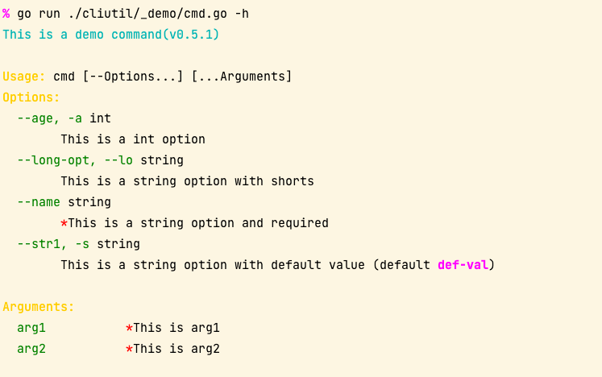
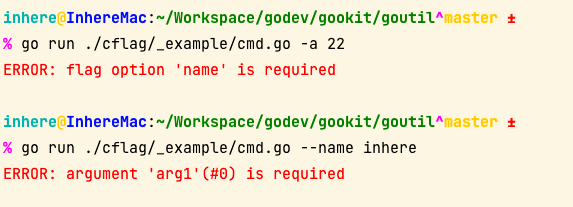
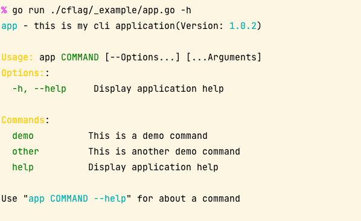
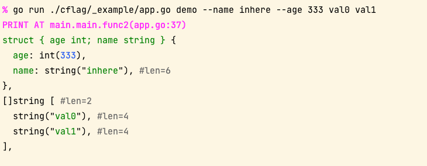

# cflag

`cflag` 基于 Go 标准库 `flag.FlagSet` 做了一层轻量封装，用于构建小型命令行应用。

- 基本使用方式与 Go `flag` 一致
- 自动渲染更友好的帮助信息
- 支持短选项别名，且一个选项可配置多个别名
- 支持必填选项和必填位置参数
- 支持命名位置参数
- 支持参数和选项校验器
- 支持选项出现在位置参数前后
- 通过 `cflag/capp` 支持多命令应用

> **[English README](README.md)**

## 安装

```shell
go get github.com/gookit/goutil/cflag
```

## Go Docs

- [github.com/gookit/goutil/cflag](https://pkg.go.dev/github.com/gookit/goutil/cflag)
- [github.com/gookit/goutil/cflag/capp](https://pkg.go.dev/github.com/gookit/goutil/cflag/capp)

## 快速开始

完整示例见 [_example/cmd.go](_example/cmd.go)。

```go
package main

import (
	"fmt"

	"github.com/gookit/goutil/cflag"
)

var opts = struct {
	age  int
	name string
	str1 string
	lOpt string
}{}

func main() {
	c := cflag.New(func(c *cflag.CFlags) {
		c.Desc = "this is a demo command"
		c.Version = "0.5.1"
	})

	c.IntVar(&opts.age, "age", 0, "this is an int option;;a")
	c.StringVar(&opts.name, "name", "", "this is a string option and required;true")
	c.StringVar(&opts.str1, "str1", "def-val", "this is a string option with default value;;s")
	c.StringVar(&opts.lOpt, "long-opt", "", "this is a string option with shortcuts;;lo")

	c.AddArg("arg1", "this is arg1", true, nil)
	c.AddArg("arg2", "this is arg2", false, "default value")

	c.Func = func(c *cflag.CFlags) error {
		fmt.Println("command:", c.Name())
		fmt.Println("option.age:", opts.age)
		fmt.Println("option.name:", opts.name)
		fmt.Println("option.str1:", opts.str1)
		fmt.Println("option.lOpt:", opts.lOpt)
		fmt.Println("arg1:", c.Arg("arg1").String())
		fmt.Println("arg2:", c.Arg("arg2").String())
		fmt.Println("remain args:", c.RemainArgs())
		return nil
	}

	c.MustParse(nil)
}
```

运行：

```shell
go run ./cflag/_example/cmd.go --name inhere -a 12 --lo val ab cd
go run ./cflag/_example/cmd.go ab --name inhere -a 12 --lo val cd
```

## 选项

`cflag` 通过扩展标准 flag 的 usage 字符串来配置必填和短选项。

usage 格式：

```text
desc
desc;required
desc;required;shorts
```

- `desc`: 选项描述
- `required`: 布尔字符串，例如 `true`、`on`、`yes`、`false`、`off`、`no`
- `shorts`: 逗号分隔的短选项，例如 `s` 或 `s,short`

示例：

```go
// 必填选项。
c.StringVar(&opts.name, "name", "", "user name;true")

// 可选项，设置短选项 "-s"。
c.StringVar(&opts.str1, "str1", "def-val", "string value;;s")

// 可选项，设置别名 "-lo" 和 "-l"。
c.StringVar(&opts.lOpt, "long-opt", "", "long option;;lo,l")
```

## 位置参数

使用 `AddArg` 绑定位置参数。

```go
c.AddArg("arg1", "this is arg1")
c.AddArg("arg2", "this is required arg2", true)
c.AddArg("arg3", "this arg has default value", false, "default value")
c.AddArg("extras", "array argument, must be the last one", false, nil, true)
```

按名称读取参数：

```go
fmt.Println(c.Arg("arg1").String())
fmt.Println(c.Arg("extras").Strings())
fmt.Println(c.RemainArgs())
```

`FlagArg` 字段：

```go
type FlagArg struct {
	Name     string
	Desc     string
	Required bool
	Arrayed  bool // 数组参数必须是最后一个绑定的位置参数。
}
```

## 选项和参数顺序

对于单命令，选项可以放在位置参数前，也可以放在位置参数后。

下面两条命令等价：

```shell
mycmd --name inhere -a 12 keyword more
mycmd keyword --name inhere more -a 12
```

`--` 会停止选项解析，后面的内容都会作为参数处理：

```shell
mycmd keyword -- --name inhere
```

解析结果：

```text
arg keyword = keyword
remain args = [--name inhere]
```

第一个位置参数之前的未知选项仍然会返回 flag 错误。位置参数之后的未知选项如果不是已注册选项，会保留为参数。

## 帮助信息

```shell
go run ./cflag/_example/cmd.go -h
```



## 必填检查

```shell
go run ./cflag/_example/cmd.go -a 22
go run ./cflag/_example/cmd.go --name inhere
```



## 多命令应用

使用 `cflag/capp` 可以快速构建多命令应用。

完整示例见 [_example/app.go](_example/app.go)。

```go
package main

import (
	"fmt"

	"github.com/gookit/goutil/cflag/capp"
)

var demoOpts = struct {
	age  int
	name string
}{}

func main() {
	app := capp.NewApp()
	app.Name = "myapp"
	app.Desc = "this is my cli application"
	app.Version = "1.0.2"

	cmd := capp.NewCmd("demo", "this is a demo command")
	cmd.IntVar(&demoOpts.age, "age", 0, "this is an int option;;a")
	cmd.StringVar(&demoOpts.name, "name", "", "this is a string option and required;true")
	cmd.AddArg("arg1", "this is arg1", true, nil)
	cmd.AddArg("arg2", "this is arg2", false, nil)
	cmd.Func = func(c *capp.Cmd) error {
		fmt.Println("age:", demoOpts.age)
		fmt.Println("name:", demoOpts.name)
		fmt.Println("arg1:", c.Arg("arg1").String())
		fmt.Println("arg2:", c.Arg("arg2").String())
		return nil
	}

	app.Add(cmd)
	app.Run()
}
```

显示命令：

```shell
go run ./cflag/_example/app.go -h
```



运行命令：

```shell
go run ./cflag/_example/app.go demo --name inhere --age 333 val0 val1
go run ./cflag/_example/app.go demo val0 --name inhere val1 --age 333
```



### 全局选项和命令选项

`capp` 只会在命令名称之前解析全局选项。进入具体命令后，命令选项可以出现在命令参数的任意位置。

```shell
myapp --workdir /tmp demo val0 --name inhere -a 333 val1
```

解析结果：

```text
global option: --workdir /tmp
command: demo
command options: --name inhere, -a 333
command args: val0 val1
```

这样可以避免把命令选项误当成全局选项解析。

在命令参数里使用 `--` 可以停止命令选项解析：

```shell
myapp demo val0 -- --name inhere
```

此时 `--name inhere` 会保留在命令参数中。
