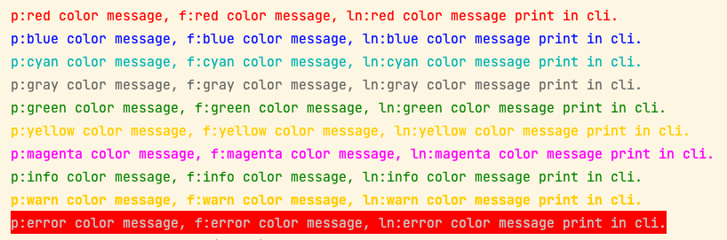

# Cli Util

- Helper util functions in cli
- Color print in console terminal
- Read terminal message input
- Command line args string parse
- Build command line string from []string

## Install

```shell
go get github.com/gookit/goutil/cliutil
```

## Helper functions

```go
cliutil.Workdir() // current workdir
cliutil.BinDir() // the program exe file dir
cliutil.QuickExec("echo $SHELL")
```

## Color print

Quick color print in console:

```go
cliutil.Redln("ln:red color message print in cli.")
cliutil.Blueln("ln:blue color message print in cli.")
cliutil.Cyanln("ln:cyan color message print in cli.")
```



## Read input

```go
name := cliutil.ReadInput("Your name: ")
name := cliutil.ReadLine("Your name: ")

ans, _ := cliutil.ReadFirst("continue?[y/n] ")

pwd := cliutil.ReadPassword("Input password:")
```

## Parse command line as args

parse input command line to `[]string`, such as cli `os.Args`

```go
package main

import (
	"github.com/gookit/goutil/cliutil"
	"github.com/gookit/goutil/dump"
)

func main() {
	args := cliutil.ParseLine(`./app top sub --msg "has multi words"`)
	dump.P(args)
}
```

**output**:

```text
PRINT AT github.com/gookit/goutil/cliutil_test.TestParseLine(line_parser_test.go:30)
[]string [ #len=5
  string("./app"), #len=5
  string("top"), #len=3
  string("sub"), #len=3
  string("--msg"), #len=5
  string("has multi words"), #len=15
]
```

## Build command line from args

```go
	s := cliutil.BuildLine("./myapp", []string{
		"-a", "val0",
		"-m", "this is message",
		"arg0",
	})
	fmt.Println("Build line:", s)
```

**output**:

```text
Build line: ./myapp -a val0 -m "this is message" arg0
```
