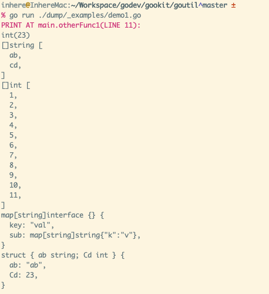

# Dump

This is an print debug vars util package.

- Github: https://github.com/gookit/goutil/dump
- GoDoc: https://godoc.org/github.com/gookit/goutil/dump

## Install

```bash
go get github.com/gookit/goutil/dump
```

## Usage

run demo: `go run ./dump/_examples/demo1.go`

```go
package main

import "github.com/gookit/goutil/dump"

// rum demo: go run ./dump/_examples/demo1.go
func main() {
	otherFunc1()
}

func otherFunc1() {
	dump.P(
		23,
		[]string{"ab", "cd"},
		[]int{1, 2, 3, 4, 5, 6, 7, 8, 9, 10, 11}, // len > 10
		map[string]interface{}{
			"key": "val", "sub": map[string]string{"k": "v"},
		},
		struct {
			ab string
			Cd int
		}{
			"ab", 23,
		},
	)
}
```

You will see:



## Functions

```go
func P(vs ...interface{})
func V(vs ...interface{})
func Print(vs ...interface{})
```
