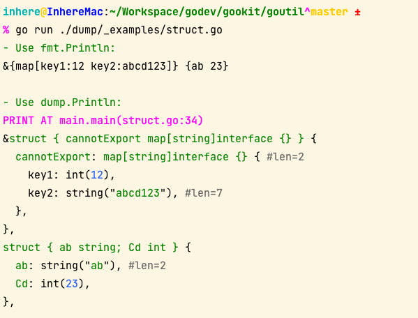

# Dump

`goutil/dump` is a golang data printing toolkit that prints beautiful and easy to read go slice, map, struct data

- Github: https://github.com/gookit/goutil/dump
- GoDoc: https://pkg.go.dev/github.com/gookit/goutil/dump

## Install

```bash
go get github.com/gookit/goutil/dump
```

## Go docs

- [Go docs](https://pkg.go.dev/github.com/gookit/goutil/dump)

## Usage

run demo: `go run ./dump/_examples/demo1.go`

```go
package main

import "github.com/gookit/goutil/dump"

// rum demo: go run ./dump/_examples/demo1.go
func main() {
	otherFunc1()
}

func otherFunc1() {
	dump.P(
		23,
		[]string{"ab", "cd"},
		[]int{1, 2, 3, 4, 5, 6, 7, 8, 9, 10, 11}, // len > 10
		map[string]interface{}{
			"key": "val", "sub": map[string]string{"k": "v"},
		},
		struct {
			ab string
			Cd int
		}{
			"ab", 23,
		},
	)
}
```

You will see:


## More preview

- print struct



- nested struct


### Options for dump

```go
// Options for dumper
type Options struct {
	// Output the output writer
	Output io.Writer
	// NoType don't show data type TODO
	NoType bool
	// NoColor don't with color
	NoColor bool
	// IndentLen width. default is 2
	IndentLen int
	// IndentChar default is one space
	IndentChar byte
	// MaxDepth for nested print
	MaxDepth int
	// ShowFlag for display caller position
	ShowFlag int
	// CallerSkip skip for call runtime.Caller()
	CallerSkip int
	// ColorTheme for print result.
	ColorTheme Theme
	// SkipNilField value dump on map, struct.
	SkipNilField bool
	// SkipPrivate field dump on struct.
	SkipPrivate bool
	// BytesAsString dump handle.
	BytesAsString bool
	// MoreLenNL array/slice elements length > MoreLenNL, will wrap new line
	// MoreLenNL int
}
```

## Functions API

> **Note**: doc by run `go doc ./dump`

```go
func Clear(vs ...interface{})
func Config(fn func(opts *Options))
func Format(vs ...interface{}) string
func Fprint(w io.Writer, vs ...interface{})
func NoLoc(vs ...interface{})
func P(vs ...interface{})
func Print(vs ...interface{})
func Println(vs ...interface{})
func Reset()
func V(vs ...interface{})
type Dumper struct{ ... }
    func NewDumper(out io.Writer, skip int) *Dumper
    func NewWithOptions(fn func(opts *Options)) *Dumper
    func Std() *Dumper
type Options struct{ ... }
    func NewDefaultOptions(out io.Writer, skip int) *Options
```

## Code Check & Testing

```bash
gofmt -w -l ./
golint ./...
```

**Testing**:

```shell
go test -v ./timex/...
```

**Test limit by regexp**:

```shell
go test -v -run ^TestSetByKeys ./timex/...
```

## Related

- https://github.com/kr/pretty
- https://github.com/davecgh/go-spew More detail for kr/pretty
  - https://github.com/kortschak/utter It's forks